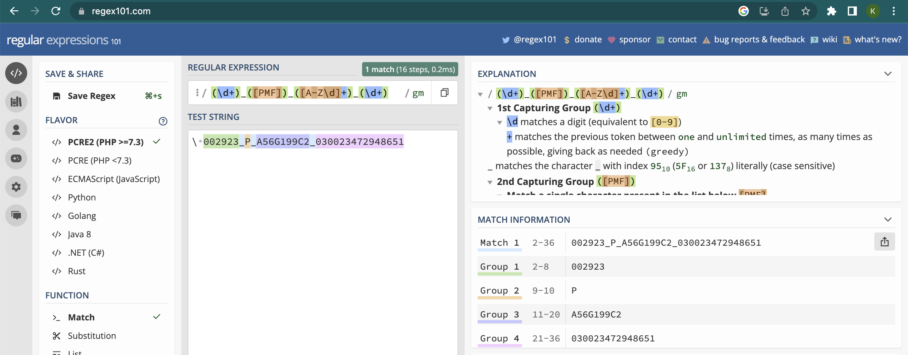

<!--
module_id: regular_expressions_groups
author:   Joy Payton
email:    paytonk@chop.edu
version:  1.0.2
current_version_description: Initial version
module_type: standard
docs_version: 1.0.0
language: en
narrator: US English Female
mode: Textbook
previous_sequential_module: regular_expressions_basics

title: Regular Expressions: Groups

comment:  Use regular expressions, or regex, for complex pattern matching involving capturing and non-capturing groups.

long_description: Learn to compose advanced regular expressions using capturing and non-capturing groups in order to find and extract important text that matches patterns you describe.

estimated_time_in_minutes: 30

@pre_reqs
Learners should have some experience composing and using simple regular expressions (regex).  For an introduction to regular expression concepts and using regular expression checkers like [Regex101](https://www.regex101.com/), consider the [Demystifying Regular Expressions](https://liascript.github.io/course/?https://raw.githubusercontent.com/arcus/education_modules/main/demystifying_regular_expressions/demystifying_regular_expressions.md#1) module.  To learn how to compose and use simple regular expressions, consider the [Regular Expressions Basics](https://liascript.github.io/course/?https://raw.githubusercontent.com/arcus/education_modules/main/regular_expressions_basics/regular_expressions_basics.md#1) module.
@end

@learning_objectives  
After completion of this module, learners will be able to:

- Define a pattern in regex notation that uses a capturing group
- Define a pattern in regex notation that uses the `|` symbol as a logical "Or" 
- Define a pattern in regex notation that uses a non-capturing group

@end
good_first_module: false
data_domain: text
collection: learn_to_code
coding_required: true
coding_level: intermediate
sequence_name: regex
previous_sequential_module: regular_expressions_basics
@sets_you_up_for
- regular_expressions_anchors_boundaries
@end 
@depends_on_knowledge_available_in
- demystifying_regular_expressions
- regular_expressions_basics
@end
@version_history
No previous versions.
@end

import: https://raw.githubusercontent.com/arcus/education_modules/main/_module_templates/macros.md
import: https://raw.githubusercontent.com/arcus/education_modules/main/_module_templates/macros_regex.md
-->

# Regular Expressions: Groups

@overview

## Regular Expression Refresher

A **regular expression** (also known as "regex") is a specific way to **express** a **rule** for a pattern.  Regular expressions are useful to biomedical researchers because they can allow you to find, replace, or extract text that matches patterns you define.  

A good place to practice regular expressions is an online regex testing website.  We like **Regex 101**, at https://www.regex101.com.

@regular_expression_checker_warning

Regex consists of **tokens** which represent characters that appear in a particular location, and **quantifiers**, which give the number of times a given token repeats.

- **Tokens** include `\d`, `[A-Za-z]`, `A`, and `.`

- **Quantifiers** include `*`, `{2,5}`, and `+`

If this refresher doesn't seem familiar, you might want to consider reviewing [Demystifying Regular Expressions](https://liascript.github.io/course/?https://raw.githubusercontent.com/arcus/education_modules/main/demystifying_regular_expressions/demystifying_regular_expressions.md#1) or [Regular Expressions Basics](https://liascript.github.io/course/?https://raw.githubusercontent.com/arcus/education_modules/main/regular_expressions_basics/regular_expressions_basics.md#1).

## Scope of This Module

We consider this module to be intermediate, because it assumes basic knowledge covers more advanced regular expressions topics, without delving into the advanced topic of using regular expressions within the context of code.  

Specifically, we'll address these topics:

* **Capturing groups**, which allow you to extract data from text
* The **logical 'Or'** in regex, and 
* **Non-capturing groups**, which allow you to use more advanced syntax without data extraction.

## Capturing Groups

We stated at the beginning of this module that one reason to use regular expressions is to extract data from strings.  That's what **capturing groups** accomplish. 

Let's consider the case where you have identifiers for some genomics data, in which there is a series of numbers that represents the trio (a proband and their genetic parents), a letter that indicates which member of the trio (`P` for proband, `M` for mother, and `F` for father), an alphanumeric series that indicates an individual id, and a final numeric identifier that is an accession id that can be traced back to the sequencer used.  

Each of these groups is separated by an underscore, and it is not clear if there are any rules around the length of any of these fields, save the P/M/F trio membership identifier.  All letters will be uppercase.

For example, `002923_P_A56G199C2_030023472948651` indicates:

* Trio id: 002923
* Proband member of the trio (P)
* Individual subject identifier: A56G199C2
* Sample accession id: 030023472948651

In your analysis code, you want to separate these fields into several different columns of data, so that you can organize your data by trios, by individuals, and so on.  How can you extract different parts of the pattern?

This is where capturing groups become relevant.  You can indicate a capturing group by using parentheses, and this will allow you to capture and use the text content, not just match the pattern.

Here's how we would simply **define** the pattern of our complex identifier, without capturing anything:

`\d+_[PMF]_[A-Z\d]+_\d+`

* `\d+` indicates 1 or more digits, 0-9 (the trio identifier).
* `_` indicates an underscore.
* `[PMF]` indicates one of `P`, `M` or `F` (the trio role).
* `_` indicates an underscore.
* `[A-Z\d]+` indicates 1 or more capital letters or digits 0-9 (the individual's id).
* `_` indicates an underscore.
* `\d+` indicates 1 or more digits, 0-9 (the accession id).

If we wanted to add a capture group for the trio identifier, we'd just add parentheses around that section of the regex (the first bit of our pattern):

`(\d+)_[PMF]_[A-Z\d]+_\d+`

We can do multiple capturing groups, too.  In a programming language, you'll be able to write code that will give you the results of these capture groups.  For example, if you have a data frame with a column called "id" that has the long identifiers, you could split out that data into four additional columns that you call "trio\_id", "trio\_role", "subject\_id", and "accession\_id".  We won't go into how to integrate regular expressions into your R or Python code in this module, but on the next page we'll go over looking at capturing groups in a regex checker.

### Capturing Groups in a Regex Checker

You can look at the capturing results for multiple groups and practice this skill in a regex checker, regardless of whether you also use a programming language like R or Python.  For example, let's say we wanted to extract all four components of our long id, `002923_P_A56G199C2_030023472948651`. 

We can put parentheses around each group and add this regular expression to a regex checker like [Regex 101](https://www.regex101.com) and check to make sure we're capturing what we intend to. See this description of [how to use Regex 101](https://liascript.github.io/course/?https://raw.githubusercontent.com/arcus/education_modules/main/demystifying_regular_expressions/demystifying_regular_expressions.md#6) if you would like a refresher.

We'll add the pattern `(\d+)_([PMF])_([A-Z\d]+)_(\d+)` to the small box labeled "Regular Expression," and our sample id, `002923_P_A56G199C2_030023472948651`, to the larger box labeled "Test String."  [We can then see our captured groups on the right!](https://regex101.com/r/XmG4kp/1)

<!-- style = "border: 1px solid rgb(var(--color-highlight));" -->

We see four groups listed in the "Match Information" pane on the right side.  Above that pane, the "Explanation" pane goes into detail about each group.

### Quiz: Capturing Groups

Consider a regular expression with capturing group that describes email addresses:

`[A-Za-z\d\-\._]+@([A-Za-z\d\-\._]+\.[A-Za-z]{2,})`

 What will the capturing group in this regular expression actually capture?

[( )] The entire email address
[( )] The user mailbox (the entire part before the `@` of the email address)
[(X)] The email domain (the entire part following the `@` of the email address)
[( )] The TLD, or "top level domain" (the last period and last few letters, like `.com`, `.edu`, or `.gov`)
[( )] None of these
[[?]] Hint: Feeling stuck?  Try using [Regex 101](https://www.regex101.com)!
***

This regex looks intimidating, but it's really only a few parts.  Let's break it apart considering the email address `regex_is_awesome_123@fakemail.org`

* `[A-Za-z\d\-\._]+` means one or more letter, number, hyphen, period, or underscore (in our case, "regex\_is\_awesome\_123")
* `@` indicates the `@`
* `[A-Za-z\d\-\._]+` again means one or more letter, number, hyphen, period, or underscore ("fakemail")
* `\.` indicates a literal period
* `[A-Za-z]{2,}` indicates two or more letters ("org").

In our case, we had a capturing group around the last three of those bullet points.  That means that what is captured is the entire email domain ("fakemail.org").

***

## The Logical "Or"

Sometimes you want to define two different pattern options at a certain point in a complex string.  For example, let's consider a mouse model study of the immune system's interaction with insulin.  

Your wild type subjects are given identifiers that include `WT` (wild type), followed by a hyphen, and a subject identifier of usually five (but possibly 6) digits.  You additionally have PBMC humanized mice, in addition to wild type mice, and their identifiers begin with `PBMC`, followed by a hyphen, followed by 5-6 digits.

There's a handy way to indicate a logical "or" in regex, using the vertical pipe (`|`).  Text on either side of a `|` character are alternative values for the given part of a pattern. 

For example, `8|5` indicates that either an 8 or a 5 appears at a given location.  Similarly,`banana|B` indicates that the word "banana" or the abbreviation "B" appears.  

<b style="color: rgb(var(--color-highlight));">Important note</b> 

Could we indicate "either a five or an eight" using a **list**, like `[85]` or `[58]`, instead of using the pipe `8|5`?  Yes, and that's usually the best choice, when you're dealing with a single character in a pattern that has several alternatives.  For example, it's easier to write `[ABC123]` than it is to write `A|B|C|1|2|3`.

However, when you are dealing with a string of **more than one character**, like the entire word "banana" being one alternative, or "B" being the other alternative, you can't use a list!  

As a reminder, a list is a token that represents **a single character** (which might repeat some number of times).  You can't indicate a multi-character string in a list.  `[banana]`, for example, means "b, or a, or n, or a, or n, or a."  

Well, what if you added the correct **quantifier** to indicate six letters?  `[banana]{6}` means any of the approved letters six times.  "banana" would match, but so would "aaabbb" or "bababa" or "nanaba."

The vertical pipe (`|`) is the only way to provide alternatives in which one of the possibilities has a length greater than one.

Using the vertical pipe, `WT|PBMC` is a good start.  However, that's not the only thing in our pattern.  We have to add a hyphen (`\-`) and then 5-6 digits (`\d{5,6}`) to complete the identifier.  

Would `WT|PBMC\-\d{5,6}` work?  No!  That would be interpreted as one of the following:

* 'WT' (by itself) **or**
* 'PBMC' followed by a hyphen and 5-6 digits.

That's not what we mean!  And we can't use a space to our regex to syntactically separate our "or" clause from the rest of the regular expression. After all, a space is interpreted literally, as a space that belongs in the pattern.  

So, what can we do? How can we indicate where the "or" stops?  We can use parentheses for grouping as a way to create a boundary.

`(WT|PBMC)\-\d{5,6}` would work, and would be interpreted as:

* "WT" or "PBMC" (and please capture whichever it is)
* Then a hyphen
* Then 5-6 digits

[That expression will work as valid regex](https://regex101.com/r/ZHs5iI/1) that will match with your various mouse subject ids.  However, you really don't **need** to capture that group, you're just using the parentheses to enclose a group that could go one of two different ways.  Let's consider another option on the next page: a **non-capturing group**.  

<b style="color: rgb(var(--color-highlight));">A little encouragement...</b> 

You might wonder what would happen if we added a third mouse type, like a CD34+ humanized mouse model with the code "CD34" in its identifier.  Well, we can string together as many or statements as we need.  We can indicate WT or PBMC or CD34 by using `WT|PBMC|CD34`.  This indicates that any of the three values separated by the pipes are valid at that location in a pattern.

## Non-Capturing Groups

So far, we have used the vertical pipe (`|`) and a capturing group to describe the pattern of our mouse identifiers:  `(WT|PBMC)\-\d{5,6}`.

But what if you don't need to capture the mouse type?  You might just want to make sure that the identifier is valid and matches the pattern correctly, without extracting any text from the identifier.

If that's the case, you can indicate that it's a **non-capturing group** by adding `?:` after the opening parenthesis, like this:

`(?:WT|PBMC)\-\d{5,6}`

[This will also work](https://regex101.com/r/ko7ySn/1) as a matching regular expression, but won't capture the group in question.

This may seem unnecessary.  Why go to the trouble of creating a non-capturing group?  You could simply use a capturing group but not pay any attention to what you capture.  That's true, but consider that in a long string, you might actually want to capture some data and not capture other data, and getting an extra captured group could be confusing or annoying.  It's useful to be able to group things and **not** capture them.

### Quiz: Non-Capturing Groups and the Logical "Or"

You're looking through lab notes written by a colleague who uses codes and abbreviations liberally.  

This investigator is known to write their lowercase initials ("sjp") and a single space followed by either "help" (always in lowercase) or "911" in notes to highlight important potential pitfalls.  

Using the logical "or" and using a non-capturing group (remember: the syntax is `(?:)`), write a regular expression that would match both the "sjp help" and "sjp 911" patterns.

Put that regular expression in the box below:

[[see answer box below for two alternatives]]

***

You'll begin by posing your two alternatives, either `help|911` or `911|help`, the order doesn't matter.  Then, you wrap that in the non-capturing group to give `(?:help|911)` or `(?:911|help)`.  But don't forget your collague's initials and the space!  The final regex should read `sjp (?:help|911)` or `sjp (?:911|help)`.

***

## Additional Resources

General regex cheat sheets:

* [Dave Child's cheat sheet](https://cheatography.com/davechild/cheat-sheets/regular-expressions/) is fairly comprehensive.
* [DataCamp's cheat sheet for regex](https://images.datacamp.com/image/upload/v1665049611/Marketing/Blog/Regular_Expressions_Cheat_Sheet.pdf) is another good option.

If you want to check out regular expression checkers, here are a few we like:

* [Regex 101](https://regex101.com) is the regular expressions tester used in this module.  We use it regularly, even after working with regular expressions for many years.
* [RegExr](https://regexr.com/) has helpful teaching aids, including a hover-over explainer that allows you to investigate matches, and a way to look at complex nested elements (for instance, a range of characters inside square brackets inside a capturing group) in a visual way.
* [RegEx Testing](https://www.regextester.com/) has a clean, simple interface and a library of popular regular expressions to start with. 

@regular_expression_checker_warning

Groups:

* [Capture Group Numbering & Naming: The Gory Details](https://www.rexegg.com/regex-capture.html) goes into detail about how to add numbering to capture groups, which can be helpful in advanced search and replace functions.  This goes beyond the scope we were able to cover in this module.

For learning more about regular expressions, consider:

[Regular-Expressions.info](https://www.regular-expressions.info/) is a compact and comprehensive handbook that includes much more information than we could convey in this module. It does seem to want readers to download or buy particular products, but if you ignore that aspect, the website is quite useful. Their [quick reference](https://www.regular-expressions.info/refquick.html), for example, is great to keep nearby while writing regex!

The [Wikipedia page for regular expressions](https://en.wikipedia.org/wiki/Regular_expression) is quite good and delves into the history of regular expressions as well as some of its mathematical qualities.

## Feedback

@feedback