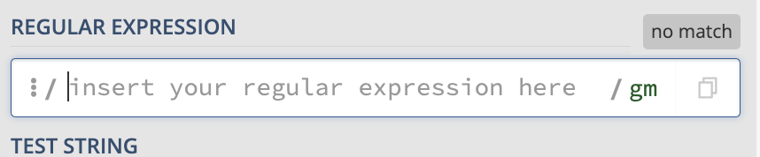
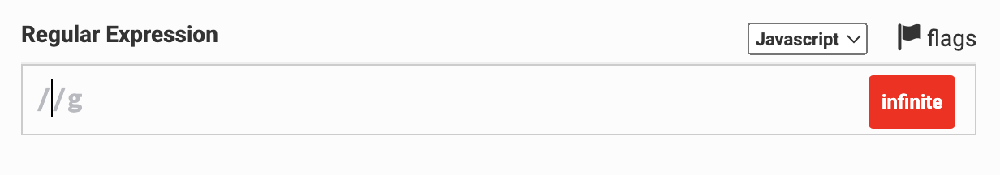
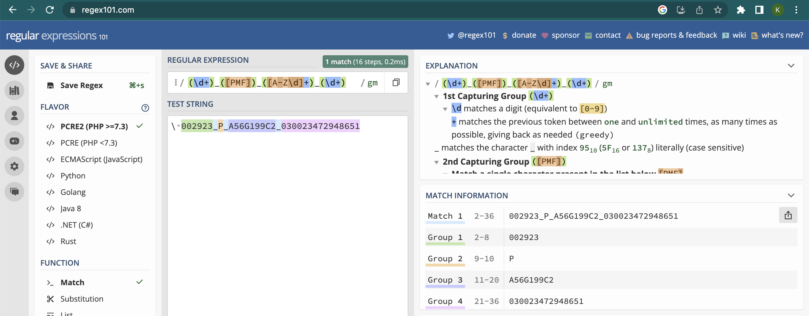
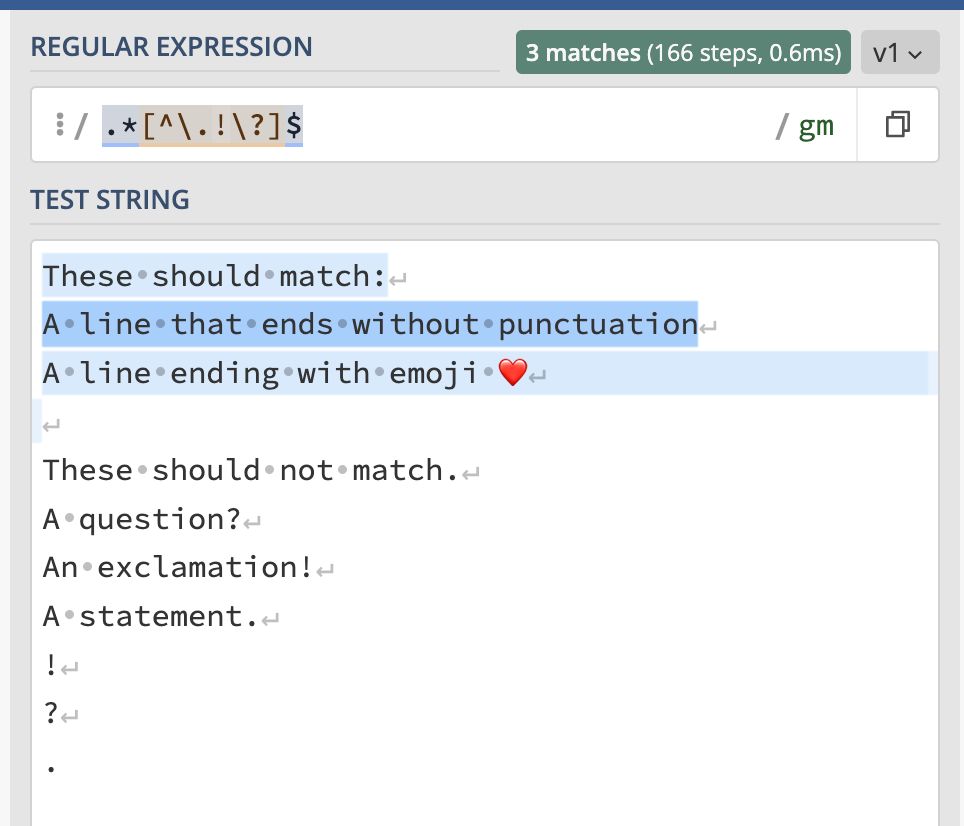
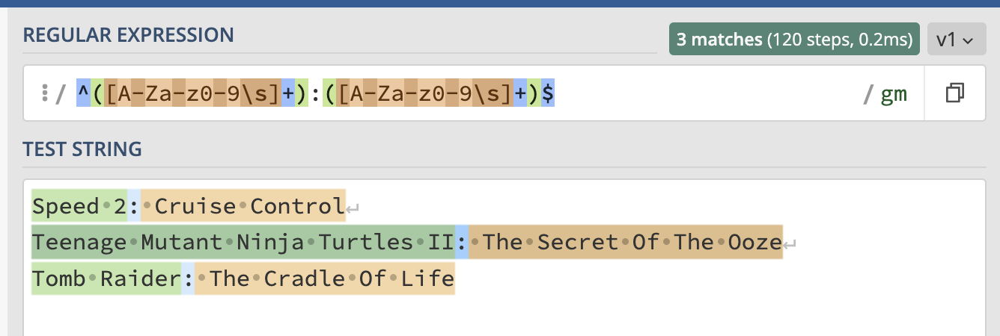

<!--

author:   Joy Payton
email:    paytonk@chop.edu
version:  1.0.0
current_version_description: Initial version
module_type: standard
docs_version: 1.0.0
language: en
narrator: US English Female
mode: Textbook
previous_sequential_module: regular_expressions_basics

title: Regular Expressions, Intermediate Level

comment:  Grow in your ability to use regular expressions, or regex, for complex pattern matching.

long_description: Learn to compose intermediate regular expressions using capturing groups, anchors, boundaries, and more, in order to find and extract important text that matches patterns you describe.

estimated_time_in_minutes: 60

@pre_reqs
Learners should have some experience composing and using simple regular expressions (regex).  For an introduction to regular expression concepts, consider the [Demystifying Regular Expressions](https://liascript.github.io/course/?https://raw.githubusercontent.com/arcus/education_modules/main/demystifying_regular_expressions/demystifying_regular_expressions.md#1) module.  To learn how to compose and use simple regular expressions, consider the [Regular Expressions Basics](https://liascript.github.io/course/?https://raw.githubusercontent.com/arcus/education_modules/main/regular_expressions_basics/regular_expressions_basics.md#1) module.
@end

@learning_objectives  
After completion of this module, learners will be able to:

- Explain what a regular expression flag does
- Define a pattern in regex notation that uses a capturing group
- Define a pattern in regex notation that uses the `|` symbol as a logical "Or" 
- Use anchors and boundaries in regular expressions
- Explain why a "lookahead" can be useful in a regular expression

@end
good_first_module: false
coding_required: true
coding_level: intermediate
sequence_name: regex
previous_sequential_module: regular_expressions_basics
@sets_you_up_for
@end 
@depends_on_knowledge_available_in
- regular_expressions_basics
-demystifying_regular_expressions
@end
@version_history 
No previous versions.
@end

import: https://raw.githubusercontent.com/arcus/education_modules/main/_module_templates/macros.md
-->

# Regular Expressions: Intermediate Level

@overview

## Regular Expression Refresher

A **regular expression** (also known as "regex") is a specific way to **express** a **rule** for a pattern.  Regular expressions are useful to biomedical researchers because they can allow you to find, replace, or extract text that matches patterns you define.  

A good place to practice regular expressions is an online regex testing website.  We like **Regex 101**, at https://www.regex101.com.

Regex consists of **tokens** which represent characters that appear in a particular location, and **quantifiers**, which give the number of times a given token repeats.

- **Tokens** include `\d`, `[A-Za-z]`, `A`, and `.`

- **Quantifiers** include `*`, `{2,5}`, and `+`

If this refresher doesn't seem familiar, you might want to consider reviewing [Demystifying Regular Expressions](https://liascript.github.io/course/?https://raw.githubusercontent.com/arcus/education_modules/main/demystifying_regular_expressions/demystifying_regular_expressions.md#1) or[Regular Expressions Basics](https://liascript.github.io/course/?https://raw.githubusercontent.com/arcus/education_modules/main/regular_expressions_basics/regular_expressions_basics.md#1).

## Scope of This Module

We consider this module to be intermediate, because it assumes basic knowledge covers more advanced regular expressions topics, without delving into the advanced topic of using regular expressions within the context of code.  

Specifically, we'll address these topics:

* **Flags**, which alter how regular expressions parsers work
* **Capturing groups**, which allow you to extract data from text, and **non-capturing groups**, which allow you to use more advanced syntax without data extraction 
* **Anchors and boundaries**, which help you define patterns that belong in certain places within text
* **Lookaheads**, which are useful for situations like overlapping data

Once you've learned these skills, you'll be a regular expressions hero!

![A note declares "Whenever I learn a new skill, I concoct elaborate fantasy scenarios where it lets me save the day."  A comic follows that shows one stick figure saying "Oh no! The killer must have followed her on vacation!  But to find them, we'd have to search through 200 MB of emails looking for something formatted like an address!", to which another stick figure replies, "It's hopeless!".  From afar, someone says, "Everybody stand back. I know regular expressions."  This hero then swings in on a rope, types some Perl code into the computer, and swings out on the same rope while the others cheer.](https://imgs.xkcd.com/comics/regular_expressions.png "[Regular Expressions](https://xkcd.com/208/) comic by xkcd, [CC BY-NC 2.5](https://xkcd.com/license.html).")

## Regular Expression Flags

The regular expression checker we refer to and use for this module, [Regex 101](https://www.regex101.com), has, by default, the "global" and "multiline" **flags** set, which you can see written as "gm" after the "Regular Expression" box.  Flags in regex are parameters which can change how regular expressions are interpreted.  

Flags aren't written within a regular expression, but are set **outside** of it, either by clicking on something (it might be the word "flag" or an image of a flag) or by typing a letter (like "g" or "m") or letters into your code, separate from the definition of a regular expression. Three frequently used flags are:

* **Global (g)**.  This indicates that the entire string given for matching against the pattern should be checked.  Without the "g" or "global" flag, only the first match to the pattern will be found, and the regex parser will stop looking for additional matches.
* **Multiline (m)**.  This flag indicates that each line should be treated as its own string, instead of all the lines being considered one string.  This is important when working with start-of-string and end-of-string **anchors**, which we'll talk about later in this module.
* **Ignore / Insensitive (i)**.  "Ignore" indicates that pattern matching should be case-insensitive, so that differences in capitalization are ignored.

If you use different "flags" than we do (for example, if you're not using the default [Regex 101](https://www.regex101.com) as your regex checker), you might see an occasional difference in how the regular expression we show works in your environment.  In the regex checker you're using, try setting your flags to "global" and "multiline", and you should get identical results to what we show here in this module.  The flags usually are shown following a forward slash, appearing just after the regular expression ends:

<!-- style = "border: 1px solid rgb(var(--color-highlight)); max-width: 400px;" --> Screenshot taken from [https://regex101.com/](https://regex101.com/)

![A sample regular expression: `([A-Z])\w+` is enclosed within forward slashes.  After the closing forward slash, the letter "g" appears.](media/example2.png)<!-- style = "border: 1px solid rgb(var(--color-highlight)); max-width: 300px;" --> Screenshot taken from [https://regexr.com/](https://regexr.com/)

<!-- style = "border: 1px solid rgb(var(--color-highlight)); max-width: 400px;" --> Screenshot taken from [https://www.regextester.com/](https://www.regextester.com/)

<b style="color: rgb(var(--color-highlight));">Behind the scenes</b> 
If you do some internet searches or use a regular expression checker, you might wondering why regular expressions are often written between forward slashes.  That's because of how regular expressions are written in some programming languages like Perl and Javascript and some utilities like `sed`.  
  
You don't need to worry about enclosing your regular expressions in forward slashes for this module.  In fact, depending on what kind of code you write, you may never have to enclose your regular expressions in forward slashes.  Still, it's somewhat customary to see regular expressions written this way.

### Quiz: Flags

Which of the following statements are true?  Check all that apply.

[[ ]] Flags are only important if you're working in Perl.
[[ ]] Flags are written as the last letter or letters of a regular expression.
[[X]] Flags alter the rules around regular expression parsing.
[[X]] One common flag is "global", written with a "g", which allows for multiple matches.
***

Flags can be important whether you're writing code or using a regular expressions checker, so it's not true that flags only matter for Perl code.  

Flags are declared outside of the definition of a regular expression, so the second statement is also false.  The last two statements are true.  

Flags alter the rules around regular expression parsing, and one common flag is "global," written with a `g`, which allows for multiple matches.

***

## Capturing and Non-Capturing Groups

We stated at the beginning of this module that one reason to use regular expressions is to extract data from strings.  That's what capturing groups accomplish.  Sometimes we need the power of groups to give our regular expressions more flexibility, but we don't need to capture the group we've made.  That's a non-capturing group.  

Let's dive in and learn about these very useful topics!

### Capturing Groups

Let's consider the case where you have identifiers for some genomics data, in which there is a series of numbers that represents the trio (a proband and their genetic parents), a letter that indicates which member of the trio (`P` for proband, `M` for mother, and `F` for father), an alphanumeric series that indicates an individual id, and a final numeric identifier that is an accession id that can be traced back to the sequencer used.  

Each of these groups is separated by an underscore, and it is not clear if there are any rules around the length of any of these fields, save the P/M/F trio membership identifier.  All letters will be uppercase.

For example, `002923_P_A56G199C2_030023472948651` indicates:

* Trio id: 002923
* Proband member of the trio (P)
* Individual subject identifier: A56G199C2
* Sample accession id: 030023472948651

In your analysis code, you want to separate these fields into several different columns of data, so that you can organize your data by trios, by individuals, and so on.  How can you extract different parts of the pattern?

This is where **capturing groups** become relevant.  You can indicate a capturing group by using parentheses, and this will allow you to capture and use the text content, not just match the pattern.

Here's how we would simply **define** the pattern of our complex identifier, without capturing anything:

`\d+_[PMF]_[A-Z\d]+_\d+`

* `\d+` indicates 1 or more digits, 0-9 (the trio identifier).
* `_` indicates an underscore.
* `[PMF]` indicates one of `P`, `M` or `F` (the trio role).
* `_` indicates an underscore.
* `[A-Z\d]+` indicates 1 or more capital letters or digits 0-9 (the individual's id).
* `_` indicates an underscore.
* `\d+` indicates 1 or more digits, 0-9 (the accession id).

If we wanted to add a capture group for the trio identifier, we'd just add parentheses around that section of the regex (the first bit of our pattern):

`(\d+)_[PMF]_[A-Z\d]+_\d+`

We can do multiple capturing groups, too.  In a programming language like R or Python, you'll be able to write code that will give you the results of these capture groups.  For example, if you have a data frame with a column called "id" that has the long identifiers, you could split out that data into four additional columns that you call "trio\_id", "trio\_role", "subject\_id", and "accession\_id".

We won't go into the details for how to write this in code in this module, but you can look at the capturing results for multiple groups and practice this skill in a regex checker.  For example, let's say we wanted to extract all four components of our long id.  We can put parentheses around each group and add this regular expression to a regex checker like [Regex 101](https://www.regex101.com) and check to make sure we're capturing what we intend to.

We'll add the pattern `(\d+)_([PMF])_([A-Z\d]+)_(\d+)` to the small box labeled "regular expression", and our sample id, `002923_P_A56G199C2_030023472948651`, to the larger box labeled "test string".  [We can then see our captured groups on the right!](https://regex101.com/r/XmG4kp/1)

<!-- style = "border: 1px solid rgb(var(--color-highlight));" -->

We see four groups listed in the "Match Information" pane on the right side.  Above that pane, the "Explanation" pane goes into detail about each group.

### Quiz: Capturing Groups

Consider a regular expression with capturing group that describes email addresses:

`[A-Za-z\d\-\._]+@([A-Za-z\d\-\._]+\.[A-Za-z]{2,})`

 What will the capturing group in this regular expression actually capture?

[( )] The entire email address
[( )] The user mailbox (the entire part before the `@` of the email address)
[(X)] The email domain (the entire part following the `@` of the email address)
[( )] The TLD, or "top level domain" (the last period and last few letters, like `.com`, `.edu`, or `.gov`)
[( )] None of these
[[?]] Hint: Feeling stuck?  Try using [Regex 101](https://www.regex101.com)!
***

This regex looks intimidating, but it's really only a few parts.  Let's break it apart considering the email address `regex_is_awesome_123@fakemail.org`

* `[A-Za-z\d\-\._]+` means one or more letter, number, hyphen, period, or underscore (in our case, "regex\_is\_awesome\_123")
* `@` indicates the `@`
* `[A-Za-z\d\-\._]+` again means one or more letter, number, hyphen, period, or underscore ("fakemail")
* `\.` indicates a literal period
* `[A-Za-z]{2,}` indicates two or more letters ("org").

In our case, we had a capturing group around the last three of those bullet points.  That means that what is captured is "fastmail.org", the entire email domain.

***

### Non-Capturing Groups and the Logical "Or"

Sometimes you want to define two different pattern options at a certain point in a complex string.  For example, let's consider a mouse model study of the immune system's interaction with insulin.  

Your wild type subjects are given identifiers that include `WT` (wild type), followed by a hyphen, and a subject identifier of usually five (but possibly 6) digits.  You additionally have PBMC humanized mice, in addition to wild type mice, and their identifiers begin with `PBMC`, followed by a hyphen, followed by 5-6 digits.

There's a handy way to indicate a logical "or" in regex, using the vertical pipe (`|`).  Text on either side of a `|` character are alternative values for the given part of a pattern. 

For example, `8|5` indicates that either an 8 or a 5 appears at a given location. `banana|B` indicates that the word "banana" or the abbreviation "B" appears.  And `NA|\d{4}|unknown` indicates that one of "NA", a four digit number, or "unknown" should appear.

<b style="color: rgb(var(--color-highlight));">A little encouragement...</b> 

You might be wondering whether you could use a list, like `[85]` or `[58]`, instead of using the pipe to write `8|5` to indicate "either a five or an eight."  You absolutely can, and that's usually the best choice, when you're dealing with a single character in your pattern that has several alternatives.  For example, it's easier to write `[ABC123]` than it is to write `A|B|C|1|2|3`.

However, when you are dealing with a string of **more than one character**, like "banana" being one alternative, or "B" being the other alternative, you can't use a list!  As a reminder, a list is a token that represents a single character.

The vertical pipe (`|`) is the only way to provide two or more alternatives in which one of the possibilities has a length greater than 1.

So, `WT|PBMC` is a good start.  However, that's not the only thing in our pattern.  We have to add a hyphen (`\-`) and then 5-6 digits (`\d{5,6}`).  

Would `WT|PBMC\-\d{5,6}` work?  No!  That would be interpreted as one of the following:

* 'WT' (by itself) **or**
* 'PBMC' followed by a hyphen and 5-6 digits.

That's not what we mean!  And we can't use a space to our regex to syntactically separate our "or" clause from the rest of the regular expression. After all, a space is interpreted literally, as a space that belongs in the pattern.  So, what can we do? We can use parentheses for grouping. 

`(WT|PBMC)\-\d{5,6}` would work, and would be interpreted as:

* "WT" or "PBMC" (and capture whichever it is)
* Then a hyphen
* Then 5-6 digits

[That expression will work as valid regex](https://regex101.com/r/ZHs5iI/1) that will match with your various mouse subject ids.  However, you really don't need to capture that group, you're just using the parentheses to enclose a group that could go one of two different ways.  If you prefer, you can indicate that it's a non-capturing group by adding `?:` after the opening parenthesis, like this:

`(?:WT|PBMC)\-\d{5,6}`

[This will also work](https://regex101.com/r/ko7ySn/1) as a matching regular expression, but won't capture the group in question.

### Quiz: Non-Capturing Groups and the Logical "Or"

You're looking through lab notes written by a colleague who uses codes and abbreviations liberally.  

This investigator is known to write their lowercase initials ("sjp") and a single space followed by either "help" (always in lowercase) or "911" in notes to highlight important potential pitfalls.  

Using the logical "or" and using a non-capturing group (remember: the syntax is `(?:)`), write a regular expression that would allow you to capture any of the "sjp help" or "sjp 911" references.

Put that regular expression in the box below:

[[see answer box below for two alternatives]]

***

You'll begin by posing your two alternatives, either `help|911` or `911|help`, the order doesn't matter.  Then, you wrap that in the non-capturing group to give `(?:help|911)` or `(?:911|help)`.  But don't forget your collague's initials and the space!  The final regex should read `sjp (?:help|911)` or `sjp (?:911|help)`.

***

## Anchors

Sometimes, it's important that certain characters appear in a certain place in a string.  For example, maybe you're not trying to find all the mouse identifiers in your text, but rather trying to find only those entries in which the line **starts** with an identifier.  

Or maybe you are editing a text transcript and you want to find all the lines that **end** without one of the punctuation marks of `.`, `!`, or `?`.

The caret symbol `^` (indicating the beginning of a string) and dollar sign `$` (indicating the end of a string) are special characters called **anchors**, which can be used when it's important to find patterns in a specific location.  

<b style="color: rgb(var(--color-highlight));">Important note</b> 

This is where one of your **flags** becomes important.  We're going to use Regex 101 with the "multiline" flag, which means that each line starts with a start-of-string and ends with an end-of-string.  As you try these yourself, make sure you're using a multiline flag as well!

### Start-of-string Anchoring

Let's consider our mouse identifiers example (our wild type and PBMC humanized mice).  We want to find text entries that begin with subject identifiers, such as:  

* PBMC-12345: listless, off feed
* WT-234293 is unremarkable

We don't, on the other hand, want to find texts that have mouse identifiers that aren't at the beginning of the line.  These should not be pattern matches:

* the mouse PBMC-12345
* subject WT-234293

If we just [use the pattern for the identifier alone](https://regex101.com/r/oTOVnK/1), `(?:WT|PBMC)\-\d{5,6}`, we won't get that discrimination between line starters and non-line starters:

<!-- style = "border: 1px solid rgb(var(--color-highlight)); max-width:400px;" -->

However, if [we add the `^` at the start of our pattern](https://regex101.com/r/4HxMlo/1), resulting in `^(?:WT|PBMC)\-\d{5,6}`, we can indicate that our pattern must immediately begin the string:

<!-- style = "border: 1px solid rgb(var(--color-highlight)); max-width:400px;" -->

<b style="color: rgb(var(--color-highlight));">Important note</b> 

To correctly use `^` as the start-of-string token, you must not enclose it in square brackets.  If `^` appears inside square brackets, it will be intepreted as doing something quite different, as you are about to discover.

### End-of-string Anchoring 

Let's check that strings **end** with one of our preapproved punctuation options.  We'd like to match problematic strings, which are ones that don't end in either a period, question mark, or exclamation point.  

There's a helpful bit of grammar in regex that means "except for," when it appears as the first symbol within square brackets.  Interestingly enough, we use `^` to do this.  That symbol does double duty, because we also use `^` to indicate the start of a line, when it's not inside square brackets!  Placement is everything.  

For example, `[ABXYZ]` means "any of these: A, B, X, Y, or Z", while `[^ABXYZ]` means "anything that isn't one of these: A, B, X, Y, and Z."  

<b style="color: rgb(var(--color-highlight));">Important note</b> 

To use `^` as "except for", it has to immediately follow an opening square bracket, and be followed by the characters it is indicating aren't acceptable.  You can't, for example, say "all the digits except for 7" by typing `\d^7` or `[\d^7]`.

Now that we know how to say "except for", we can now write the pattern for lines that end with anything except for a period, exclamation point, or question mark:

`.*[^\.!\?]$`

* `.*` means any amount of text, from zero to many characters
* `[^\.!\?]` means any character that isn't a period, exclamation point, or question mark.
* `$` means "the end of the string".

We can [check this in Regex 101](https://regex101.com/r/KIkx58/1) for accuracy, and put a few strings in to see if it's matching what we want it to match:

<!-- style = "border: 1px solid rgb(var(--color-highlight)); max-width:400px;" -->

### Scenario: Start- and End-of-String Anchors

Consider these test strings, which are movie sequel titles:

* Speed 2: Cruise Control
* Teenage Mutant Ninja Turtles II: The Secret Of The Ooze
* Tomb Raider: The Cradle Of Life

You're helping a colleague who tried to write regex that would capture two groups for each movie: first, the part of the title before the colon, and second, the part of the title after the colon. 

They used this regular expression, which uses capturing groups:  `([A-Za-z0-9\s]+):([A-Za-z0-9\s]+)`. [As we can see in Regex 101](https://regex101.com/r/3kyzIp/1), this did not segment the movie titles exactly right.  The regular expression matches the pattern twice, not three times.  It gets the first capturing group correct.  But for the second capturing group, the parser takes the second part of the first movie and keeps reading well into the second movie line, stopping only when it gets to a colon. 

This is what they **expected to see**:

| Title  | Subtitle |
| :--------- | :--------- |
| Speed 2   | Cruise Control   |
| Teenage Mutant Ninja Turtles II | The Secret Of The Ooze|
| Tomb Raider | The Cradle Of Life |

But this is what they got instead:

| Title  | Subtitle |
| :--------- | :--------- |
| Speed 2   | Cruise Control Teenage Mutant Ninja Turtles II | 
| The Secret Of The Ooze Tomb Raider | The Cradle Of Life |

It seems like the regular expression parser isn't stopping at the end of a string and restarting at the beginning of a string.  You assist your collague by adding syntax to their regular expression such that the pattern must start at the beginning of a string and end at the end of a string.  This is what you write:  

`^([A-Za-z0-9\s]+):([A-Za-z0-9\s]+)$`

When you [try this in Regex 101](https://regex101.com/r/Ld3HWY/1) you get exactly what was intended:

<!-- style = "border: 1px solid rgb(var(--color-highlight)); max-width:600px;" -->

<b style="color: rgb(var(--color-highlight));">Another option</b> 

There are other ways to solve your colleague's problem.  You may have realized that the `\s` that allowed for spaces in titles and subtitles was too broad -- `\s` allows for spaces, tabs, carriage returns, and new lines.  You could also have rewritten their regex by changing the `\s` to just be a literal space, like this: `([A-Za-z0-9 ]+):([A-Za-z0-9 ]+)`

In regular expressions, there are often many ways to accomplish the same goal!

## Boundaries 

Boundaries are similar to anchors in that they allow you to think in advanced ways about where your pattern is positioned.  For example, let's consider **words** and **word boundary**.  

Word characters, expressed in regex as `\w`, are (generally, and this can depend a bit by what flavor of regular expression engine you're using) letters, numbers, and underscores (`_`).  Where word characters meet non-word characters, there's a word boundary, indicated in regex as `\b`.

In the string `subject AB_123 has 10 lesions.`, there are five word boundaries. Between the words and after the last word are non-word characters (four spaces and one period):

*  The point between the "t" in "subject" and the space following it is a word boundary and can be expressed as `\b`.  
* The same is true for the boundary between "3" and the space following it.
* Also there's a word boundary between the "s" in has and the space following it.
* The point between "0" and the space following it, is also a word boundary.
* Finally, between the "s" in "lesions" and the period following it is our final word boundary.

Word boundaries are useful in case you're looking for patterns that match the start or end of a word.  For example, what if you're looking in a text for "ome" words -- mentions of "microbiome," "genome," "transcriptome," "exome," "proteome," "trisome," "microsome," and similar words?  [If you look just for the pattern `ome`](https://regex101.com/r/gk7BYK/1), you will also match "women," "foment," "moment," "omega," and so on.  

<!-- style = "border: 1px solid rgb(var(--color-highlight)); max-width:400px;" -->

How can you indicate words with "ome" and the end?  [Append a word boundary](https://regex101.com/r/GnLvOU/1) at the end of the `ome` pattern: `ome\b`.

<!-- style = "border: 1px solid rgb(var(--color-highlight)); max-width:400px;" -->

We still have some "false" hits with "home" and "some."  How could we solve this and require at least two, and not just one, leading letter?  That way, "home," "some," "come," "dome," etc. would be excluded, but "exome" would still match.

Well, what if we started off our pattern with "two or more characters" followed immediately by "ome" and then the word boundary?  Let's try it on the next page.

### A Greedy Complication

What if we started off our "-ome but not four letter words" pattern with "two or more characters" followed immediately by "ome" and then the word boundary?  [Something like `.{2,}ome\b`](https://regex101.com/r/Pm16s0/1)?

<!-- style = "border: 1px solid rgb(var(--color-highlight)); max-width:400px;" -->

What went wrong here?  Why is this treating my entire string up to "proteome" as a single match?  Regular expressions are by default **greedy**.  

Greedy
-----

This is a technical term in regex that indicates that a regular expression will, by default, match the longest possible string that will match the pattern.  

In our case, we weren't specific enough, because we said that any character (`.`) could be in the leading part of the string.  That includes letters and spaces.  Therefore, our long phrase "The genome of women is home to some of the most comely parts of the human exome: the omega moment that foments the prote" matches as the longest series of at least two characters preceding "ome" and a word boundary (the period). 

But that's not what we meant!  Luckily we can fix this by being more specific.  Click the regular expressions below to see them *in situ* on Regex 101.

* We could indicate that we want two or more letters, excluding other things like spaces, with [`[A-Za-z]{2,}ome\b`](https://regex101.com/r/TdF4kr/1)
* We could use the special "word character" symbol of `\w` to indicate that letters, numbers, and underscores are what we mean: [`\w{2,}ome\b`](https://regex101.com/r/sh6CV5/1).

In both of these cases, the matches we get back are the longer words that end in "ome" -- namely, "genome," "exome," and "proteome."

<b style="color: rgb(var(--color-highlight));">Behind the scenes</b> 

There are other defined boundaries, such as the "not a word" boundary (`\B`), which isn't supported in every engine.  For now, the word boundary will probably be enough for most of the regular expressions you need to write.

## Lookaheads

A regular expression engine (a program on a computer that parses and executes regular expressions) works by moving forward through text and analysing it.  You can imagine the computer as a finger tracing the text, always advancing, never moving backwards.  "Oh, a 3?  Great! I was told to expect a number, so that matches. Let me slide my finger to the next character.  It's a space, and that works, because there was an optional space in the next part of the pattern. I'll move once more. Oh, but the next character is a letter, which I wasn't expecting.  This isn't a match."

That usually works perfectly, but there are times when the "move ahead" model can cause trouble.  Overlapping patterns is one great example.

**Overlapping Patterns** 

A sensor in your experiment stores decimal values for PM 2.5 air contamination with a decimal number for each hour.  These are all saved together in a log file that continues with reading after reading, separated by spaces.  Sometimes the sensor stores the letters `NA` instead of a number because its intake was blocked, or there was an error of some sort.  

A log file includes text like `20.3 22.0 19.5 NA NA 30.9 30.2 33.8 29.5 NA NA`.

In your code, you'd like to process each pair of consecutive decimal values to study rate of change, so you are using regular expressions to return consecutive pairs of decimal numbers.  You only want consecutive pairs of numbers, not any consecutive pairs that have `NA` values.

You start by writing this regular expression to capture consecutive decimal numbers: `([\d\.]+)\s+([\d\.]+)`.  You [try this out in your favorite regex checker](https://regex101.com/r/pecVbn/1), and you're confused! Why do you only capture three pairs of numbers?  There should be five pairs!

Well, once the regex engine has found and captured the first pair (20.3 and 22.0), it has already "moved its finger" to the space following 22.0.  It then starts moving forward again, looking for a new pattern match, and finds another pair at 30.9 and 30.2, and captures those.  At this point, it's at the space after 30.2, and it begins to move again. It then finds 33.8 and 29.5 as the final pair.  In the image below, we're showing the regular expression, the test string, and the matches that occur from "moving ahead" in the string.

 <!-- style = "border: 1px solid rgb(var(--color-highlight)); " -->

This is a case where you would like the regex engine to not **move** ahead, but rather **look** ahead.  Imagine that the regex engine moves along and finds 20.3.  Then it keeps its place and doesn't move, but it "looks" ahead and sees that yes, 20.3 is indeed followed by another decimal number, so this is a match.  The computer therefore captures that pair, 20.3 and 22.0.  Once that's done, it starts moving again, to 22.0, and when it hits the space after 22.0, it again stops, and **looks** ahead, without **moving** ahead, to see 19.5.  That's our second pair of numbers, 22.0 and 19.5.  This continues and we manage to find all 5 pairs of consecutive numbers, even when the patterns overlap.  

The **lookahead** regular expression syntax takes the form of `(?=regex)` where `regex` is replaced with what you're looking for.  So, for example, our pattern for the second decimal number, which is currently in a capturing group and looks like: `([\d\.]+)` could be placed between `(?=` and `)`, giving us `(?=([\d\.]+))`.
Go ahead and [try that in a regex checker](https://regex101.com/r/NvzPb0/1) and you should see something like the following:

 <!-- style = "border: 1px solid rgb(var(--color-highlight));" -->

<b style="color: rgb(var(--color-highlight));">Behind the scenes</b> 

There are other types of "lookarounds," including **lookbehinds**, that you might consider learning if you write a lot of regular expressions, but for now, the lookahead by itself will serve you well for more complex cases.

## Quiz 4: Anchors, Boundaries, and Lookaheads

What's the anchor character that indicates the "start of a string"?

[[^]]

***

The anchor for the start of a string is the caret, or `^`, symbol.

***

What's the anchor character that indicates the "end of a string"?

[[$]]

***

The anchor for the start of a string is the dollar sign, or `$`, symbol.

***

What's the two character sequence that indicates the boundary between a word-type character (like a letter, number, or underscore) and a non-word-type character (like punctuation or spaces)?

[[\b]]

***

The code for a word boundary is ` \b `.

***

Which of these is true about lookaheads in regular expressions?

[( )] Lookaheads use the syntax ` \w`
[(X)] Lookaheads can be helpful when dealing with overlapping patterns
[( )] Lookaheads describe special places in a string, like the very beginning or the very end.
***

The syntax ` \w` actually indicates a word character, like a letter, number, or underscore.  Lookaheads use a syntax like `(?=regex)`.

Lookaheads are ideal for overlapping patterns, and prevent missing matches.

The word that describes special places in the string, like the very beginning or end, is **anchor**, not lookahead.

***

## Additional Resources

Here are some good cheat sheets:

* [Dave Child's cheat sheet](https://cheatography.com/davechild/cheat-sheets/regular-expressions/) is fairly comprehensive.
* [DataCamp's cheat sheet for regex](https://images.datacamp.com/image/upload/v1665049611/Marketing/Blog/Regular_Expressions_Cheat_Sheet.pdf) is another good option.

If you want to check out regular expression checkers, here are a few we like:

* [Regex 101](https://regex101.com) is the regular expressions tester used in this module.  We use it regularly, even after working with regular expressions for many years.
* [RegExr](https://regexr.com/) has helpful teaching aids, including a hover-over explainer that allows you to investigate matches, and a way to look at complex nested elements (for instance, a range of characters inside square brackets inside a capturing group) in a visual way.
* [RegEx Testing](https://www.regextester.com/) has a clean, simple interface and a library of popular regular expressions to start with. 

For learning more about regular expressions, consider:

[Regular-Expressions.info](https://www.regular-expressions.info/) is a compact and comprehensive handbook that includes much more information than we could convey in this module. It does seem to want readers to download or buy particular products, but if you ignore that aspect, the website is quite useful. Their [quick reference](https://www.regular-expressions.info/refquick.html), for example, is great to keep nearby while writing regex!

The [Wikipedia page for regular expressions](https://en.wikipedia.org/wiki/Regular_expression) is quite good and delves into the history of regular expressions as well as some of its mathematical qualities.

## Feedback

@feedback
