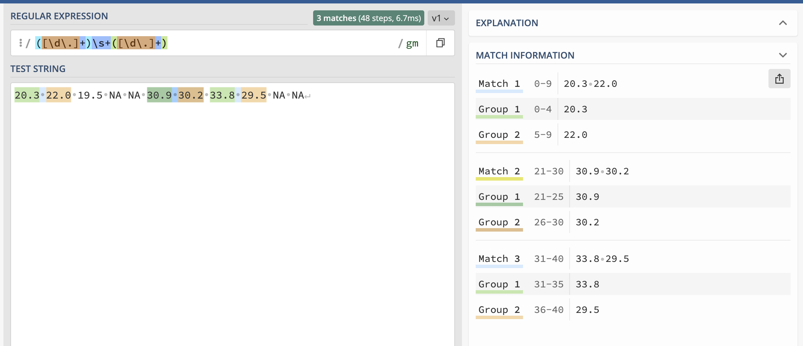
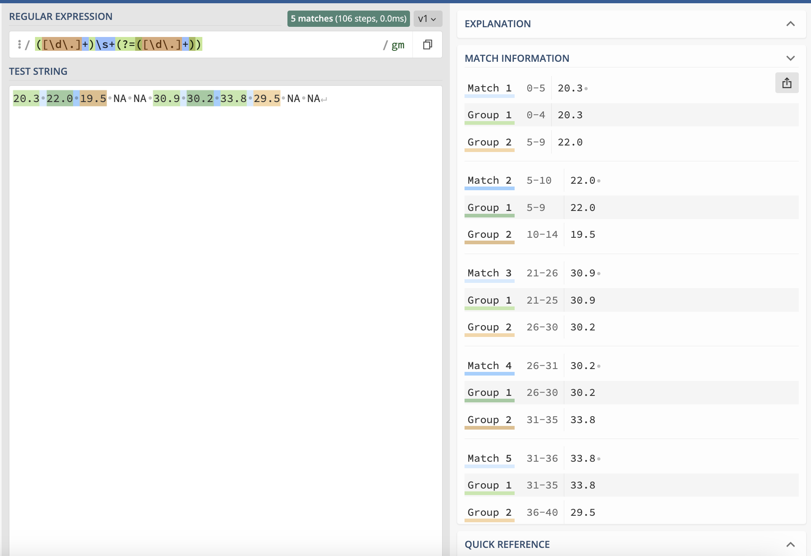

<!--

author:   Joy Payton
email:    paytonk@chop.edu
version:  1.0.0
current_version_description: Initial version
module_type: standard
docs_version: 1.0.0
language: en
narrator: US English Female
mode: Textbook

title: Regular Expressions: Lookaheads

comment:  Use regular expressions, or regex, for complex pattern matching involving lookaheads.

long_description: Learn to compose intermediate regular expressions using lookahead syntax, in order to identify text that matches patterns you describe.

estimated_time_in_minutes: 30

@pre_reqs
Learners should have some experience composing and using simple regular expressions (regex), including the use of capturing groups.  For an introduction to regular expression concepts, consider the [Demystifying Regular Expressions](https://liascript.github.io/course/?https://raw.githubusercontent.com/arcus/education_modules/main/demystifying_regular_expressions/demystifying_regular_expressions.md#1) module.  To learn how to compose and use simple regular expressions, consider the [Regular Expressions Basics](https://liascript.github.io/course/?https://raw.githubusercontent.com/arcus/education_modules/main/regular_expressions_basics/regular_expressions_basics.md#1) module. The [Regular Expressions: Groups](https://liascript.github.io/course/?https://raw.githubusercontent.com/arcus/education_modules/main/regular_expressions_groups/regular_expressions_groups.md#1) module will introduce you to capturing and non-capturing groups if those are new to you or you would like a refresher.
@end

@learning_objectives  
After completion of this module, learners will be able to:

- Explain the difference between "moving" ahead and "looking" ahead in regular expression parsing
- Explain why a "lookahead" can be useful in a regular expression

@end
good_first_module: false
coding_required: true
coding_level: intermediate
sequence_name: regex
previous_sequential_module: regular_expressions_anchors_boundaries
@sets_you_up_for

@end 
@depends_on_knowledge_available_in
- demystifying_regular_expressions
- regular_expressions_basics
- regular_expressions_groups
@end
@version_history 
No previous versions.
@end

import: https://raw.githubusercontent.com/arcus/education_modules/main/_module_templates/macros.md
import: https://github.com/arcus/education_modules/blob/warning_regex101/_module_templates/macros_regex.md
-->

# Regular Expressions: Lookaheads

@overview

## Regular Expression Refresher

A **regular expression** (also known as "regex") is a specific way to **express** a **rule** for a pattern.  Regular expressions are useful to biomedical researchers because they can allow you to find, replace, or extract text that matches patterns you define.  

A good place to practice regular expressions is an online regex testing website.  We like **Regex 101**, at https://www.regex101.com.

@regular_expression_checker_warning

Regex consists of **tokens** which represent characters that appear in a particular location, and **quantifiers**, which give the number of times a given token repeats.

- **Tokens** include `\d`, `[A-Za-z]`, `A`, and `.`

- **Quantifiers** include `*`, `{2,5}`, and `+`

Regular expressions can make use of **groups**, both **capturing** and **non-capturing**.

If this refresher doesn't seem familiar, you might want to consider reviewing [Demystifying Regular Expressions](https://liascript.github.io/course/?https://raw.githubusercontent.com/arcus/education_modules/main/demystifying_regular_expressions/demystifying_regular_expressions.md#1), [Regular Expressions Basics](https://liascript.github.io/course/?https://raw.githubusercontent.com/arcus/education_modules/main/regular_expressions_basics/regular_expressions_basics.md#1), and [Regular Expressions: Groups](https://liascript.github.io/course/?https://raw.githubusercontent.com/arcus/education_modules/main/regular_expressions_groups/regular_expressions_groups.md#1).

## Lookaheads

We consider this module to be intermediate, because it assumes basic knowledge and covers more advanced regular expressions topics, without delving into the advanced topic of using regular expressions within the context of code.  

Specifically, we'll address the topic of **lookaheads**, which are useful for situations like overlapping data.

Lookaheads
----

A regular expression engine (a program on a computer that parses and executes regular expressions) works by moving forward through text and analysing it.  You can imagine the computer as a finger tracing the text, always advancing, never moving backwards.  If we imagine the regex parser explaining how it works, it might sound like this:

> Oh, a 3?  Great! I was told to expect a number, so that matches. Let me slide my finger to the next character.  It's a space, and that works, because there was an optional space in the next part of the pattern. I'll move once more. Oh, but the next character is a letter, which I wasn't expecting.  This isn't a match.

That usually works perfectly, but there are times when the "move ahead" model can cause trouble.  Overlapping patterns is one great example.  

## A Log File Example

A sensor in your experiment stores decimal values for PM 2.5 air contamination with a decimal number for each hour.  These are all saved together in a log file that continues with reading after reading, separated by spaces.  Sometimes the sensor stores the letters `NA` instead of a number because its intake was blocked, or there was an error of some sort.  

A log file includes text like:

`20.3 22.0 19.5 NA NA 30.9 30.2 33.8 29.5 NA NA`.

In your code, you'd like to process each pair of consecutive decimal values to study rate of change, so you are using regular expressions to return consecutive pairs of decimal numbers.  You only want consecutive pairs of numbers, not any consecutive pairs that have `NA` values.

So, you'd expect five pairs:

* The pair 20.3 and 22.0
* The pair 22.0 and 19.5
* The pair 30.9 and 30.2
* The pair 30.2 and 33.8
* The pair 33.8 and 29.5

You start by writing this regular expression which uses capture groups to extract consecutive decimal numbers: `([\d\.]+)\s+([\d\.]+)`.  You [try this out in your favorite regex checker](https://regex101.com/r/pecVbn/1), and you're confused! Why do you only capture three pairs of numbers?  There should be five pairs!

 <!-- style = "border: 1px solid rgb(var(--color-highlight)); " -->

See if you can figure out why only three pairs, not all five, were found to be matches before advancing to the next page.

### Moving Ahead 

You expected to get five pairs, but you only got three:

* The pair 20.3 and 22.0 was captured
* The pair ~22.0 and 19.5~ was missed
* The pair 30.9 and 30.2 was captured
* The pair ~30.2 and 33.8~ was missed
* The pair 33.8 and 29.5 was captured

 <!-- style = "border: 1px solid rgb(var(--color-highlight)); " -->

Do you have a hypothesis as to what happened?  This is related to the default regular expression method of moving ahead instead of looking ahead.  

Let's take this text a bit at a time:

`20.3 22.0 19.5 NA NA 30.9 30.2 33.8 29.5 NA NA`.

* The regular expression engine starts by reading 2, then 0, then a decimal point, then a 3.  So far, so good, we're still in the first capturing group: `([\d\.]+)`.  
* Then it reads a space (not part of the capturing group) and realizes that the first capturing group is now filled (it's 20.3), and the regex engine is now in the next part of the pattern: `\s+`.
* Then the next things to be read are a 2, a 2, a decimal point, and a 0.  These all fall into the last part of the regular expression, the second capturing group, which is identical to the first: ([\d\.]+)
* Then, there's another space.  This indicates that the second capturing group is filled (22.0) and the pattern is complete.  Time to start over and look back at the start of the pattern!
* The regular expression checker then starts the pattern over, and keeps moving along the string until it finds the first character that fulfills what it's looking for: membership in the **first** capturing group.  That'll be the number 1, which will start to complete that first capturing group.

That is, once the regex engine has found and captured the first pair (20.3 and 22.0), it has already "moved its finger" to the space following 22.0.  That's the moment it knows it's finished the pattern of two consecutive decimals separated by a space.  If the regular expression parser could think, maybe it would sound something like this:

`20.3 22.0`` 19.5 NA NA 30.9 30.2 33.8 29.5 NA NA`

> Found it!  Found the first pair.  Will start over now, starting the pattern from the beginning. 

`19.5 NA NA` `30.9 30.2`` 33.8 29.5 NA NA`

> Hmm, 19.5 looked good for a first capture group, but it was followed by "NA", so the pattern didn't match.  Let's keep moving forward.  Oh here we go!  It looks like I found another pair!

Our engine finds another pair at 30.9 and 30.2, and captures those.  At this point, it's at the space after 30.2, and it starts over again. 

`33.8 29.5`` NA NA`

> I have another match!   

It then finds 33.8 and 29.5 as the final pair.

Unfortunately, that means we've missed out -- we would actually like to accommodate overlapping patterns.  So, 22.0 should appear twice: once as the second captured text, and once as the first captured text.  The same should be true of 30.2 and 33.8.

### Looking Ahead

Once again:

A log file includes text like:

`20.3 22.0 19.5 NA NA 30.9 30.2 33.8 29.5 NA NA`.

So, you'd expect five pairs:

* The pair 20.3 and 22.0
* The pair 22.0 and 19.5
* The pair 30.9 and 30.2
* The pair 30.2 and 33.8
* The pair 33.8 and 29.5

This overlapping pattern scenario is a case where you would like the regex engine to not **move** ahead and forgetting what it has seen earlier, but rather **look** ahead, able to maintain its place in the text.

Imagine that the regex engine moves along and finds 20.3.  Then it **keeps its place** (just as you might leave your finger at a location in a text) and doesn't move, but it "glances" ahead briefly and sees that yes, 20.3 is indeed followed by another decimal number, so this is a match.  

The computer therefore registers that pair, 20.3 and 22.0, as a pattern match, and it captures the two groups that represent the two decimal numbers.  

Once that's done, it starts moving again, to 22.0, and when it hits the space after 22.0, it again stops, and **looks** ahead, without **moving** ahead, to see 19.5.  That's our second pair of numbers, 22.0 and 19.5.  This time, 22.0 is allowed to appear in two different matches, which is what we wanted to achieve.

This continues and we manage to find all 5 pairs of consecutive numbers, even when the patterns overlap.  

The **lookahead** regular expression syntax takes the form of `(?=regex)` where `regex` is replaced with what you're looking for.  So, for example, our pattern for the second decimal number, which is currently in a capturing group and looks like: `([\d\.]+)` could be placed between `(?=` and `)`, giving us `(?=([\d\.]+))`.
Go ahead and [try that in a regex checker](https://regex101.com/r/NvzPb0/1) and you should see something like the following. 

 <!-- style = "border: 1px solid rgb(var(--color-highlight));" -->

In the image above, the overlapping color in the "Text String" box can make the visual interpretation of the image tricky.  Look over in the "Match Information" section to see all five matches!

<b style="color: rgb(var(--color-highlight));">Behind the scenes</b> 

There are other types of "lookarounds," including **lookbehinds**, that you might consider learning if you write a lot of regular expressions, but for now, the lookahead by itself will serve you well for more complex cases.

## Quiz: Lookaheads

Which of these is true about lookaheads in regular expressions?  Select all that apply!

[[ ]]  Lookaheads use the syntax `(?:)`
[[X]]  Lookaheads use the syntax `(?=)`
[[ ]]  Lookaheads use the syntax ` \w`
[[X]]  Lookaheads can be helpful when dealing with overlapping patterns
[[ ]]  Lookaheads describe special places in a string, like the very beginning or the very end.
***

The syntax `(?:)` is used for **non-capturing groups**.  You can read more about this syntax in [Regular Expressions: Groups](https://liascript.github.io/course/?https://raw.githubusercontent.com/arcus/education_modules/main/regular_expressions_groups/regular_expressions_groups.md#1).

Lookaheads use a syntax like `(?=regex)`, where the word regex is replaced by whatever regular expression you want to look ahead for.  So the second statement is correct.

The syntax ` \w` actually indicates a **word character**, like a letter, number, or underscore.  You can read more about word characters and boundaries in [Regular Expressions: Anchors and Boundaries](https://liascript.github.io/course/?https://raw.githubusercontent.com/arcus/education_modules/main/regular_expressions_anchors_boundaries/regular_expressions_anchors_boundaries.md#1).

Lookaheads are ideal for overlapping patterns, and prevent missing matches when a pattern should be applied more than once to the same text.

The word that describes special places in the string, like the very beginning or end, is **anchor**, not lookahead.  Again, if this is a new concept for you, check out [Regular Expressions: Anchors and Boundaries](https://liascript.github.io/course/?https://raw.githubusercontent.com/arcus/education_modules/main/regular_expressions_anchors_boundaries/regular_expressions_anchors_boundaries.md#1).

***

## Additional Resources

Lookaheads and Lookbehinds:

* The [Regular-Expressions.info page on lookaheads and lookbehinds](https://www.regular-expressions.info/lookaround.html) goes into detail about regex engine internals that we don't delve into here, including potential pitfalls in the use of these constructs.
* [Mastering Lookahead and Lookbehind](https://www.rexegg.com/regex-lookarounds.html) has a quick syntax cheat sheet at the top of the article and goes into another example, that of password complexity validation.
* [Regex Boundaries and Delimiters—Standard and Advanced](https://www.rexegg.com/regex-boundaries.html) uses lookaheads and lookbehinds to create what the author refers to as DIY boundaries.

Regex general cheat sheets:

* [Dave Child's cheat sheet](https://cheatography.com/davechild/cheat-sheets/regular-expressions/) is fairly comprehensive.
* [DataCamp's cheat sheet for regex](https://images.datacamp.com/image/upload/v1665049611/Marketing/Blog/Regular_Expressions_Cheat_Sheet.pdf) is another good option.

If you want to check out regular expression checkers, here are a few we like:

* [Regex 101](https://regex101.com) is the regular expressions tester used in this module.  We use it regularly, even after working with regular expressions for many years.
* [RegExr](https://regexr.com/) has helpful teaching aids, including a hover-over explainer that allows you to investigate matches, and a way to look at complex nested elements (for instance, a range of characters inside square brackets inside a capturing group) in a visual way.
* [RegEx Testing](https://www.regextester.com/) has a clean, simple interface and a library of popular regular expressions to start with. 

@regular_expression_checker_warning

For learning more about regular expressions, consider:

[Regular-Expressions.info](https://www.regular-expressions.info/) is a compact and comprehensive handbook that includes much more information than we could convey in this module. It does seem to want readers to download or buy particular products, but if you ignore that aspect, the website is quite useful. Their [quick reference](https://www.regular-expressions.info/refquick.html), for example, is great to keep nearby while writing regex!

The [Wikipedia page for regular expressions](https://en.wikipedia.org/wiki/Regular_expression) is quite good and delves into the history of regular expressions as well as some of its mathematical qualities.

## Feedback

@feedback