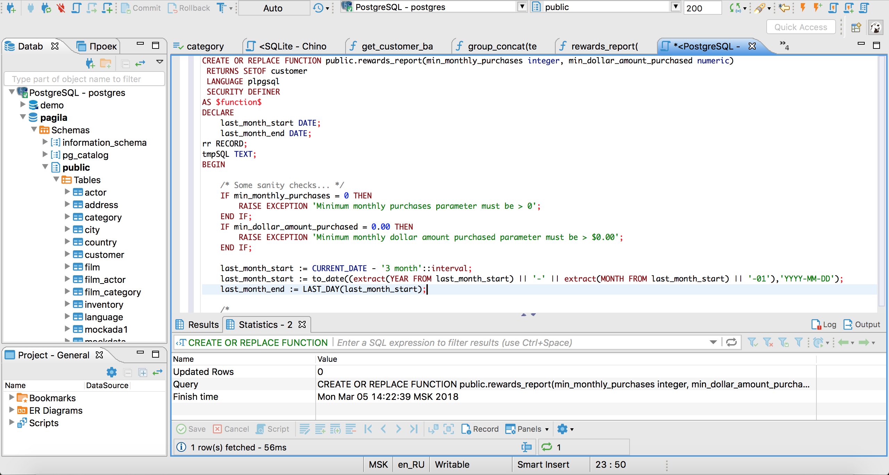

<!--
author:   Peter Camacho
email:    camachop@chop.edu
version:  1.0.1
module_template_version: 2.0.0
language: en
narrator: US English Male
code_language: SQL
topic: Learn to Code
title: SQL Basics
comment:  Structured Query Language, or SQL, is a relational database solution that has been around for decades.  Learn how to do basic SQL queries on single tables, by using code, hands-on.
long_description: Do you want to learn basic Structured Query Language (SQL) either to understand concepts or prepare for access to a relational database?  This module will give you hands on experience with simple queries using keywords including SELECT, WHERE, FROM, DISTINCT, and AS.  We'll also briefly cover working with empty (NULL) values using IS NULL and IS NOT NULL.  This module is appropriate for people who have little or no experience in SQL and are ready to practice with real queries.
estimated_time: 1 hour

@learning_objectives  

After completion of this module, learners will be able to:

- Use SELECT, FROM, and WHERE to do a basic query on a SQL table
- Use IS NULL and IS NOT NULL operators to work with empty values
- Explain the use of DISTINCT and how it can be useful
- Use AS and ORDER BY to change how query results appear
- Explain why the LIMIT keyword can be useful


@end

link:  https://chop-dbhi-arcus-education-website-assets.s3.amazonaws.com/css/styles.css

script: https://kit.fontawesome.com/83b2343bd4.js

script: https://cdn.jsdelivr.net/npm/alasql@0.6.5/dist/alasql.min.js
attribute: [AlaSQL](https://alasql.org)
           by [Andrey Gershun](agershun@gmail.com)
           & [Mathias Rangel Wulff](m@rawu.dk)
           is licensed under [MIT](https://opensource.org/licenses/MIT)

script: https://cdnjs.cloudflare.com/ajax/libs/PapaParse/4.6.1/papaparse.min.js
attribute: [PapaParse](https://www.papaparse.com)
           by [Matthew Holt](https://twitter.com/mholt6)
           is licensed under [MIT](https://opensource.org/licenses/MIT)

script: https://cdnjs.cloudflare.com/ajax/libs/jquery/3.6.0/jquery.min.js
attribute: [jQuery](https://jquery.com/)
           is licensed under [OpenJS Foundation](https://openjsf.org/)

@AlaSQL.eval
<script>
//////////////////////////////////////////////////////////////////////////////////////////////////////////////////////////////
// BUILD FUNCTIONS
//////////////////////////////////////////////////////////////////////////////////////////////////////////////////////////////

function buildHtmlTable() {
  // Builds the HTML Table out of myList, and writes output to the id attribute assigned via the "@0" argument to this marco.
  var columns = addAllColumnHeaders(myList);
  for (var i = 0 ; i < myList.length ; i++) {
    var row$ = $('<tr/>');
    for (var colIndex = 0 ; colIndex < columns.length ; colIndex++) {
      var cellValue = myList[i][columns[colIndex]];
      if (cellValue == null) { cellValue = ""; }
      row$.append($('<td/>').html(cellValue).css({
      "padding-left": "1em",
      "padding-right": "1em"
      }));
    }
    $(@0).append(row$);
  }
  try { // Error Handling for no null.
    var rowCount = document.getElementById(@0.substring(1)).rows.length - 1;
  } catch(err) {
    var cnt = 0
  }
  if (rowCount > 0) {
    var complete_message = "Query Execution Complete! (See Result Set Below)..."
  } else {
    var complete_message = "No Data to Return.."
  }
  return JSON.stringify(complete_message, null, 3);
}
function addAllColumnHeaders(myList) {
  // Creates and Returns Header Row From Array Data Provided as Input.
  var columnSet = [];
  var headerTr$ = $('<tr/>');
  for (var i = 0 ; i < myList.length ; i++) {
    var rowHash = myList[i];
    for (var key in rowHash) {
      if ($.inArray(key, columnSet) == -1){
        columnSet.push(key);
        headerTr$.append($('<th/>').html(key));
      }
    }
  }
  $(@0).append(headerTr$);
  return columnSet;
}
//////////////////////////////////////////////////////////////////////////////////////////////////////////////////////////////
//
//////////////////////////////////////////////////////////////////////////////////////////////////////////////////////////////
try {
    var myinput=`@input`
    myinput=myinput.replace(/;/, ""); // remove all semi-colon
    var myStriptArray= myinput.split(';');
    var arrayLength = myStriptArray.length;
    console.clear();
    for (var i = 0; i < arrayLength; i++) {
        if((myStriptArray[i].trim()).length != 0) { // ignore blank queries.
            var myList=alasql(myStriptArray[i]);
        }
        if (myList != 1  & ((myStriptArray[i].trim()).length) != 0) { // If data is returned, format output as table.
            $(@0).html(""); // clear out existing data
            buildHtmlTable();
        } else {
            $(@0).html(""); // clear out existing data
            JSON.stringify("No Data to Return..", null, 3);
        }
    }
} catch(e) {
  let error = new LiaError(e.message, 1);
  try {
    let log = e.message.match(/.*line (\d):.*\n.*\n.*\n(.*)/);
    error.add_detail(0, e.name+": "+log[2], "error", log[1] -1 , 0);
  } catch(e) {
  }
  throw error;
}
</script>
@end

@AlaSQL.buildTable_patients
<script>
    alasql("DROP TABLE IF EXISTS patients;");
    alasql("create table patients (id text,birthdate date,deathdate date,ssn text,drivers text,passport text,prefix text,first text,last text,suffix text,maiden text,marital text,race text,ethnicity text,sex text,birthplace text,address text,city text,state text,county text,zip text,lat real,lon real, expenses real, coverage real);");
    alasql("INSERT INTO patients VALUES ('03963166-b49f-4440-a80d-30abb90b4a78', '1979-08-19', 'NA', '999-53-2391', 'S99976779', 'X57420256X', 'Mr.', 'Jacob959', 'Daniel959', 'NA', 'NA', 'M', 'white', 'nonhispanic', 'M', 'Danvers  Massachusetts  US', '699 Ankunding Run Apt 36', 'Norwood', 'Massachusetts', 'Norfolk County', '02062', '42.1716590630744', '-71.2263318929621', '125695.89', '4242.12');");
alasql("INSERT INTO patients VALUES ('0982ef39-7ff9-4c24-8239-e9fc0667e8ca', '1998-12-14', 'NA', '999-87-3074', 'S99917986', 'X72211827X', 'Ms.', 'Stasia733', 'Kirlin939', 'NA', 'NA', 'NA', 'other', 'nonhispanic', 'F', 'Lynn  Massachusetts  US', '958 Robel Run Unit 83', 'Carver', 'Massachusetts', 'Plymouth County', 'NA', '41.9005925642133', '-70.7320231895707', '37492.08', '444.96');");
alasql("INSERT INTO patients VALUES ('1474f954-3781-4de1-9d5d-27a2b8688419', '1994-02-25', 'NA', '999-61-4523', 'S99953247', 'X66416063X', 'Ms.', 'Tamisha203', 'Considine820', 'NA', 'NA', 'NA', 'white', 'nonhispanic', 'F', 'Worcester  Massachusetts  US', '589 McLaughlin Route Apt 69', 'Wareham', 'Massachusetts', 'Plymouth County', 'NA', '41.7607992858186', '-70.7511725489897', '84681.47', '9639.33');");
alasql("INSERT INTO patients VALUES ('29fc389e-f454-4907-8fa5-987f312cc32a', '1982-03-07', 'NA', '999-59-4905', 'S99924114', 'X76526910X', 'Mr.', 'Eusebio566', 'Cremin516', 'NA', 'NA', 'M', 'white', 'hispanic', 'M', 'Woburn  Massachusetts  US', '915 Legros Neck Apt 5', 'Lynn', 'Massachusetts', 'Essex County', '01905', '42.4827539638704', '-70.8578543300735', '791005.88', '4364.56');");
alasql("INSERT INTO patients VALUES ('2abf5d21-8d0f-4263-b720-81d9d25f7a70', '1991-06-20', 'NA', '999-49-8301', 'S99922026', 'X65406262X', 'Mr.', 'Abram53', 'Schinner682', 'NA', 'NA', 'M', 'black', 'nonhispanic', 'M', 'Franklin  Massachusetts  US', '1071 Bahringer Park', 'Mansfield', 'Massachusetts', 'Bristol County', 'NA', '42.0170083027574', '-71.2201039521409', '667979.05', '3695.48');");
alasql("INSERT INTO patients VALUES ('344de08b-bae0-4d79-b89e-a2b6204e1a21', '1941-02-14', '1958-01-03', '999-43-4878', 'S99994390', 'NA', 'NA', 'Sibyl335', 'Zulauf375', 'NA', 'NA', 'NA', 'black', 'nonhispanic', 'F', 'Southbridge  Massachusetts  US', '449 Shields Extension Unit 55', 'Hanover', 'Massachusetts', 'Plymouth County', 'NA', '42.0829961514318', '-70.8269756491514', '449896.36', '1854');");
alasql("INSERT INTO patients VALUES ('4a50c62e-24ba-459b-993c-0959691cf96d', '1947-07-12', '1989-11-25', '999-13-8181', 'S99993186', 'X9890795X', 'Mrs.', 'Kristeen693', 'Cole117', 'NA', 'Konopelski743', 'M', 'asian', 'nonhispanic', 'F', 'Hong Kong  Hong Kong Special Administrative Region  CN', '1070 Bartoletti Neck', 'Peabody', 'Massachusetts', 'Essex County', 'NA', '42.4942259149787', '-71.0785466574374', '848337.83', '5741.8');");
alasql("INSERT INTO patients VALUES ('50ee80ee-bce0-4794-87f6-d0fb74a88f8a', '1997-10-15', 'NA', '999-42-6450', 'S99964529', 'X81391446X', 'Mr.', 'Esteban536', 'Sierra982', 'NA', 'NA', 'NA', 'black', 'nonhispanic', 'M', 'Carolina  Puerto Rico  PR', '677 Hoppe Rapid', 'Boston', 'Massachusetts', 'Suffolk County', '02134', '42.3620775494977', '-71.0746898287342', '519266.17', '3938');");
alasql("INSERT INTO patients VALUES ('55506d51-2c6a-4608-aae3-7cb2f111c926', '1941-06-14', 'NA', '999-49-7097', 'S99984057', 'X2961509X', 'Ms.', 'Rosalind66', 'Torp761', 'NA', 'NA', 'S', 'white', 'nonhispanic', 'F', 'Ludlow  Massachusetts  US', '1000 Runolfsdottir Extension', 'Lowell', 'Massachusetts', 'Middlesex County', '01851', '42.6514751630267', '-71.318674676214', '1716727.06', '7784.36');");
alasql("INSERT INTO patients VALUES ('5b891358-1bb3-4bbf-b8a6-a73fbe58efe7', '1962-12-21', 'NA', '999-58-8644', 'S99992512', 'X35458892X', 'Ms.', 'Rene434', 'Schinner682', 'NA', 'NA', 'S', 'black', 'nonhispanic', 'F', 'Lowell  Massachusetts  US', '604 Sipes Divide Unit 0', 'Boston', 'Massachusetts', 'Suffolk County', '02136', '42.2380394989987', '-71.1400184488966', '1116196.22', '3667.92');");
alasql("INSERT INTO patients VALUES ('6e20fc08-a75d-43db-b642-4f15064aeb0d', '2016-11-21', 'NA', '999-91-7902', 'NA', 'NA', 'NA', 'Cathie710', 'Beatty507', 'NA', 'NA', 'NA', 'black', 'nonhispanic', 'F', 'Marblehead  Massachusetts  US', '227 Rippin Vista', 'Walpole', 'Massachusetts', 'Norfolk County', '02081', '42.1276179917707', '-71.2445777349412', '94888.09', '1549.92');");
alasql("INSERT INTO patients VALUES ('7f9a57e5-cfc5-4970-b19f-1a7b6ce22882', '1971-09-11', 'NA', '999-59-9011', 'S99961342', 'X35775930X', 'Mrs.', 'Emilie407', 'Bednar518', 'NA', 'Keeling57', 'M', 'asian', 'nonhispanic', 'F', 'Hanoi  Hà Đông  VN', '846 Marvin Approach Unit 12', 'Lowell', 'Massachusetts', 'Middlesex County', '01854', '42.6747573365128', '-71.2862778307696', '1148999.04', '5613.64');");
alasql("INSERT INTO patients VALUES ('88ea8573-863c-47e3-b144-b810c63156a0', '1962-10-25', 'NA', '999-64-2812', 'S99970548', 'X27386052X', 'Mrs.', 'Mayte822', 'Candelaria844', 'NA', 'Hernandes724', 'M', 'other', 'hispanic', 'F', 'Santo Domingo  National District  DO', '222 Weimann Parade Apt 21', 'Billerica', 'Massachusetts', 'Middlesex County', 'NA', '42.5605178544939', '-71.2305090816335', '1198802.9', '49212.96');");
alasql("INSERT INTO patients VALUES ('8d236c5c-485e-4030-b3e8-20e580afbb0a', '2010-03-11', 'NA', '999-37-4171', 'NA', 'NA', 'NA', 'Donn979', 'Casper496', 'NA', 'NA', 'NA', 'asian', 'nonhispanic', 'M', 'Westford  Massachusetts  US', '330 Hermiston Trafficway', 'Westborough', 'Massachusetts', 'Worcester County', 'NA', '42.3146913804637', '-71.6092388699133', '232331.46', '2698.17');");
alasql("INSERT INTO patients VALUES ('99b1c709-00fc-4be2-97ba-a6222e567305', '1992-10-05', 'NA', '999-72-9974', 'S99975875', 'X37620710X', 'Mr.', 'Forrest301', 'Jacobs452', 'NA', 'NA', 'M', 'white', 'hispanic', 'M', 'Wrentham  Massachusetts  US', '722 Ullrich Promenade', 'Everett', 'Massachusetts', 'Middlesex County', '02148', '42.4779060051335', '-71.0204050464474', '733205.81', '2664.8');");
alasql("INSERT INTO patients VALUES ('ab88386a-1c0d-4d1c-89fc-b38f631b3edc', '1990-01-25', 'NA', '999-85-3833', 'S99935526', 'X74358200X', 'Mrs.', 'Oda116', 'Willms744', 'NA', 'Dietrich576', 'M', 'white', 'nonhispanic', 'F', 'Acushnet  Massachusetts  US', '158 Rempel Drive', 'Wareham', 'Massachusetts', 'Plymouth County', 'NA', '41.7864240325723', '-70.7434572830845', '753274.93', '4847.99');");
alasql("INSERT INTO patients VALUES ('b1d50391-79c5-403c-919f-3ded66c9d77a', '1959-09-01', 'NA', '999-96-8597', 'S99987915', 'X27141234X', 'Mrs.', 'Gertie348', 'Runolfsson901', 'NA', 'Nolan344', 'M', 'black', 'hispanic', 'F', 'Westborough  Massachusetts  US', '361 Haag Boulevard Unit 0', 'Springfield', 'Massachusetts', 'Hampden County', 'NA', '42.134943625397', '-72.601106133145', '1308480.38', '13897.55');");
alasql("INSERT INTO patients VALUES ('ca24f616-30cc-4351-aca9-1b49297de076', '1942-05-23', '2001-02-10', '999-61-4406', 'S99934749', 'X55713048X', 'Mr.', 'Filiberto722', 'Adams676', 'NA', 'NA', 'M', 'native', 'nonhispanic', 'M', 'Boston  Massachusetts  US', '673 Pagac Esplanade Apt 20', 'Chatham', 'Massachusetts', 'Barnstable County', '02633', '41.6887565172739', '-69.9407634414895', '198943.29', '51847.26');");
alasql("INSERT INTO patients VALUES ('cafc2141-2307-4f62-abd1-2d6e5486d7a5', '1942-05-23', '2011-12-14', '999-68-4539', 'S99979088', 'X14233432X', 'Mr.', 'Alonso270', 'Gerhold939', 'NA', 'NA', 'M', 'native', 'nonhispanic', 'M', 'West Springfield  Massachusetts  US', '260 Effertz Hollow', 'Chatham', 'Massachusetts', 'Barnstable County', '02633', '41.6313534346182', '-70.0176252634712', '236803.89', '34294.4');");
alasql("INSERT INTO patients VALUES ('d286528e-a39a-4c04-8545-5e648f781052', '1974-04-25', 'NA', '999-72-6418', 'S99924001', 'X17879337X', 'Mrs.', 'Scottie437', 'Koss676', 'NA', 'Witting912', 'M', 'black', 'nonhispanic', 'F', 'Worcester  Massachusetts  US', '474 Hettinger Arcade', 'Hamilton', 'Massachusetts', 'Essex County', 'NA', '42.605565952088', '-70.8917039273168', '890218.58', '7506.68');");
alasql("INSERT INTO patients VALUES ('dcda9f18-59eb-402e-985b-f13c15c2131c', '2012-12-19', 'NA', '999-10-6031', 'NA', 'NA', 'NA', 'Colby655', 'Gleichner915', 'NA', 'NA', 'NA', 'white', 'nonhispanic', 'M', 'Peabody  Massachusetts  US', '408 Dicki Corner Unit 82', 'Everett', 'Massachusetts', 'Middlesex County', '02148', '42.4043223426552', '-71.0735281194192', '197008.18', '2066.56');");
alasql("INSERT INTO patients VALUES ('e175908a-09db-4730-a311-4e57ba73438b', '2009-05-07', 'NA', '999-19-6600', 'NA', 'NA', 'NA', 'Eveline832', 'Wintheiser220', 'NA', 'NA', 'NA', 'black', 'hispanic', 'F', 'Sandwich  Massachusetts  US', '895 MacGyver Skyway', 'Chicopee', 'Massachusetts', 'Hampden County', '01020', '42.1834548010167', '-72.5016471115102', '26070.08', '645.8');");
alasql("INSERT INTO patients VALUES ('e974e5c3-9b22-41f2-b3a3-c12848f29a73', '1922-02-14', '2016-04-17', '999-40-9174', 'S99950579', 'X27596354X', 'Mrs.', 'Ramona980', 'Alcaraz418', 'NA', 'Vázquez552', 'M', 'asian', 'hispanic', 'F', 'Port-au-Prince  Haiti  HT', '932 Hoppe Camp Unit 1', 'Cambridge', 'Massachusetts', 'Middlesex County', '02140', '42.32956821377', '-71.0655750714097', '1399151.49', '28678.46');");
alasql("INSERT INTO patients VALUES ('ed6fb8d6-c14d-4e34-a029-2dab33855ddd', '1973-06-10', 'NA', '999-41-4345', 'S99931849', 'X85490024X', 'Mrs.', 'Sara501', 'Arreola736', 'NA', 'Medina536', 'M', 'native', 'hispanic', 'F', 'Caguas  Puerto Rico  PR', '313 Gulgowski Plaza Unit 81', 'Peabody', 'Massachusetts', 'Essex County', 'NA', '42.5629355117525', '-71.017704116768', '155686.2', '20059.08');");
alasql("INSERT INTO patients VALUES ('fcc61454-1b07-4e49-a25b-29e5064e0063', '1966-07-06', 'NA', '999-87-1534', 'S99948423', 'X7514421X', 'Mr.', 'Patrick786', 'Farrell962', 'NA', 'NA', 'M', 'asian', 'nonhispanic', 'M', 'Hanoi  Hà Đông  VN', '341 Homenick Trailer Suite 77', 'Marlborough', 'Massachusetts', 'Middlesex County', '01752', '42.3590769360988', '-71.5160843735423', '1392358.66', '5569.53');");
</script>
@end

@AlaSQL.buildTable_allergies
<script>
    alasql("DROP TABLE IF EXISTS allergies;");
    alasql("create table allergies (start date,stop date,patient text,encounter text,description text);");
    alasql("INSERT INTO allergies VALUES ('2002-01-24',null,'bf35e4fa-ea4f-40a4-8fe6-1f2f26e0aa45','a61f97fa-70c3-4366-90e1-7c6fdcba5cbb','Latex allergy');");
    alasql("INSERT INTO allergies VALUES ('2002-01-24',null,'bf35e4fa-ea4f-40a4-8fe6-1f2f26e0aa45','a61f97fa-70c3-4366-90e1-7c6fdcba5cbb','Allergy to mould');");
    alasql("INSERT INTO allergies VALUES ('2002-01-24',null,'bf35e4fa-ea4f-40a4-8fe6-1f2f26e0aa45','a61f97fa-70c3-4366-90e1-7c6fdcba5cbb','House dust mite allergy');");
    alasql("INSERT INTO allergies VALUES ('2002-01-24',null,'bf35e4fa-ea4f-40a4-8fe6-1f2f26e0aa45','a61f97fa-70c3-4366-90e1-7c6fdcba5cbb','Dander (animal) allergy');");
    alasql("INSERT INTO allergies VALUES ('2002-01-24',null,'bf35e4fa-ea4f-40a4-8fe6-1f2f26e0aa45','a61f97fa-70c3-4366-90e1-7c6fdcba5cbb','Allergy to grass pollen');");
    alasql("INSERT INTO allergies VALUES ('2002-01-24',null,'bf35e4fa-ea4f-40a4-8fe6-1f2f26e0aa45','a61f97fa-70c3-4366-90e1-7c6fdcba5cbb','Allergy to tree pollen');");
    alasql("INSERT INTO allergies VALUES ('2002-01-24',null,'bf35e4fa-ea4f-40a4-8fe6-1f2f26e0aa45','a61f97fa-70c3-4366-90e1-7c6fdcba5cbb','Allergy to wheat');");
    alasql("INSERT INTO allergies VALUES ('2002-01-24',null,'bf35e4fa-ea4f-40a4-8fe6-1f2f26e0aa45','a61f97fa-70c3-4366-90e1-7c6fdcba5cbb','Shellfish allergy');");
    alasql("INSERT INTO allergies VALUES ('2002-01-24',null,'bf35e4fa-ea4f-40a4-8fe6-1f2f26e0aa45','a61f97fa-70c3-4366-90e1-7c6fdcba5cbb','Allergy to fish');");
    alasql("INSERT INTO allergies VALUES ('2002-01-24',null,'bf35e4fa-ea4f-40a4-8fe6-1f2f26e0aa45','a61f97fa-70c3-4366-90e1-7c6fdcba5cbb','Allergy to peanuts');");
    alasql("INSERT INTO allergies VALUES ('2014-12-04',null,'e3af2463-f4c9-4dbb-a8d2-d6a08c5b1460','469fbd8a-ec48-4da9-9165-027144ccf9a0','Latex allergy');");
    alasql("INSERT INTO allergies VALUES ('2014-12-04',null,'e3af2463-f4c9-4dbb-a8d2-d6a08c5b1460','469fbd8a-ec48-4da9-9165-027144ccf9a0','Allergy to mould');");
    alasql("INSERT INTO allergies VALUES ('2014-12-04',null,'e3af2463-f4c9-4dbb-a8d2-d6a08c5b1460','469fbd8a-ec48-4da9-9165-027144ccf9a0','House dust mite allergy');");
    alasql("INSERT INTO allergies VALUES ('2014-12-04',null,'e3af2463-f4c9-4dbb-a8d2-d6a08c5b1460','469fbd8a-ec48-4da9-9165-027144ccf9a0','Dander (animal) allergy');");
    alasql("INSERT INTO allergies VALUES ('2014-12-04',null,'e3af2463-f4c9-4dbb-a8d2-d6a08c5b1460','469fbd8a-ec48-4da9-9165-027144ccf9a0','Allergy to grass pollen');");
    alasql("INSERT INTO allergies VALUES ('2014-12-04',null,'e3af2463-f4c9-4dbb-a8d2-d6a08c5b1460','469fbd8a-ec48-4da9-9165-027144ccf9a0','Allergy to tree pollen');");
    alasql("INSERT INTO allergies VALUES ('2014-12-04',null,'e3af2463-f4c9-4dbb-a8d2-d6a08c5b1460','469fbd8a-ec48-4da9-9165-027144ccf9a0','Allergy to wheat');");
    alasql("INSERT INTO allergies VALUES ('2014-12-04',null,'e3af2463-f4c9-4dbb-a8d2-d6a08c5b1460','469fbd8a-ec48-4da9-9165-027144ccf9a0','Allergy to fish');");
    alasql("INSERT INTO allergies VALUES ('2014-12-04',null,'e3af2463-f4c9-4dbb-a8d2-d6a08c5b1460','469fbd8a-ec48-4da9-9165-027144ccf9a0','Allergy to peanuts');");
    alasql("INSERT INTO allergies VALUES ('1998-07-19','2014-03-20','e061409e-4b85-4ec1-b1f7-02677d51f763','022ad487-e41c-43ba-90f3-eb2d6711f4d3','Allergy to mould');");
    alasql("INSERT INTO allergies VALUES ('1998-07-19','2014-03-20','e061409e-4b85-4ec1-b1f7-02677d51f763','022ad487-e41c-43ba-90f3-eb2d6711f4d3','Dander (animal) allergy');");
    alasql("INSERT INTO allergies VALUES ('1998-07-19',null,'e061409e-4b85-4ec1-b1f7-02677d51f763','022ad487-e41c-43ba-90f3-eb2d6711f4d3','Allergy to grass pollen');");
    alasql("INSERT INTO allergies VALUES ('1998-07-19',null,'e061409e-4b85-4ec1-b1f7-02677d51f763','022ad487-e41c-43ba-90f3-eb2d6711f4d3','Allergy to peanuts');");
    alasql("INSERT INTO allergies VALUES ('1974-05-17',null,'71e13815-55fb-4734-bcac-6079160d82a0','9607667e-4c98-4087-9c59-0fd5b6331078','Allergy to tree pollen');");
    alasql("INSERT INTO allergies VALUES ('1974-05-17',null,'71e13815-55fb-4734-bcac-6079160d82a0','9607667e-4c98-4087-9c59-0fd5b6331078','Allergy to fish');");
    alasql("INSERT INTO allergies VALUES ('1974-05-17',null,'71e13815-55fb-4734-bcac-6079160d82a0','9607667e-4c98-4087-9c59-0fd5b6331078','Allergy to peanuts');");
    alasql("INSERT INTO allergies VALUES ('2004-07-03',null,'ca3330c5-bbbc-47e7-addb-302f2e069986','d8f2b92b-5971-455f-a0b9-99da66d03899','Allergy to bee venom');");
    alasql("INSERT INTO allergies VALUES ('2004-07-03','2019-12-30','ca3330c5-bbbc-47e7-addb-302f2e069986','d8f2b92b-5971-455f-a0b9-99da66d03899','Allergy to mould');");
    alasql("INSERT INTO allergies VALUES ('2004-07-03',null,'ca3330c5-bbbc-47e7-addb-302f2e069986','d8f2b92b-5971-455f-a0b9-99da66d03899','House dust mite allergy');");
    alasql("INSERT INTO allergies VALUES ('2004-07-03',null,'ca3330c5-bbbc-47e7-addb-302f2e069986','d8f2b92b-5971-455f-a0b9-99da66d03899','Dander (animal) allergy');");
    alasql("INSERT INTO allergies VALUES ('2004-07-03',null,'ca3330c5-bbbc-47e7-addb-302f2e069986','d8f2b92b-5971-455f-a0b9-99da66d03899','Allergy to tree pollen');");
    alasql("INSERT INTO allergies VALUES ('2004-07-03',null,'ca3330c5-bbbc-47e7-addb-302f2e069986','d8f2b92b-5971-455f-a0b9-99da66d03899','Allergy to dairy product');");
    alasql("INSERT INTO allergies VALUES ('2004-07-03',null,'ca3330c5-bbbc-47e7-addb-302f2e069986','d8f2b92b-5971-455f-a0b9-99da66d03899','Allergy to nut');");
    alasql("INSERT INTO allergies VALUES ('2004-07-03',null,'ca3330c5-bbbc-47e7-addb-302f2e069986','d8f2b92b-5971-455f-a0b9-99da66d03899','Allergy to peanuts');");
    alasql("INSERT INTO allergies VALUES ('1978-11-04',null,'24bca5cf-ba55-457f-8e80-49690202443c','1d475126-f3c0-41c9-a9ed-f4a0c9a955c4','Allergy to mould');");
    alasql("INSERT INTO allergies VALUES ('1978-11-04',null,'24bca5cf-ba55-457f-8e80-49690202443c','1d475126-f3c0-41c9-a9ed-f4a0c9a955c4','Dander (animal) allergy');");
    alasql("INSERT INTO allergies VALUES ('1978-11-04',null,'24bca5cf-ba55-457f-8e80-49690202443c','1d475126-f3c0-41c9-a9ed-f4a0c9a955c4','Allergy to fish');");
    alasql("INSERT INTO allergies VALUES ('1978-11-04',null,'24bca5cf-ba55-457f-8e80-49690202443c','1d475126-f3c0-41c9-a9ed-f4a0c9a955c4','Allergy to peanuts');");
    alasql("INSERT INTO allergies VALUES ('2018-03-20',null,'841095eb-d29f-4492-8f0e-08011321e85d','32622f63-734e-4433-8628-942ce1585e6a','Allergy to mould');");
    alasql("INSERT INTO allergies VALUES ('2018-03-20',null,'841095eb-d29f-4492-8f0e-08011321e85d','32622f63-734e-4433-8628-942ce1585e6a','House dust mite allergy');");
    alasql("INSERT INTO allergies VALUES ('2018-03-20',null,'841095eb-d29f-4492-8f0e-08011321e85d','32622f63-734e-4433-8628-942ce1585e6a','Dander (animal) allergy');");
    alasql("INSERT INTO allergies VALUES ('2018-03-20',null,'841095eb-d29f-4492-8f0e-08011321e85d','32622f63-734e-4433-8628-942ce1585e6a','Allergy to grass pollen');");
    alasql("INSERT INTO allergies VALUES ('2018-03-20',null,'841095eb-d29f-4492-8f0e-08011321e85d','32622f63-734e-4433-8628-942ce1585e6a','Allergy to tree pollen');");
    alasql("INSERT INTO allergies VALUES ('2018-03-20',null,'841095eb-d29f-4492-8f0e-08011321e85d','32622f63-734e-4433-8628-942ce1585e6a','Shellfish allergy');");
    alasql("INSERT INTO allergies VALUES ('2018-03-20',null,'841095eb-d29f-4492-8f0e-08011321e85d','32622f63-734e-4433-8628-942ce1585e6a','Allergy to nut');");
    alasql("INSERT INTO allergies VALUES ('2018-03-20',null,'841095eb-d29f-4492-8f0e-08011321e85d','32622f63-734e-4433-8628-942ce1585e6a','Allergy to peanuts');");
    alasql("INSERT INTO allergies VALUES ('1951-04-21',null,'ee7f6c74-a8ed-4147-b8e2-4879c8657b0f','0b7d2e65-a9df-4b74-84ed-25feffc23f62','Allergy to bee venom');");
    alasql("INSERT INTO allergies VALUES ('1951-04-21',null,'ee7f6c74-a8ed-4147-b8e2-4879c8657b0f','0b7d2e65-a9df-4b74-84ed-25feffc23f62','Allergy to peanuts');");
    alasql("INSERT INTO allergies VALUES ('1971-03-07',null,'ab6a2662-f6d1-4da6-b3ce-3929d68650d7','603a0692-9302-459a-84b4-af631dc3aee8','Allergy to bee venom');");
    alasql("INSERT INTO allergies VALUES ('1971-03-07',null,'ab6a2662-f6d1-4da6-b3ce-3929d68650d7','603a0692-9302-459a-84b4-af631dc3aee8','Allergy to fish');");
    alasql("INSERT INTO allergies VALUES ('1971-03-07',null,'ab6a2662-f6d1-4da6-b3ce-3929d68650d7','603a0692-9302-459a-84b4-af631dc3aee8','Allergy to nut');");
    alasql("INSERT INTO allergies VALUES ('1971-03-07',null,'ab6a2662-f6d1-4da6-b3ce-3929d68650d7','603a0692-9302-459a-84b4-af631dc3aee8','Allergy to peanuts');");
    alasql("INSERT INTO allergies VALUES ('2002-05-31',null,'4440ff11-69ec-440b-a2bd-dc1c14105e8e','38de2a79-6bea-438e-963f-804823c1e32d','Allergy to mould');");
    alasql("INSERT INTO allergies VALUES ('2002-05-31',null,'4440ff11-69ec-440b-a2bd-dc1c14105e8e','38de2a79-6bea-438e-963f-804823c1e32d','House dust mite allergy');");
    alasql("INSERT INTO allergies VALUES ('2002-05-31',null,'4440ff11-69ec-440b-a2bd-dc1c14105e8e','38de2a79-6bea-438e-963f-804823c1e32d','Dander (animal) allergy');");
    alasql("INSERT INTO allergies VALUES ('2002-05-31',null,'4440ff11-69ec-440b-a2bd-dc1c14105e8e','38de2a79-6bea-438e-963f-804823c1e32d','Allergy to grass pollen');");
    alasql("INSERT INTO allergies VALUES ('2002-05-31',null,'4440ff11-69ec-440b-a2bd-dc1c14105e8e','38de2a79-6bea-438e-963f-804823c1e32d','Allergy to tree pollen');");
    alasql("INSERT INTO allergies VALUES ('2002-05-31','2020-03-21','4440ff11-69ec-440b-a2bd-dc1c14105e8e','38de2a79-6bea-438e-963f-804823c1e32d','Allergy to eggs');");
    alasql("INSERT INTO allergies VALUES ('2002-05-31','2020-03-21','4440ff11-69ec-440b-a2bd-dc1c14105e8e','38de2a79-6bea-438e-963f-804823c1e32d','Allergy to wheat');");
    alasql("INSERT INTO allergies VALUES ('2002-05-31',null,'4440ff11-69ec-440b-a2bd-dc1c14105e8e','38de2a79-6bea-438e-963f-804823c1e32d','Allergy to peanuts');");
    alasql("INSERT INTO allergies VALUES ('1994-05-12','2011-02-03','1aa71b23-790e-4d22-92da-c689682c8993','228c992b-3877-454c-920d-fa629bb8c5d9','Latex allergy');");
    alasql("INSERT INTO allergies VALUES ('1994-05-12',null,'1aa71b23-790e-4d22-92da-c689682c8993','228c992b-3877-454c-920d-fa629bb8c5d9','Allergy to nut');");
    alasql("INSERT INTO allergies VALUES ('1994-05-12',null,'1aa71b23-790e-4d22-92da-c689682c8993','228c992b-3877-454c-920d-fa629bb8c5d9','Allergy to peanuts');");
    alasql("INSERT INTO allergies VALUES ('1950-01-07',null,'848e0227-5d5d-4bdf-8603-207cdea72e2a','77427b07-f03b-49bc-9556-d69b4feed7ef','Allergy to mould');");
    alasql("INSERT INTO allergies VALUES ('1950-01-07',null,'848e0227-5d5d-4bdf-8603-207cdea72e2a','77427b07-f03b-49bc-9556-d69b4feed7ef','House dust mite allergy');");
    alasql("INSERT INTO allergies VALUES ('1950-01-07',null,'848e0227-5d5d-4bdf-8603-207cdea72e2a','77427b07-f03b-49bc-9556-d69b4feed7ef','Dander (animal) allergy');");
    alasql("INSERT INTO allergies VALUES ('1950-01-07',null,'848e0227-5d5d-4bdf-8603-207cdea72e2a','77427b07-f03b-49bc-9556-d69b4feed7ef','Allergy to tree pollen');");
    alasql("INSERT INTO allergies VALUES ('1950-01-07',null,'848e0227-5d5d-4bdf-8603-207cdea72e2a','77427b07-f03b-49bc-9556-d69b4feed7ef','Allergy to soya');");
    alasql("INSERT INTO allergies VALUES ('1950-01-07',null,'848e0227-5d5d-4bdf-8603-207cdea72e2a','77427b07-f03b-49bc-9556-d69b4feed7ef','Allergy to peanuts');");
    alasql("INSERT INTO allergies VALUES ('2004-12-06',null,'eafd1fd3-3778-423a-ba79-4584bd310eb4','36279aee-15ff-48ad-a4a6-8ba334466278','Allergy to peanuts');");
    alasql("INSERT INTO allergies VALUES ('1952-03-10',null,'0288abb6-633c-40c3-ba0c-66c7d957727e','a64c55df-b288-4f78-9996-d2ecf0b65c9d','Allergy to mould');");
    alasql("INSERT INTO allergies VALUES ('1952-03-10',null,'0288abb6-633c-40c3-ba0c-66c7d957727e','a64c55df-b288-4f78-9996-d2ecf0b65c9d','House dust mite allergy');");
    alasql("INSERT INTO allergies VALUES ('1952-03-10',null,'0288abb6-633c-40c3-ba0c-66c7d957727e','a64c55df-b288-4f78-9996-d2ecf0b65c9d','Dander (animal) allergy');");
    alasql("INSERT INTO allergies VALUES ('1952-03-10',null,'0288abb6-633c-40c3-ba0c-66c7d957727e','a64c55df-b288-4f78-9996-d2ecf0b65c9d','Allergy to grass pollen');");
    alasql("INSERT INTO allergies VALUES ('1952-03-10',null,'0288abb6-633c-40c3-ba0c-66c7d957727e','a64c55df-b288-4f78-9996-d2ecf0b65c9d','Allergy to peanuts');");
    alasql("INSERT INTO allergies VALUES ('2004-04-26','2019-12-25','097079b1-ff8f-4ee0-8ce3-0ea744ecfa21','9c3c633f-c33c-426c-b771-b6117ba7d6fc','Allergy to mould');");
    alasql("INSERT INTO allergies VALUES ('2004-04-26',null,'097079b1-ff8f-4ee0-8ce3-0ea744ecfa21','9c3c633f-c33c-426c-b771-b6117ba7d6fc','Dander (animal) allergy');");
    alasql("INSERT INTO allergies VALUES ('2004-04-26',null,'097079b1-ff8f-4ee0-8ce3-0ea744ecfa21','9c3c633f-c33c-426c-b771-b6117ba7d6fc','Allergy to grass pollen');");
    alasql("INSERT INTO allergies VALUES ('2004-04-26',null,'097079b1-ff8f-4ee0-8ce3-0ea744ecfa21','9c3c633f-c33c-426c-b771-b6117ba7d6fc','Allergy to tree pollen');");
    alasql("INSERT INTO allergies VALUES ('2004-04-26',null,'097079b1-ff8f-4ee0-8ce3-0ea744ecfa21','9c3c633f-c33c-426c-b771-b6117ba7d6fc','Allergy to dairy product');");
    alasql("INSERT INTO allergies VALUES ('2004-04-26',null,'097079b1-ff8f-4ee0-8ce3-0ea744ecfa21','9c3c633f-c33c-426c-b771-b6117ba7d6fc','Allergy to soya');");
    alasql("INSERT INTO allergies VALUES ('2004-04-26',null,'097079b1-ff8f-4ee0-8ce3-0ea744ecfa21','9c3c633f-c33c-426c-b771-b6117ba7d6fc','Allergy to peanuts');");
    alasql("INSERT INTO allergies VALUES ('1994-06-07',null,'78a9a8d6-b3b2-47dc-b4a0-867abec7c78f','7c0482a4-04fc-4cdc-9c2b-ff1f28f704db','Allergy to bee venom');");
    alasql("INSERT INTO allergies VALUES ('1994-06-07',null,'78a9a8d6-b3b2-47dc-b4a0-867abec7c78f','7c0482a4-04fc-4cdc-9c2b-ff1f28f704db','Allergy to mould');");
    alasql("INSERT INTO allergies VALUES ('1994-06-07',null,'78a9a8d6-b3b2-47dc-b4a0-867abec7c78f','7c0482a4-04fc-4cdc-9c2b-ff1f28f704db','House dust mite allergy');");
    alasql("INSERT INTO allergies VALUES ('1994-06-07',null,'78a9a8d6-b3b2-47dc-b4a0-867abec7c78f','7c0482a4-04fc-4cdc-9c2b-ff1f28f704db','Dander (animal) allergy');");
    alasql("INSERT INTO allergies VALUES ('1994-06-07',null,'78a9a8d6-b3b2-47dc-b4a0-867abec7c78f','7c0482a4-04fc-4cdc-9c2b-ff1f28f704db','Allergy to tree pollen');");
    alasql("INSERT INTO allergies VALUES ('1994-06-07','2011-03-09','78a9a8d6-b3b2-47dc-b4a0-867abec7c78f','7c0482a4-04fc-4cdc-9c2b-ff1f28f704db','Allergy to dairy product');");
    alasql("INSERT INTO allergies VALUES ('1994-06-07',null,'78a9a8d6-b3b2-47dc-b4a0-867abec7c78f','7c0482a4-04fc-4cdc-9c2b-ff1f28f704db','Allergy to peanuts');");
    alasql("INSERT INTO allergies VALUES ('2011-10-24',null,'c05478a7-a4df-4fd3-8d68-60b9452d4781','6dbce8d2-3bb0-4ff9-8e9b-7152ff03cc0c','Latex allergy');");
    alasql("INSERT INTO allergies VALUES ('2011-10-24',null,'c05478a7-a4df-4fd3-8d68-60b9452d4781','6dbce8d2-3bb0-4ff9-8e9b-7152ff03cc0c','Allergy to bee venom');");
    alasql("INSERT INTO allergies VALUES ('2011-10-24',null,'c05478a7-a4df-4fd3-8d68-60b9452d4781','6dbce8d2-3bb0-4ff9-8e9b-7152ff03cc0c','Allergy to mould');");
    alasql("INSERT INTO allergies VALUES ('2011-10-24',null,'c05478a7-a4df-4fd3-8d68-60b9452d4781','6dbce8d2-3bb0-4ff9-8e9b-7152ff03cc0c','House dust mite allergy');");
    alasql("INSERT INTO allergies VALUES ('2011-10-24',null,'c05478a7-a4df-4fd3-8d68-60b9452d4781','6dbce8d2-3bb0-4ff9-8e9b-7152ff03cc0c','Dander (animal) allergy');");
    alasql("INSERT INTO allergies VALUES ('2011-10-24',null,'c05478a7-a4df-4fd3-8d68-60b9452d4781','6dbce8d2-3bb0-4ff9-8e9b-7152ff03cc0c','Allergy to grass pollen');");
    alasql("INSERT INTO allergies VALUES ('2011-10-24',null,'c05478a7-a4df-4fd3-8d68-60b9452d4781','6dbce8d2-3bb0-4ff9-8e9b-7152ff03cc0c','Allergy to tree pollen');");
    alasql("INSERT INTO allergies VALUES ('2011-10-24',null,'c05478a7-a4df-4fd3-8d68-60b9452d4781','6dbce8d2-3bb0-4ff9-8e9b-7152ff03cc0c','Allergy to eggs');");
    alasql("INSERT INTO allergies VALUES ('2011-10-24',null,'c05478a7-a4df-4fd3-8d68-60b9452d4781','6dbce8d2-3bb0-4ff9-8e9b-7152ff03cc0c','Allergy to peanuts');");
    alasql("INSERT INTO allergies VALUES ('2009-01-22',null,'e188fafe-c1bb-45dc-9627-4ff4e4bc0ec0','5e4a49f2-47e7-4b76-9120-276a79f1766f','Allergy to mould');");
    alasql("INSERT INTO allergies VALUES ('2009-01-22',null,'e188fafe-c1bb-45dc-9627-4ff4e4bc0ec0','5e4a49f2-47e7-4b76-9120-276a79f1766f','Dander (animal) allergy');");
    alasql("INSERT INTO allergies VALUES ('2009-01-22',null,'e188fafe-c1bb-45dc-9627-4ff4e4bc0ec0','5e4a49f2-47e7-4b76-9120-276a79f1766f','Allergy to grass pollen');");
    alasql("INSERT INTO allergies VALUES ('2009-01-22',null,'e188fafe-c1bb-45dc-9627-4ff4e4bc0ec0','5e4a49f2-47e7-4b76-9120-276a79f1766f','Allergy to tree pollen');");
    alasql("INSERT INTO allergies VALUES ('2009-01-22',null,'e188fafe-c1bb-45dc-9627-4ff4e4bc0ec0','5e4a49f2-47e7-4b76-9120-276a79f1766f','Allergy to wheat');");
    alasql("INSERT INTO allergies VALUES ('2009-01-22',null,'e188fafe-c1bb-45dc-9627-4ff4e4bc0ec0','5e4a49f2-47e7-4b76-9120-276a79f1766f','Allergy to fish');");
    alasql("INSERT INTO allergies VALUES ('2009-01-22',null,'e188fafe-c1bb-45dc-9627-4ff4e4bc0ec0','5e4a49f2-47e7-4b76-9120-276a79f1766f','Allergy to peanuts');");
    alasql("INSERT INTO allergies VALUES ('2003-06-13','2018-09-08','8db0d104-4c3f-40d3-bcf5-f5eb81b7308f','e75460f0-5f5c-4aa2-ab0b-200310a96c63','Allergy to mould');");
    alasql("INSERT INTO allergies VALUES ('2003-06-13','2018-09-08','8db0d104-4c3f-40d3-bcf5-f5eb81b7308f','e75460f0-5f5c-4aa2-ab0b-200310a96c63','House dust mite allergy');");
    alasql("INSERT INTO allergies VALUES ('2003-06-13','2018-09-08','8db0d104-4c3f-40d3-bcf5-f5eb81b7308f','e75460f0-5f5c-4aa2-ab0b-200310a96c63','Dander (animal) allergy');");
    alasql("INSERT INTO allergies VALUES ('2003-06-13',null,'8db0d104-4c3f-40d3-bcf5-f5eb81b7308f','e75460f0-5f5c-4aa2-ab0b-200310a96c63','Allergy to grass pollen');");
    alasql("INSERT INTO allergies VALUES ('2003-06-13',null,'8db0d104-4c3f-40d3-bcf5-f5eb81b7308f','e75460f0-5f5c-4aa2-ab0b-200310a96c63','Allergy to tree pollen');");
    alasql("INSERT INTO allergies VALUES ('2003-06-13','2019-05-02','8db0d104-4c3f-40d3-bcf5-f5eb81b7308f','e75460f0-5f5c-4aa2-ab0b-200310a96c63','Allergy to eggs');");
    alasql("INSERT INTO allergies VALUES ('2003-06-13','2019-05-02','8db0d104-4c3f-40d3-bcf5-f5eb81b7308f','e75460f0-5f5c-4aa2-ab0b-200310a96c63','Allergy to wheat');");
    alasql("INSERT INTO allergies VALUES ('2003-06-13',null,'8db0d104-4c3f-40d3-bcf5-f5eb81b7308f','e75460f0-5f5c-4aa2-ab0b-200310a96c63','Allergy to peanuts');");
    alasql("INSERT INTO allergies VALUES ('1981-01-29',null,'df7c1d66-eac2-49bd-9d12-ee17e8758f68','a232db22-565f-4559-bb56-edf9021b74b2','Allergy to mould');");
    alasql("INSERT INTO allergies VALUES ('1981-01-29',null,'df7c1d66-eac2-49bd-9d12-ee17e8758f68','a232db22-565f-4559-bb56-edf9021b74b2','Dander (animal) allergy');");
    alasql("INSERT INTO allergies VALUES ('1981-01-29',null,'df7c1d66-eac2-49bd-9d12-ee17e8758f68','a232db22-565f-4559-bb56-edf9021b74b2','Allergy to grass pollen');");
    alasql("INSERT INTO allergies VALUES ('1981-01-29',null,'df7c1d66-eac2-49bd-9d12-ee17e8758f68','a232db22-565f-4559-bb56-edf9021b74b2','Allergy to tree pollen');");
    alasql("INSERT INTO allergies VALUES ('1981-01-29',null,'df7c1d66-eac2-49bd-9d12-ee17e8758f68','a232db22-565f-4559-bb56-edf9021b74b2','Allergy to peanuts');");
    alasql("INSERT INTO allergies VALUES ('1978-07-20',null,'68878f91-5962-4ef2-83e7-43b8298c1708','95099931-0042-4524-b808-dd6b6447fc0e','Allergy to bee venom');");
    alasql("INSERT INTO allergies VALUES ('1978-07-20',null,'68878f91-5962-4ef2-83e7-43b8298c1708','95099931-0042-4524-b808-dd6b6447fc0e','Allergy to mould');");
    alasql("INSERT INTO allergies VALUES ('1978-07-20',null,'68878f91-5962-4ef2-83e7-43b8298c1708','95099931-0042-4524-b808-dd6b6447fc0e','House dust mite allergy');");
    alasql("INSERT INTO allergies VALUES ('1978-07-20',null,'68878f91-5962-4ef2-83e7-43b8298c1708','95099931-0042-4524-b808-dd6b6447fc0e','Dander (animal) allergy');");
    alasql("INSERT INTO allergies VALUES ('1978-07-20',null,'68878f91-5962-4ef2-83e7-43b8298c1708','95099931-0042-4524-b808-dd6b6447fc0e','Allergy to grass pollen');");
    alasql("INSERT INTO allergies VALUES ('1978-07-20',null,'68878f91-5962-4ef2-83e7-43b8298c1708','95099931-0042-4524-b808-dd6b6447fc0e','Allergy to tree pollen');");
    alasql("INSERT INTO allergies VALUES ('1978-07-20',null,'68878f91-5962-4ef2-83e7-43b8298c1708','95099931-0042-4524-b808-dd6b6447fc0e','Allergy to peanuts');");
    alasql("INSERT INTO allergies VALUES ('1963-07-23',null,'1c2aa038-9366-4c7d-9a3e-52cb753a670f','c90b2536-b388-479c-aa7e-3406fe4c2211','Latex allergy');");
    alasql("INSERT INTO allergies VALUES ('1963-07-23',null,'1c2aa038-9366-4c7d-9a3e-52cb753a670f','c90b2536-b388-479c-aa7e-3406fe4c2211','Allergy to bee venom');");
    alasql("INSERT INTO allergies VALUES ('1963-07-23',null,'1c2aa038-9366-4c7d-9a3e-52cb753a670f','c90b2536-b388-479c-aa7e-3406fe4c2211','Allergy to mould');");
    alasql("INSERT INTO allergies VALUES ('1963-07-23',null,'1c2aa038-9366-4c7d-9a3e-52cb753a670f','c90b2536-b388-479c-aa7e-3406fe4c2211','House dust mite allergy');");
    alasql("INSERT INTO allergies VALUES ('1963-07-23',null,'1c2aa038-9366-4c7d-9a3e-52cb753a670f','c90b2536-b388-479c-aa7e-3406fe4c2211','Dander (animal) allergy');");
    alasql("INSERT INTO allergies VALUES ('1963-07-23',null,'1c2aa038-9366-4c7d-9a3e-52cb753a670f','c90b2536-b388-479c-aa7e-3406fe4c2211','Allergy to grass pollen');");
    alasql("INSERT INTO allergies VALUES ('1963-07-23',null,'1c2aa038-9366-4c7d-9a3e-52cb753a670f','c90b2536-b388-479c-aa7e-3406fe4c2211','Allergy to tree pollen');");
    alasql("INSERT INTO allergies VALUES ('1963-07-23',null,'1c2aa038-9366-4c7d-9a3e-52cb753a670f','c90b2536-b388-479c-aa7e-3406fe4c2211','Shellfish allergy');");
    alasql("INSERT INTO allergies VALUES ('1963-07-23',null,'1c2aa038-9366-4c7d-9a3e-52cb753a670f','c90b2536-b388-479c-aa7e-3406fe4c2211','Allergy to fish');");
    alasql("INSERT INTO allergies VALUES ('1963-07-23',null,'1c2aa038-9366-4c7d-9a3e-52cb753a670f','c90b2536-b388-479c-aa7e-3406fe4c2211','Allergy to peanuts');");
    alasql("INSERT INTO allergies VALUES ('1987-11-30',null,'8d202c65-427d-4190-8c28-3aa27e1a9f4c','16bc6376-a1cc-4d63-8307-c5d7479dc021','Allergy to bee venom');");
    alasql("INSERT INTO allergies VALUES ('1987-11-30',null,'8d202c65-427d-4190-8c28-3aa27e1a9f4c','16bc6376-a1cc-4d63-8307-c5d7479dc021','Allergy to mould');");
    alasql("INSERT INTO allergies VALUES ('1987-11-30',null,'8d202c65-427d-4190-8c28-3aa27e1a9f4c','16bc6376-a1cc-4d63-8307-c5d7479dc021','House dust mite allergy');");
    alasql("INSERT INTO allergies VALUES ('1987-11-30',null,'8d202c65-427d-4190-8c28-3aa27e1a9f4c','16bc6376-a1cc-4d63-8307-c5d7479dc021','Dander (animal) allergy');");
    alasql("INSERT INTO allergies VALUES ('1987-11-30',null,'8d202c65-427d-4190-8c28-3aa27e1a9f4c','16bc6376-a1cc-4d63-8307-c5d7479dc021','Allergy to tree pollen');");
    alasql("INSERT INTO allergies VALUES ('1987-11-30',null,'8d202c65-427d-4190-8c28-3aa27e1a9f4c','16bc6376-a1cc-4d63-8307-c5d7479dc021','Allergy to nut');");
    alasql("INSERT INTO allergies VALUES ('1987-11-30',null,'8d202c65-427d-4190-8c28-3aa27e1a9f4c','16bc6376-a1cc-4d63-8307-c5d7479dc021','Allergy to peanuts');");
    alasql("INSERT INTO allergies VALUES ('1965-09-23',null,'2a6d1e58-88eb-4be0-b6b4-59a471257c2e','f7ff5032-50cc-480e-90ca-848c85d6d014','Allergy to mould');");
    alasql("INSERT INTO allergies VALUES ('1965-09-23',null,'2a6d1e58-88eb-4be0-b6b4-59a471257c2e','f7ff5032-50cc-480e-90ca-848c85d6d014','Dander (animal) allergy');");
    alasql("INSERT INTO allergies VALUES ('1965-09-23',null,'2a6d1e58-88eb-4be0-b6b4-59a471257c2e','f7ff5032-50cc-480e-90ca-848c85d6d014','Allergy to grass pollen');");
    alasql("INSERT INTO allergies VALUES ('1965-09-23',null,'2a6d1e58-88eb-4be0-b6b4-59a471257c2e','f7ff5032-50cc-480e-90ca-848c85d6d014','Allergy to tree pollen');");
    alasql("INSERT INTO allergies VALUES ('1965-09-23',null,'2a6d1e58-88eb-4be0-b6b4-59a471257c2e','f7ff5032-50cc-480e-90ca-848c85d6d014','Allergy to wheat');");
    alasql("INSERT INTO allergies VALUES ('1965-09-23',null,'2a6d1e58-88eb-4be0-b6b4-59a471257c2e','f7ff5032-50cc-480e-90ca-848c85d6d014','Shellfish allergy');");
    alasql("INSERT INTO allergies VALUES ('1965-09-23',null,'2a6d1e58-88eb-4be0-b6b4-59a471257c2e','f7ff5032-50cc-480e-90ca-848c85d6d014','Allergy to peanuts');");
    alasql("INSERT INTO allergies VALUES ('2000-01-03','2016-06-25','e6ff4bf9-09c2-4976-aa84-cca142207cf8','6c760807-a6b7-4af4-8d50-f32325803448','Latex allergy');");
    alasql("INSERT INTO allergies VALUES ('2000-01-03',null,'e6ff4bf9-09c2-4976-aa84-cca142207cf8','6c760807-a6b7-4af4-8d50-f32325803448','Allergy to mould');");
    alasql("INSERT INTO allergies VALUES ('2000-01-03',null,'e6ff4bf9-09c2-4976-aa84-cca142207cf8','6c760807-a6b7-4af4-8d50-f32325803448','House dust mite allergy');");
    alasql("INSERT INTO allergies VALUES ('2000-01-03',null,'e6ff4bf9-09c2-4976-aa84-cca142207cf8','6c760807-a6b7-4af4-8d50-f32325803448','Dander (animal) allergy');");
    alasql("INSERT INTO allergies VALUES ('2000-01-03',null,'e6ff4bf9-09c2-4976-aa84-cca142207cf8','6c760807-a6b7-4af4-8d50-f32325803448','Allergy to grass pollen');");
    alasql("INSERT INTO allergies VALUES ('2000-01-03',null,'e6ff4bf9-09c2-4976-aa84-cca142207cf8','6c760807-a6b7-4af4-8d50-f32325803448','Allergy to tree pollen');");
    alasql("INSERT INTO allergies VALUES ('2000-01-03',null,'e6ff4bf9-09c2-4976-aa84-cca142207cf8','6c760807-a6b7-4af4-8d50-f32325803448','Allergy to eggs');");
    alasql("INSERT INTO allergies VALUES ('2000-01-03',null,'e6ff4bf9-09c2-4976-aa84-cca142207cf8','6c760807-a6b7-4af4-8d50-f32325803448','Allergy to peanuts');");
</script>
@end


-->

# SQL Basics

<div class = "overview">

## Overview
@comment

**Is this module right for me?** @long_description

**Estimated time to completion:** @estimated_time

**Pre-requisites**

Experience working with rectangular data (data in rows and columns) is required, as is some exposure to the idea of SQL and its use of tables with rows and columns.  No experience writing SQL code is expected or required for this module.  If you would like a code-free overview to SQL we recommend our module [Demystifying SQL](https://liascript.github.io/course/?https://raw.githubusercontent.com/arcus/education_modules/main/demystifying_sql/demystifying_sql.md).

**Learning Objectives**

@learning_objectives

</div>


## SQL: A Brief Refresher

**SQL** (**S**tructured **Q**uery **L**anguage) is a language that for more than four decades has been used to interact with **relational databases**.  You can pronounce it as "sequel" or just say the letters S-Q-L.

A relational database is a data storage solution that stores data tables, which are comprised of columns (also called 'fields') and rows.

<div class = "important">

Sometimes we'll use the word "column" and sometimes we'll use the word "field".  These refer to the same thing!

</div>

SQL is great at working with rectangular data, data that is stored in tables with rows and columns / fields.  Its powerful SELECT - FROM - WHERE syntax makes SQL an ideal tool for isolating just the data you care about, whether that's specifying the columns you're interested in or limiting your data to just those rows that meet certain conditions.  However, it's not great for fine-tuned statistical, linguistic, or data visualization purposes.  SQL is therefore a tool that is often partnered with other tools like R or Python, which are better suited for work like statistical analysis.

If you want to review SQL at a high level, consider our [Demystifying SQL](https://liascript.github.io/course/?https://raw.githubusercontent.com/arcus/education_modules/main/demystifying_sql/demystifying_sql.md) module.

Most users of SQL do a lot of their work in one of many SQL **clients**.  A SQL client is a piece of software that has lots of functions, like allowing you to connect to various databases you have access to, giving you a place to type queries and submit them, and diagramming capability to help you understand the relationships in your database.  Here's a screenshot from a popular SQL client, DBeaver.  This screenshot is one they share [on their website](https://dbeaver.io/screenshots/).

<!-- style = "max-width: 800px; border: 1px solid rgb(var(--color-highlight));" -->

However, in our module, we won't ask you to download a heavy-duty SQL client.  Rather, you'll work with code in a simple code box like this one.  Go ahead and hit the play button below the code box to run the code below.

```sql
SELECT
  birthdate
  ,sex
FROM patients
LIMIT 10;
```
@AlaSQL.eval("#dataTable2a")

<table id="dataTable2a" border="1"></table><br>

<div style = "display:none;">

@AlaSQL.buildTable_patients

</div>

<div class = "important">

Don't worry -- the data here, although it **looks** like human subject or patient data, is completely fabricated.  We used sample data from the open source project [Synthea](https://synthetichealth.github.io/synthea).

</div>


### SQL Implementations

Although all SQL implementations have a similar structure, and the same basic syntax, each different SQL database product often has its own minor variations in dialect.

Colloquially people often refer to the different SQL dialects as different "flavors" of SQL.

Some popular "flavors" of SQL:

* [**MySQL**](https://www.mysql.com/) (open source)
* [**SQLite**](https://www.sqlite.org) (open source)
* [**PostgreSQL**](https://www.postgresql.org/) (open source)
* [**Oracle**](https://www.oracle.com/database/technologies/appdev/sql.html) (proprietary)
* [**BigQuery**](https://cloud.google.com/bigquery/docs/reference/standard-sql/query-syntax) (proprietary)

The most common difference between different SQL "flavors" are the availability of different functions that users can use for data manipulation, as well as the types of error messages that will be returned to the user when running code with syntax issues.

That said, knowing the specific flavor or dialect of SQL your database uses is especially useful when first getting started writing queries and troubleshooting errors.  

In the hands-on portion of this module, we'll be using a form of SQL that actually runs in your web browser as you look at these pages.  This lightweight SQL engine is called "AlaSQL".  We pre-populated some tables for you to experiment with in this module.  These tables are filled with fabricated data meant to look a little like an electronic health record (EHR).  Rest assured that this data was completely invented, although it might look realistic!

## SQL Queries

A SQL **query** is essentially a question or request for data, written in a specific structure.  Let's take a closer look at how to compose a SQL query!

At a high level, we generally provide three pieces of information when constructing SQL queries:

 1. The name of the **table(s)** where the data is stored.
 2. The **column name(s)** you want to look at from the table(s) you specified.  Want all the columns?  You can use an asterisk!
 3. Any **filtering condition(s)** you want to apply to your data pull.  This part is optional but is often used.

You put these basic pieces of information together using the syntax shown below to create a SQL query:

```sql
SELECT _2_ FROM _1_ WHERE _3_;
```

For example, here are some sample queries, each of which take place on just a single table.  To be extra clear, we're ending each query with a semicolon, which tells SQL you're done with a query.  If you're working interactively with SQL, one query at a time, you can sometimes get away with not ending your query with a semicolon.  Still, one of the things we're interested in doing in this module is instilling good practices from the start, so we encourage you to always end your queries with proper punctuation.

<!-- data-readOnly="true" -->
```sql
SELECT price FROM products WHERE product_type = "FRUIT";

SELECT mpg, transmission_type FROM cars;

SELECT * FROM patients WHERE age < 20;
```

Please note that while we write these queries all on a single line to show you a few examples in just a little space, that's the last time you'll see that kind of SQL in this module.  We have some strong opinions about SQL style here that we'll share in the next section.

### An Aside About Style

Style is how we choose to write SQL or other languages, within the confines of syntax.  

All of the following queries are valid and would work.  What distinguishes them?  Style.  

<!-- data-readOnly="true" -->
```sql
select price, best_by_date, sale_pct, quantity from products where product_type = "FRUIT";
```

<!-- data-readOnly="true" -->
```sql
SELECT price, best_by_date, sale_pct,
quantity from products WHERE
product_type = "FRUIT";
```

<!-- data-readOnly="true" -->
```sql
SELECT
  price
  ,best_by_date
  ,sale_pct
  ,quantity
FROM products
WHERE product_type = "FRUIT";
```
There's nothing to stop you from writing a long query on a single line -- a line that might not wrap around and instead go "off the screen", depending on how you are looking at the query.  There is no SQL-level enforcement of line breaks or indentation.  You are free to write SQL as you see fit, but we encourage you to adopt specific conventions and hold yourself to them.

You may be working with a group that has an established SQL style guide, either in written form or as oral tradition.  If so, great!  Ignore the style suggestions we offer and do what they suggest.  Style is nothing more than a convention to help humans read and write code more easily, and it's a good idea to go along with what is already broadly understood within your team.  Everyone agreeing on conventions like when to start a new line and how and where to comment means it's easier for other people to help you with your code or for you to copy / paste from existing examples your peers share with you.

But if you don't have anyone to guide you in style, we'll do our best to instill some basic principles. It might seem silly to start talking about style now with very short queries, but we encourage you to develop good habits now.  We are going to advocate for some style conventions that not everyone will share.  As they say, there's no accounting for taste, and if you depart from our suggestions, that's fine -- but do start to develop your own standards for style, because it will help you immensely once your SQL queries get to be 5, 10, or 100 lines long and the number of queries you write increases.

Here are our (opinionated but not necessarily "right" style suggestions).  These might not make sense right now, but once you see them in actual queries, we think you'll understand them more intuitively.

1) **Put keywords in CAPITAL LETTERS so they stand out.**  Examples of keywords are SELECT, LIKE, AS, WHERE, JOIN, DISTINCT, MEAN, ORDER BY, and many more.  While most code editors and SQL clients (software that lets you query a database) do a good job of color-coding these special words, you might end up seeing a SQL query in monochrome, and having keywords stand out helps you figure out where each part of your query is.  

2) **Put members of a list on separate lines.**  This usually means the list of fields you're requesting.  Putting each item on its own line is easier on the eyes and allows for much easier cut-and-paste to rearrange things.  It also means you have space after each item of the list to add a comment if necessary.

3) **Use indentation to clarify the various sections of your query.**  Indenting the list of columns below a SELECT statement is a way of subordinating those lines to the SELECT, subtly indicating that those lines are a continuation of the SELECT statement.  A new line that isn't indented (say, a FROM statement) shows that the SELECT part of the query is over.

4) **Use "dot notation"**, which we'll talk about in the next section.  Dot notation means adding more information about your data, for example, by including the table name the column comes from.  This practice will prepare you for using multiple data sources in your queries.

5) **Use a comma-first style.**  This one can be a little jarring at first, but it does have real advantages, especially if you end up doing SQL for more than a few hours a week.  In a list of length n, don't put the comma **after** items 1 through n-1.  Rather, put the comma **before** items 2 through n.  

<div class = 'options'>

As long as you put a comma between the columns you are requesting (but not after the last column), your syntax is valid.  However, we propose a "comma-first" syntax.  To explain what comma-first syntax looks like, here are two shopping lists.  One is in comma-first style, where the first item is lacking a comma, and the other is comma-last, where the last item is missing a comma:


| comma-first (or leading comma) | comma-last (or trailing comma) |
| --- | ---- |
| apples | apples, |
| ,oranges | oranges, |
| ,lettuce | lettuce, |
| ,olives  | olives |


A comma-first stance is not uncontroversial, and some people find this style distracting or hard to understand.  If you hate it, you don't have to use it.  But first, allow us to share our rationale. Our thinking behind proposing a "comma-first" notation is based in ease of editing and improving your code as you go:

* **Commas line up.** In the comma-first example, it's easy to spot if you've left a comma out, because they all line up on the same character.  Not so in the comma-last version.  A missing comma will cause your SQL to not execute, and that's annoying and costs you extra time to track down which is the offending line.
* **It's easy to rearrange columns 2-n.** In SQL we often try a short query with just a few fields, then add a few more, then maybe rearrange their order, and finally delete the columns we don't need.  Usually, the first item in a list of columns is something of central importance, while the others in the list have a higher likelihood to be ones you may decide you don't need, or will change the order of.  Because you rarely touch the first item in a list but more frequently change the last item, it's less likely that you'll introduce a missing (or extra) comma using a comma-first paradigm as compared to the comma-last style.
* **You won't accidentally add a comma after your last item.** The reasoning is the same as above.  Anyone who's done SQL for very long has accidentally added a comma after the last item and spent a few minutes scratching their head trying to figure out what the error is.

</div>

Now that we've got you thinking about style, let's move on to the substance of SQL and work with SELECT and FROM.

### SELECT and FROM

A **SELECT statement** is used to specify which columns (or fields, we use both terms interchangeably here) you would like to have returned as output from your SQL query.

The basic components of a select statement are the `SELECT` and `FROM` keywords. The `FROM` keyword is used to specify the table or tables that hold the data you're interested in, and the `SELECT` keyword is used to provide a list of columns within those table(s) that you would like returned as output.  

**Select All Columns**

If you would like to return **all** of the fields from the table(s) specified in your SQL query, you can use the `*` wild card character as shown in the example below.  You'll notice that we put a line break between the asterisk and the `FROM` keyword.  Spaces and line breaks (together, called **whitespace**) don't really matter for SQL.  You can run your code together on a single line, or (as we strongly suggest) use styled whitepsace such as predictable line breaks and indentation.

Notice that the `FROM` line of this query is followed by 2 words separated by a period. This format is known as "**dot notation**".  Dot notation is usually something like `dataset_name.table_name.column_name`.  Some dialects of SQL might require some special notation, like backticks (`\``) around part of the dot notation, but we don't need that for your hands on work here.

So the first word in the dot notation below is "alasql", which is the name of the **schema** or **catalog** or **dataset** that your data is stored in (terms differ according to the dialect of SQL that you're using), and the second word, "patients", is the name of the specific table you would like to reference as the base of your query.

Ready to try this?  Hit the execute button below the SQL code to run this query and you'll see the results appear!

```sql
SELECT *
FROM alasql.patients;
```
@AlaSQL.eval("#dataTable6a")

<table id="dataTable6a" border="1"></table><br>

Now, complete the code below.  How would you get all the fields from the table `alasql.allergies`?  When you think you have it, try running the code and see if you get it right!

```sql
SELECT
FROM  ;
```
@AlaSQL.eval("#dataTable6b")

<table id="dataTable6b" border="1"></table><br>

<div style = "display:none;">

@AlaSQL.buildTable_patients
@AlaSQL.buildTable_allergies

</div>

**Select Specific Columns**

If you would only like to return a specific set of columns in your select statement you will need to explicitly list out each of those columns after the `SELECT` keyword, with each separate column reference separated by a comma.  Note that this time, our dot notation is in the form `table_name.column_name` for our columns, and `dataset_name.table_name` for our table.  We do this to be very explicit about which data we mean.  

It may seem obvious that if we're getting data from the `patients` table (after all, we have that information in the FROM statement), that all of our columns come, well, from `patients`.  Why, then, do we use dot notation to specify that in the list of columns in the SELECT statement?  Why say `patients.id` when `id` alone would work just as well?  

This is an example of forming a good habit early.  You will eventually need to do queries that involve multiple tables, which may each have identical column names.  In that case, you **do** have to indicate which table you're referring to, in order to disambiguate which `date` column you mean -- do you mean `date` in `encounters`, or `date` in `medication_administration`?  Rather than learn dot notation later, we want to introduce you to it now, even if it feels unnecessary.

Go ahead and run this code by clicking the execute button.  How are your results different from the `SELECT *` query you ran previously?

```sql
SELECT
  patients.id
  ,patients.sex
  ,patients.race
  ,patients.ethnicity
  ,patients.state
FROM alasql.patients;
```
@AlaSQL.eval("#dataTable6c")

<table id="dataTable6c" border="1"></table><br>

<div style = "display:none;">

@AlaSQL.buildTable_patients

</div>

### DISTINCT

The `DISTINCT` clause in **SQL** can be placed directly after the `SELECT` key word, and can be used to limit your result set to only the unique row values.  

This can be especially useful when exploring a dataset for the first time and trying to become familiar with the data in each column of a given table.  For example, perhaps you want to see all the possible values for `sex` or `race` in the `patients` table, to understand a bit more about the data collection options.  If you were to use `SELECT` by itself to get just the `race` field from the `patients` table, you'd get the race of every patient, with lots of repeats.  If you used `SELECT DISTINCT` instead, you'd get a much shorter list of every possible value for `race`, each listed just once.  

You can also explore using `SELECT DISTINCT` on more than one field.  The code block below provides an example of using this syntax to invesitgate the unique combinations of values from the `sex` and `ethnicity` columns from the `patient` table.  As you can see, the `DISTINCT` clause will work on any number of columns.  Go ahead and execute this code to see the results.  

Then, if you're up for a challenge, change the code to find out what unique combinations there are of race and ethnicity!

```sql
SELECT DISTINCT
  patients.sex
  ,patients.ethnicity
FROM alasql.patients;
```
@AlaSQL.eval("#dataTable7a")

<table id="dataTable7a" border="1"></table><br>

<div class = "important">

Here's a pro tip!  The `DISTINCT` keyword is especially useful for removing duplicates rows from the result set of your SQL queries.  If you suspect that there may be duplicate data, you can use `SELECT DISTINCT` to make sure you only get one copy of any identical rows of results.  

However, if you notice an increasing reliance on `SELECT DISTINCT` to eliminate troublesome duplication, you might want to ask the deeper question of what is creating duplicate records.  This could be a symptom of a poorly written query further up in your analysis, or a problem with the underlying data.  Because `SELECT DISTINCT` requires each row of output to be compared with every other row, it is computationally expensive.  This doesn't matter much when you're looking at a field or two (like we did to see the possible combinations of sex and ethnicity), but can cause slowness when you are using `SELECT DISTINCT` across many fields (like a `SELECT DISTINCT *` query).

</div>

<div style = "display:none;">
@AlaSQL.buildTable_patients
</div>

### Quiz: SELECT, FROM, DISTINCT

Which of the following is **not** true about DISTINCT?  Select all that apply!

[[ ]] `DISTINCT` returns rows that are unique, with no duplicated rows in the result set
[[ ]] `DISTINCT` is a handy tool for seeing what possible values, or value combinations, exist in various columns (or sets of columns)
[[X]] `DISTINCT` is computationally inexpensive and doesn't use much in the way of resources
[[X]] `DISTINCT` immediately follows FROM in a query
[[ ]] `DISTINCT` immediately follows SELECT in a query
***************

<div class = "answer">

`DISTINCT` is a powerful tool that allows you to retrieve a unique set of rows with no duplication.  This is great for eliminating duplicated data or finding out what the possible values for a single column are (or the possible combinations of values across two or more columns). The `DISTINCT` keyword appears directly after the `SELECT` keyword in a query.  It's useful, but it can also be computationally expensive, so if you end up using DISTINCT across many columns of data in order to eliminate duplicate rows, consider doing a bit of investigation about why there's so much duplication!

</div>

**************

In the code block below, write a query that will return the unique combinations of `county` and `state` from the `patients` table.  Then we'll ask you a question about your findings!

```sql

```
@AlaSQL.eval("#dataTable8a")
<table id="dataTable8a" border="1"></table><br>

How many rows do you have in your results?  Type the number with no spaces or extra characters.

[[9]]
***************

<div class = "answer">

You should have 9 rows displayed!  If you don't, we'll share the query we used in the explanation of the next question.

</div>

**************

Which of the following statements are true about your data?  Select all that apply!

[[X]] There are no patients with a `state` value of Pennsylvania
[[X]] There are no patients from Hampshire county
[[ ]] There are four counties represented from Massachusetts
[[ ]] Bristol County appears twice, once for Massachusetts and once for New Jersey
[[ ]] Connecticut appears with four counties
***************

<div class = "answer">

Wondering how we got these answers?

Run the following query:

```sql
SELECT DISTINCT
	county
	,state
FROM alasql.patients;
```
@AlaSQL.eval("#dataTable8b")
<table id="dataTable8b" border="1"></table><br>


</div>

**************

<div style = "display:none;">
@AlaSQL.buildTable_patients
</div>

### Adding Comments

**Comments** are explanatory or helpful bits of text that you can add to your code as documentation for yourself or other reviewers of your code.  Comments don't actually affect the execution of the SQL code in any way and are simply there for humans.

In **SQL** there are 2 different techniques that can be used for adding comments, **single-line** and **multi-line** comments.

Single-line comments can be created by typing 2 minus signs in a row (i.e. `--`).

Once added to your code, anything that appears to the right of the `--` comment delimiter will be treated as comment text.

Multi-line comments can be started by adding the `/*` characters to your code, and the multi-line comment can be closed by adding the `*/` characters.

Once created, any text that appears between the `/*` and `*/` "tags" will be treated as comment text.

The code block below provides an example of each of these styles of commenting:

```sql
/* This is a simple demographics query*/
SELECT
  patients.id         --unique patient identifier.
  ,patients.sex       --patient sex {'M', 'F'}
  ,patients.race      --patient race
  ,patients.ethnicity --patient ethnicity {'hispanic', 'nonhispanic'}
  ,patients.state     --full name of patients state of residence.
FROM alasql.patients;


/*
    Aren't Comments Great!
*/
```
@AlaSQL.eval("#dataTable9a")

<table id="dataTable9a" border="1"></table><br>

<div style = "display:none;">

@AlaSQL.buildTable_patients

</div>

### WHERE

The **WHERE clause**, using the `WHERE` keyword, is the section of your query used to specify any "filtering logic" that should be applied to your query before returning any output.  It's optional but very useful.

The below example uses `WHERE` to filter output on only the records for a specific county.

```sql
SELECT *
FROM alasql.patients
WHERE
	patients.county = "Suffolk County";
```
@AlaSQL.eval("#dataTable10a")

<table id="dataTable10a" border="1"></table><br>

Although the above example lists only one constraint for the dataset, the WHERE clause can contain any number of filtering arguments needed.

Check out the code block below for an example of a where clause that includes multiple constraints, and makes use of both **comparison** operators like `=` and `<=` and **logical** operators including `AND` and `OR`.  Also take a look at the useful comments!  The queries are getting a bit more complex, so it's worth trying to describe this query to yourself in plain English (or another natural language).

```sql
SELECT *
FROM alasql.patients
WHERE
	(
		patients.county = "Suffolk County"
		OR patients.county = "Barnstable County"
	)
	AND
	(
	  patients.ethnicity = "hispanic"
	  OR patients.race != "white"
	);
```
@AlaSQL.eval("#dataTable10b")

<table id="dataTable10b" border="1"></table><br>

<div class ="warning">
When you mix `AND` and `OR`, you have to be careful.  It's easy to make a logical order-of-operations mistake.  That's why it's crucial to include parentheses to show the scope of your `AND` and `OR` logical operators.  To see this in action, remove the second set of parentheses, around the `race` and `ethnicity` comparisons, and re-run the query.  What happens?  Why?  
</div>

Ready to try your luck at a complex WHERE statement?

Get every field from `patients` for all male patients who were born on or after January 1, 2001.  Not sure about the field name that holds sex, or whether male is coded "Male", "male", "M", or some other way?  Look at the results of other queries to get this information!

```sql
SELECT
FROM
WHERE

```
@AlaSQL.eval("#dataTable10c")

<table id="dataTable10c" border="1"></table><br>

<div style = "display:none;">
@AlaSQL.buildTable_patients
</div>

### Dealing with Null Values

Like many programing languages, **SQL** deals with "blank" values in a very specific way.

**SQL** uses the concept of **null** to represent "blank" row values.

If you ever find yourself in a situation where you need to filter on null values you can use the `IS NULL` or `IS NOT NULL` operators as shown below.

Here, we're asking to see rows from the `allergies` table where the `stop` value (the date at which the presumed allergy was considered no longer applicable, resolved, a mistake, or not an allergy) isn't missing.  In other words, the allergy has a date at which it was ruled to not exist.

```sql
SELECT *
FROM alasql.allergies
WHERE
    allergies.stop IS NOT NULL; -- there is some value here, it's not empty
```
@AlaSQL.eval("#dataTable11a")

<table id="dataTable11a" border="1"></table><br>

It's also worth noting that null values are treated very differently from actual data.  Note that you cannot use operators like `=` to ask if something is null, because null values are inherently unknowable, so we can't know what a null value is equal to.  You can't do math with a null value and you can't compare to a null value.  To illustrate this point, we can look at an example below.  

Consider the options with regards to the `stop` column of `allergies`.  The `stop` column will meet, for each row, one of the conditions below.  Here we're using an arbitrary date to illustrate the categories.

1. A date less than (earlier than) March 1, 2020,
2. A date equal to March 1, 2020,
3. A date greater than (after) March 1, 2020,
4. No date at all (null)

Run the code cell below.  It's important to realize that the code below returns rows that belong to **only** the first case.  Rows that meet the second or third condition are in direct violation of the WHERE clause and are not included.  Rows that fall into the fourth condition (null) cannot be evaluated with a comparison operator, and are left out as well.

```sql
SELECT *
FROM alasql.allergies
WHERE
    allergies.stop < '2020-03-01';
```
@AlaSQL.eval("#dataTable11b")

<table id="dataTable11b" border="1"></table><br>

Why is this interesting?  Because sometimes we want to return a mix of null and non-null values.  For example, maybe you're aware that allergies with a `stop` date prior to March 1, 2020 have data quality issues and need to be checked -- these could be real allergies that should not have a `stop` date.  And to that group of possible allergies you want to add the cases where there is no `stop` date at all, where we can presume that the allergy wasn't ruled out.  In order to make sure that records where the `stop` date is null are also included in our output we will need to add another line to  the select statement to explicitly include them, as shown below.  

```sql
SELECT *
FROM alasql.allergies
WHERE
    (
        allergies.stop < '2020-03-01'
        OR allergies.stop IS NULL
    );
```
@AlaSQL.eval("#dataTable11c")

<table id="dataTable11c" border="1"></table><br>

<div class = "warning">

The fact that nulls aren't included in comparisons is a very subtle distinction that can drastically alter the output of your SQL statements.  This can be very important when writing inclusion and exclusion logic and thinking about what cases belong in your data set.  Always keep in mind that you might have missing values, and consider what that might mean for your selection of rows.  

</div>

Sometimes you want to evaluate missing data patterns.  For example, maybe there's a discernible pattern in patients who are missing sex or race data.  Write a query that will give you all the fields for rows in `patients` where either the sex or race data is missing.   (Hint: there might not be any rows that have missing data in those two fields).

```sql

```
@AlaSQL.eval("#dataTable11b")

<table id="dataTable11d" border="1"></table><br>

<div style = "display:none;">
@AlaSQL.buildTable_allergies
@AlaSQL.buildTable_patients
</div>

### Quiz: Comments, WHERE, Null Values

What has to change to make this code work?  Select all that apply.  You will be able to check your own work!

```sql
SELECT
FROM alasql.patients
WHERE
  race = NULL OR
  sex = NULL.
```
@AlaSQL.eval("#dataTable0d")

<table id="dataTable0d" border="1"></table><br>

[[X]] ` = NULL ` should be changed to ` IS NULL `
[[ ]] `OR` should be in lowercase
[[X]] A column selection should be made after the `SELECT` keyword
[[X]] The period at the end of the query should be replaced with a semicolon
[[ ]] The two conditions in the `WHERE` clause should be enclosed by parentheses
***************

<div class = "answer">

First things first, what are you `SELECT`ing?  Also, you do need to replace the ` = NULL` to ` IS NULL `, and end the query with a semicolon, not a period.

`OR` isn't case sensitive, but we suggest leaving it in CAPITAL letters so it stands out as a keyword.  And since there's no nesting and no mixing of `AND` and `OR`, parentheses around the `WHERE` clauses is totally optional.  You only really **have** to add parentheses when you're mixing operations (just as in math, to make sure things get added before they're multiplied).

</div>

***************

What has to change to make this code work?  Select all that apply.  You will be able to check your own work!

```sql
SELECT *             # we want all the fields/columns
FROM alasql.patients # note that this uses dot notation
WITH
  sex = M;
```
@AlaSQL.eval("#dataTable12a")

<table id="dataTable12a" border="1"></table><br>


[[ ]] `alasql.patients` should be changed to just `patients`
[[ ]] The semicolon should be omitted
[[X]] The `M` in the last line should have quotes around it
[[X]] The hash marks (`#`) on the first two lines should be replaced with `--`
[[X]] `WITH` should be replaced by `where`
***************

<div class = "answer">

While you **could** omit `alasql`, it certainly isn't hurting things, and it's often useful to add the additional context that dot notation provides.  Similarly, while in this module page, you can get away without typing a semicolon, that doesn't mean it's a good idea.  Here's what needs to change to make this code run:

* Comments need to be corrected -- the right way to do end-of-line comments like this is using a double dash (`--`), not a hash mark.
* `WITH` should be replaced by `WHERE`.  
* When you compare something to a string, you need to put that string in quotes.  So try `"M"` instead of `M`.

</div>

***************

### ORDER BY Statement

Another useful piece of SQL syntax for exporing datasets is the `ORDER BY` statement, which (as its name suggests) is used to order your result set by a given set of one or more columns.

When listing columns in the `ORDER BY` statment you can specify that they be sorted in either ascending (`ASC`) or descending (`DESC`) order. If you list more than one column in `ORDER BY`, items will be sorted first by the first column you provide, and then, within "ties", by the second, then third, etc., column.  For instance, the code below first sorts by `county`, and then within each possible value of `county` sorts by `ethnicity`.  Run it to see the results!

```sql
SELECT DISTINCT
  patients.county
  ,patients.ethnicity
FROM alasql.patients
ORDER BY
  patients.county ASC
  ,patients.ethnicity DESC;
```
@AlaSQL.eval("#dataTable13a")

<table id="dataTable13a" border="1"></table><br>

Some things to think about:

* What does the query above help you understand about your patient population?
* How could you switch the sorting so that all the counties with a Latino / Hispanic patient population were at the top, followed by all the counties without a Latino / Hispanic patient population?  Try it!

<div class = "important">

By default, all items in the `ORDER BY` clause will be sorted in `asc` order if no explicit ordering direction is provided.

</div>

<div style = "display:none;">

@AlaSQL.buildTable_patients

</div>

### LIMIT

The `LIMIT` clause can be used to limit the result set of your select statement to (at most) a pre-defined number of rows.

To do this all you need to do is add the word `LIMIT` as the last line of your query, followed by the number of rows you would like your result set truncated at. This is a great bit of syntax to use for exporting a quick peek at tables you might be unfamiliar with.  Showing just the first three or five or ten rows of a table can give you a quick intuitive grasp of the contents of the whole table and will come back very quickly.  Without a `LIMIT`, large tables can take a long time to return all their results.

The example below pulls all columns from the `patients` table, and limits the result set to only 3 rows.

```sql
SELECT *
FROM alasql.patients
LIMIT 3;
```
@AlaSQL.eval("#dataTable14a")

<table id="dataTable14a" border="1"></table><br>

<div style = "display:none;">

@AlaSQL.buildTable_patients

</div>


### Aliasing with AS

In SQL, it is possible to assign a custom name (usually a kind of shortened name) to a table or column in your query using a technique called **aliasing**.

* Aliasing **tables** can be helpful for long or complex queries involving multiple tables because it allows you to avoid typing out the full name of a table each time you refer to it.  For example, in a long query involving the `patients` table, the `encounters` table, and the `diagnosis` table, you might prefer to use the shorthand terms `pt`, `enc`, and `dx` or even `p`, `e`, and `d`.

* Aliasing **columns** can be helpful as well by assigning clearer, more comprehensible names for a given column than the name that might be assigned to it in the database.  For example, you might want to see the results from the `stop` column in the `allergies` table returned to you not as `stop`, but rather as `ruled_out_date`.

Aliases are assigned by placing the `AS` key word directly after the item (table/column) you would like to alias, followed by the name you would like to assign as its **alias**.

In the example below, we can see aliasing being used to rename the `patient` table to `p`, and renaming the `pat_id` and `state_abbr` columns to `unique_patient_id` (because there are other id fields you're working with elsewhere) and `state_name` (because you want to point out that this isn't the state abbreviation).

```sql
SELECT
  p.id AS unique_patient_id
  ,p.sex
  ,p.race
  ,p.ethnicity
  ,p.state AS state_name
FROM alasql.patients AS p;
```
@AlaSQL.eval("#dataTable15a")

<table id="dataTable15a" border="1"></table><br>

In the SQL code block below, try writing a query that accomplishes the following.  Because there are several constraints, try starting with a simple query (something like a `SELECT * ...`) and gradually changing it so that you knock out one bullet point at a time.

* Retrieves the patient identifier, sex, ethnicity, state, and zip
* Aliases the `patients` table as `pt`
* Aliases the `sex` field as `sex_assigned_at_birth`
* Aliases `zip` as `postal_code`
* Orders the result by zip

```sql


```
@AlaSQL.eval("#dataTable15b")

<table id="dataTable15b" border="1"></table><br>

<div style = "display:none;">
@AlaSQL.buildTable_patients
</div>

### Quiz: ORDER BY, LIMIT, AS

What does `ORDER BY` accomplish?

[[ ]] `ORDER BY` changes the order of columns, so you can rearrange columns to be more helpful to your use case
[[X]] `ORDER BY` changes the order of rows, putting them in order according to the value in one or more columns
***************

<div class = "answer">

If you want to change the order of columns, the best thing to do is change the order you type things in after `SELECT`.  That's not the job of `ORDER BY`!  No, what `ORDER BY` does is permit you to organize your **rows**.  You can put rows in order according to one or more column values.

</div>

**************

Which of the following are true about the `AS` keyword?

[[X]] `AS` indicates an alias -- a temporary command to "please call this by a different name".
[[X]] `AS` can be useful for making queries easier to type
[[X]] `AS` can be helpful for giving columns more accurate names
***************

<div class = "answer">

All of these are true!  Aliasing uses the `AS` keyword.  You can alias table names, which often means less typing (for instance, you could use `pt` instead of `patient`) in long queries.  Aliasing column names can be helpful when you're making the alias something more understandable than the column name in the table.

</div>

**************

What does `LIMIT` accomplish?


[[X]] `LIMIT` controls the maximum number of rows output.  You will not get more rows than what your `LIMIT` value is.  
[[ ]] `LIMIT` puts a limit on number of identical rows that can be output as the result of a query.
***************

<div class = "answer">

`LIMIT` controls the maximum number of rows output.  You will not get more rows than what your `LIMIT` value is.  Of course, if the total number of rows a query outputs is **less** than `LIMIT`, you'll get that value.  `LIMIT` doesn't have anything to do with ensuring that rows are unique, so it won't do anything about identical rows.  You need to think about `DISTINCT` for that use case!

</div>

**************

## Recap

In this module, you learned about the language SQL, which is an acronym for "Structured Query Language".  It's a powerful tool for requesting specific subsets of data from a relational database, and has been around since the 1970's because of its efficiency and utility.  

We also introduced you to important functions, in terms of **keywords**.  You got a chance to read about and practice these keywords:

* `SELECT`
* `FROM`
* `DISTINCT`
* `WHERE`
* `IS NULL`
* `IS NOT NULL`
* `ORDER BY`
* `LIMIT`
* `AS`

We also learned about comparison operators, comments, and style -- how to write code in a specific way that promotes reusability and readability.

You also got to practice hands on, which probably meant you got to see some error messages, too, which is helpful experience.

## Additional Resources

* Khan Academy's [Introduction to SQL](https://www.khanacademy.org/computing/computer-programming/sql) is high quality and easy to learn from.

* To read more about the basic types of **operators** available for use in a SQL query, check out [tutorialspoint.com](https://www.tutorialspoint.com/sql/sql-operators.htm) for some helpful documentation.


## Feedback

In the beginning, we stated some goals.

**Learning Objectives:**

@learning_objectives

We ask you to fill out a brief (5 minutes or less) survey to let us know:

* If we achieved the learning objectives
* If the module difficulty was appropriate
* If we gave you the experience you expected

We gather this information in order to iteratively improve our work.  Thank you in advance for filling out [our brief survey](https://redcap.chop.edu/surveys/?s=KHTXCXJJ93&module_name=%22SQL+Basics%22)!
