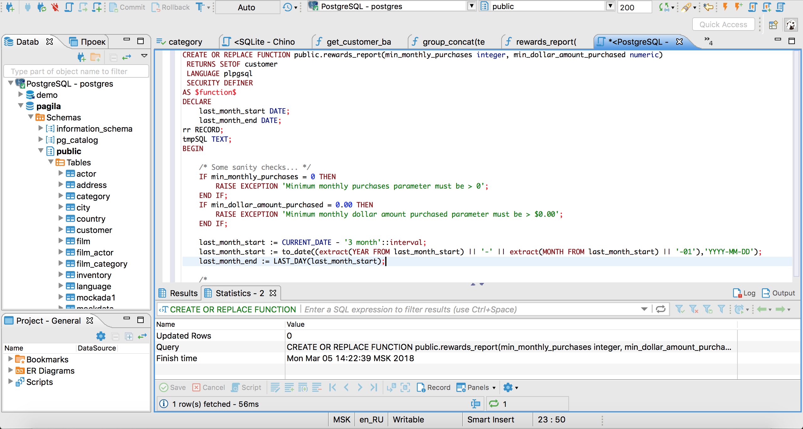

<!--
module_id: sql_intermediate
author:   Peter Camacho; Joy Payton
email:    camachop@chop.edu
version: 1.2.4
current_version_description: Correct typo, update metadata version
module_type: standard
docs_version: 2.0.0
language: en
narrator: US English Male
title: SQL, Intermediate Level
comment:  Learn how to do intermediate SQL queries on single tables, by using code, hands-on.
long_description: Do you want to learn intermediate Structured Query Language (SQL) for more precise and complex data querying on single tables?  This module will give you hands on experience with single-table queries using keywords including CASE, LIKE, REGEXP_LIKE, GROUP BY, HAVING, and WITH, along with a number of aggregate functions like COUNT and AVG.  This module is appropriate for people who are comfortable writing basic SQL queries and are ready to practice more advanced skills.
mode: Textbook

estimated_time_in_minutes: 60

@pre_reqs

Some experience writing basic SQL code (SELECT, FROM, WHERE) is expected in this module.  If you would like a code-free overview to SQL we recommend our module [Demystifying SQL](https://liascript.github.io/course/?https://raw.githubusercontent.com/arcus/education_modules/main/demystifying_sql/demystifying_sql.md).  If you need to develop basic SQL fluency we recommend our module [SQL Basics](https://liascript.github.io/course/?https://raw.githubusercontent.com/arcus/education_modules/main/sql_basics/sql_basics.md).

@end

@learning_objectives  

After completion of this module, learners will be able to:

- Create new data classifications using `CASE` statements
- Find text that matches a given pattern using `LIKE` and `REGEXP_LIKE` statements
- Use `GROUP BY` and `HAVING` statements along with aggregate functions to understand group characteristics
- Use `WITH` to create sub queries

@end

@version_history

Previous versions: 

- [1.1.1](https://liascript.github.io/course/?https://raw.githubusercontent.com/arcus/education_modules/9c77106b2074e1d51ce41ebaf0d849429b146c2b/sql_intermediate/sql_intermediate.md#1): Update with improvements to regular expressions, highlight boxes, correct typos
- [1.0.3](https://liascript.github.io/course/?https://raw.githubusercontent.com/arcus/education_modules/9e3ed69c5c70e4b6e116e2799329029e9542ca98/sql_intermediate/sql_intermediate.md#1): Initial version, then typo fixes, clarify group by aggregation troubleshooting, and feedback form improvements

@end

good_first_module: false
data_domain: ehr
data_task: data_wrangling
collection: learn_to_code
coding_required: true
coding_level: intermediate
coding_language: sql
sequence_name: sql
previous_sequential_module: sql_basics

@sets_you_up_for

- sql_joins

@end

@depends_on_knowledge_available_in

- demystifying_sql
- sql_basics

@end

import: https://raw.githubusercontent.com/arcus/education_modules/main/_module_templates/macros.md
import: https://raw.githubusercontent.com/arcus/education_modules/main/_module_templates/macros_sql.md 
-->

# SQL, Intermediate Level

@overview

## SQL: A Brief Refresher

**SQL** (**S**tructured **Q**uery **L**anguage) is a language that for more than four decades has been used to interact with **relational databases**.  You can pronounce it as "sequel" or just say the letters S-Q-L.

A relational database is a data storage solution that stores data tables, which are comprised of columns (also called 'fields') and rows.

<div class = "important">
<b style="color: rgb(var(--color-highlight));">Important note</b><br>

Sometimes we'll use the word "column" and sometimes we'll use the word "field".  These refer to the same thing!

</div>

SQL is great at working with rectangular data, data that is stored in tables with rows and columns / fields.  Its powerful SELECT - FROM - WHERE syntax makes SQL an ideal tool for isolating just the data you care about, whether that's specifying the columns you're interested in or limiting your data to just those rows that meet certain conditions.  However, it's not great for fine-tuned statistical, linguistic, or data visualization purposes.  SQL is therefore a tool that is often partnered with other tools like R or Python, which are better suited for work like statistical analysis.

If you want to review SQL at a high level, consider our [Demystifying SQL](https://liascript.github.io/course/?https://raw.githubusercontent.com/arcus/education_modules/main/demystifying_sql/demystifying_sql.md) module.

Most users of SQL do a lot of their work in one of many SQL **clients**.  A SQL client is a piece of software that has lots of functions, like allowing you to connect to various databases you have access to, giving you a place to type queries and submit them, and diagramming capability to help you understand the relationships in your database.  Here's a screenshot from a popular SQL client, DBeaver, found on [DBeaver's Screenshots Page](https://dbeaver.io/screenshots/).

<!-- style = "max-width: 800px; border: 1px solid rgb(var(--color-highlight));" -->

However, in our module, we won't ask you to download a heavy-duty SQL client.  Rather, you'll work with code in a simple code box like this one.  Go ahead and hit the play button below the code box to run the code below.

```sql
SELECT
  birthdate
  ,sex
FROM patients
LIMIT 10;
```
@AlaSQL.eval("#dataTable2a")

<table id="dataTable2a" border="1"></table><br>

<div style = "display:none;">

@AlaSQL.buildTable_patients

</div>

<div class = "important">
<b style="color: rgb(var(--color-highlight));">Important note</b><br>

Don't worry -- the data here, although it **looks** like human subject or patient data, is completely fabricated.  We used sample data from the open source project [Synthea](https://synthetichealth.github.io/synthea).  There are other clues that this data isn't real: for example, names include a numerical suffix, and SSN values are clearly fake.

</div>

### Style

Whether you adopt our preferred style or not, it's a good idea to have some sort of convention in your way of writing SQL, so that your code is consistent and reader-friendly.  We propose the following as a basic style guide.  To read more about this, reference our [longer treatment of style](https://liascript.github.io/course/?https://raw.githubusercontent.com/arcus/education_modules/main/sql_basics/sql_basics.md#5) in our SQL Basics module.

1) **Put keywords in CAPITAL LETTERS so they stand out.**  Examples of keywords are SELECT, LIKE, AS, WHERE, JOIN, DISTINCT, MEAN, ORDER BY, and many more.  While most code editors and SQL clients (software that lets you query a database) do a good job of color-coding these special words, you might end up seeing a SQL query in monochrome, and having keywords stand out helps you figure out where each part of your query is.  

2) **Put members of a list on separate lines.**  This usually means the list of fields you're requesting.  Putting each item on its own line is easier on the eyes and allows for much easier cut-and-paste to rearrange things.  It also means you have space after each item of the list to add a comment if necessary.

3) **Use indentation to clarify the various sections of your query.**  Indenting the list of columns below a SELECT statement is a way of subordinating those lines to the SELECT, subtly indicating that those lines are a continuation of the SELECT statement.  A new line that isn't indented (say, a FROM statement) shows that the SELECT part of the query is over.

4) **Use "dot notation"**, which we'll talk about in the next section.  Dot notation means adding more information about your data, for example, by including the table name the column comes from.  This practice will prepare you for using multiple data sources in your queries.

5) **Use a comma-first style.**  This one can be a little jarring at first, but it does have real advantages, especially if you end up doing SQL for more than a few hours a week.  In a list of length n, don't put the comma **after** items 1 through n-1.  Rather, put the comma **before** items 2 through n.  


## CASE Statement

The `CASE` statement is used to produce conditional row-level output based on columns/rows provided as input.  It's like an "if" statement in other languages, but with multiple possibilities, or "cases", that are considered.  A `CASE` statement will have several lines (possibly many lines), but for any row of data, SQL will give only **one** value back per `CASE` statement.

Often when working with data, you will come across the need to define your own "custom categories/groupings" given some raw row data as input (for example, "normal" versus "borderline" vs "abnormal" hematocrit levels). This is where the `CASE` statement can come in handy!

The `CASE` statement has 4 main components (shown below).


```sql
CASE                --COMPONENT 1: start tag of the case statement.
  WHEN (…) THEN (…) --COMPONENT 2: conditional when "some input" then "some output" logic.
  …                 --             additional "when / then" possibilities continue,
                    --             as many as you need.
  ELSE (…)          --COMPONENT 3: declaration of default value to be returned if
                    --             none of the when/then conditions are met.
END                 --COMPONENT 4: end tag of case statement with optional
                    --             field name (for instance, `AS patient_category`)
```

It's important to note that the `CASE`, `ELSE`, and `END` components can only be listed once for a given `CASE` statement.  Additionally, the `CASE` and `END` components **must** be included).

However, you can list as many occurrences of the `WHEN` / `THEN` component as you would like.

<div class = "important">
<b style="color: rgb(var(--color-highlight));">Important note</b><br>

When multiple `WHEN` / `THEN` components are listed, SQL will walk through each of them in the order they are listed and will return output for the first `WHEN` condition to be evaluated as TRUE.  This is very important to remember, because sometimes multiple conditions might be true, if you don't write them carefully, but only **one** result will be returned -- the one corresponding to the first matching condition.

</div>

Finally, if no `ELSE` clause is explicitly specified SQL imposes a condition of `ELSE NULL` by default.  We strongly encourage you to always include an `ELSE` clause even if you like the default value of `ELSE NULL`, to make your code more explicit.

The example below looks at "Peanut IgE Ab in Serum" observations (i.e. labs) and uses a `CASE` statement to create a column called `interpretation`, which categorizes (or you might hear "bins", "lumps", or "buckets") the results of the `observations.observation_value` field for each record into one of five distinct categories, or, if none of the criteria is met, makes the value of `interpretation` NULL.

```sql
SELECT
	observations.*
	,CASE
        WHEN observations.observation_value >= 17.5 THEN 'Strongly Positive'
        WHEN observations.observation_value >= .7 THEN 'Positive'
        WHEN observations.observation_value >= 0.35 THEN 'Equivocal'
        WHEN observations.observation_value >= 0.10 THEN 'Borderline'
        WHEN observations.observation_value < 0.10 THEN 'Negative'
        ELSE NULL
	END AS interpretation
FROM alasql.observations
WHERE
	observations.description = 'Peanut IgE Ab in Serum';
```
@AlaSQL.eval("#dataTable4a")

<table id="dataTable4a" border="1"></table><br>

<div style = "display:none;">

@AlaSQL.buildTable_observations

</div>

## LIKE Operator

The `LIKE` operator can be used to filter on row values that contain a simple pattern of text in a column of interest (this action is known as "text/pattern matching").

For the purpose of "pattern matching", the `LIKE` operator is able to utilize the 2 distinct **wildcard characters** listed below:

| Wildcard Characters | Description |
| --- | --- |
| `%` | "Wildcard" for 0 or more characters. |
| `_` | "Wildcard" for exactly 1 characters. |

The code block shown below uses the `LIKE` operator, in the `WHERE` clause, to filter on records from the `allergies` table where the `allergies.description` contains the two letters "nu" or the two letters "fi" (listed one right after the other).

```sql
SELECT DISTINCT allergies.description
FROM alasql.allergies
WHERE
	LOWER(allergies.description) LIKE LOWER('%nu%')
	or LOWER(allergies.description) LIKE LOWER('%fi%')

```
@AlaSQL.eval("#dataTable5a")

<table id="dataTable5a" border="1"></table><br>

<div style = "display:none;">

@AlaSQL.buildTable_allergies

</div>

<div class = "options">
<b style="color: rgb(var(--color-highlight));">Another option</b><br>

Why are we using `LOWER` in the query above? This is a handy trick to make sure that the things we're comparing are in a single case.  You could do the same thing by setting everything to `UPPER`, if you prefer.

If we're not certain if texts are in upper, lower, or mixed case, we can set both sides of a comparison to the same case, assuming that case doesn't matter to us (e.g. *Apples*, *APPLES* and *apples* should be considered equal).  Otherwise, because SQL is **case-sensitive**, the same text in a different case will not be considered equal: *Apples*, *APPLES*, and *apples* are, according to SQL, three different things that are unequal to one another.

But, you might point out, `nu` and `fi` are already in lower case!  Why are we adding an unneeded `LOWER` to the right side of our `LIKE` operator?

Good eye!  You indeed **don't** need that second `LOWER`, but we want you to get in the habit of doing the same thing on both sides of a text comparison, so we overdid it and added `LOWER` to both sides even though only one side really needs it.

</div>

### REGEXP\_LIKE and Regular Expressions

**Regular expression functions** are a class of function that utilize [regular expressions](https://en.wikipedia.org/wiki/Regular_expression), including [metacharacters](https://en.wikipedia.org/wiki/Regular_expression#POSIX_basic_and_extended), to perform some kind of pattern matching on text data.  

A regular expression (or "regex", which you can pronounce either with "reg" rhyming with "beg" or "reg" rhyming with "wedge") is a coded description of a pattern, such as the pattern for a phone number in the United States.  

You might describe what an American phone number looks like written out by describing it as follows:

* Maybe a '+1' for the country code, then 
* Optionally a space or some other separator like a dash or period or open parenthesis, then 
* Three digits for the area code, 
* Another optional space or separator (but this time it could be a closed parenthesis, not an open one), 
* Three more digits, 
* Another optional space or separator, and then 
* The last four digits.  

In a regular expression, we could write that like this:

```
(?:\+1)?[\s\(\-\.]?\d{3}[\s\)\-\.]?\d{3}[\s\-\.]?\d{4}
```

<div class = "care">
<b style="color: rgb(var(--color-highlight));">A little encouragement...</b><br>

Regular expressions can look intimidating, but learning regex can be a powerful way to find text needles in a haystack, helping you pull out useful text from clinical notes, Python code you've written, a pile of social media posts compiled for research, or other text.  If you'd like to learn regex, we suggest checking out our modules [Demystifying Regular Expressions](https://liascript.github.io/course/?https://raw.githubusercontent.com/arcus/education_modules/main/demystifying_regular_expressions/demystifying_regular_expressions.md#1) or [Regular Expressions Basics](https://liascript.github.io/course/?https://raw.githubusercontent.com/arcus/education_modules/main/regular_expressions_basics/regular_expressions_basics.md#1) to get started!

You don't need to memorize the information we share here about regular expressions.  In our regex quiz question, we provide you with the regular expression you need!  Our goal is to let you see and work with these powerful tools in a supported way, so they're less scary when you run across them later.

</div>

Regex can be thought of as a supercharged version of the the `LIKE` operator's "wildcard" characters.

The most common set of regular expression metacharacters are listed below.

| Metacharacter | Description                                                                                                                                                                                                          |
| :------------ | :------------------------------------------------------------------------------------------------------------------------------------------------------------------------------------------------------------------- |
| `^`             | Matches the starting position within the string.                                                                                                                                                                     |
| `$`            | Matches the ending position within the string.                                                                                                                                                                       |
| `.`             | Matches any single character (similar to the `_` wildcard in a `LIKE` statement).                                                                                                                                    |
| `*`             | Matches 0 or more occurrences of the preceding character.                                                                                                                                                            |
| `|`            | This character (known as the "choice operator") can be used to delimit multiple match patterns, and will provide a match on either the expression before or the expression after it is listed in your search string. |

To experiment with regular expressions and learn more about them, we recommend using a regular expression tester or checker online, like [regular expressions 101](https://regex101.com).   A website like that will give you a lot of instant feedback and practice to help you understand regex.  We teach more about regular expression checkers in our [Demystifying Regular Expressions](https://liascript.github.io/course/?https://raw.githubusercontent.com/arcus/education_modules/main/demystifying_regular_expressions/demystifying_regular_expressions.md#1) module.

In the SQL `REGEXP_LIKE()` function, you have to give two arguments or parameters.  The first argument is the string SQL should look at (normally, a SQL column), and the second argument is the pattern it should look for, to see if there's a match (this is what's written in regex code). The example below uses the `REGEXP_LIKE()` function to filter on records where the `allergies.description` field contains either the string "nu" or "fi".  

```sql
SELECT DISTINCT allergies.description
FROM alasql.allergies
WHERE
  REGEXP_LIKE(LOWER(allergies.description), LOWER("nu|fi"))
```
@AlaSQL.eval("#dataTable6a")

<table id="dataTable6a" border="1"></table><br>

<div style = "display:none;">

@AlaSQL.buildTable_allergies

</div>

As you can see from even just this simple example, regular expression functions can be much more useful & dynamic than the `LIKE` operator for filtering on complex text based data.

### Quiz: CASE, LIKE, and REGEXP\_LIKE

In this quiz, we have some scenarios for you to consider as a researcher.  If you create the correct SQL query, you'll get the corresponding quiz answer (which appears below the code box) easily!  There is one question each for `CASE`, `LIKE`, and `REGEXP_LIKE`.

You're studying attitudes about smoking and will issue a survey in phases.  Phase 1 will go out to residents of Plymouth County, Phase 2 will go out to residents of Essex County and Phase 3 will go out to Barnstable County.  Finish the following query such that you get the patient name, county, and a new column called `phase`.  Then scroll down to answer a simple question.  Stuck?  No worries -- scroll ahead to where the question appears, and if you click the "check mark" button <i aria-hidden="true" class="icon icon-resolve lia-btn__icon"></i>  after the question, you'll see the code that we used to answer the question.

```sql
SELECT
  patients.first
  ,patients.last
  ,patients.county
  ,CASE
    WHEN      THEN "Phase 1"
    WHEN      THEN "Phase 2"
    WHEN      THEN "Phase 3"
    ELSE NULL
  END
FROM alasql.patients;
```
@AlaSQL.eval("#dataTable7a")

<table id="dataTable7a" border="1"></table><br>

<div style = "display:none;">

@AlaSQL.buildTable_patients

</div>

How many patients are in the third phase of surveys?

[[ ]] 0
[[ ]] 1
[[X]] 2
[[ ]] 3
***************

<div class = "answer" style = "width: 100%">

This is the query we used to get the answer:

```sql
SELECT
  patients.first
  ,patients.last
  ,patients.county
  ,CASE
    WHEN patients.county = "Plymouth County" THEN "Phase 1"
    WHEN patients.county = "Essex County" THEN "Phase 2"
    WHEN patients.county = "Barnstable County" THEN "Phase 3"
    ELSE NULL
  END AS phase
FROM alasql.patients;
```
@AlaSQL.eval("#dataTable7b")

<table id="dataTable7b" border="1"></table><br>

</div>

*********

You'd like to research patients born in the 1970s (so any year starting 197\_ would work).  Use a `LIKE` statement to enrich the query below and find the patient set you care about.  Below the code box, there's a question.  Stuck?  No worries -- scroll ahead to where the question appears, and if you click the "check mark" button <i aria-hidden="true" class="icon icon-resolve lia-btn__icon"></i> after the question, you'll see the code that we used to answer the question.

```sql
SELECT
  patients.id
  ,patients.birthdate
FROM alasql.patients;
```
@AlaSQL.eval("#dataTable7c")

<table id="dataTable7c" border="1"></table><br>

Which of these years are represented in your query results?

[[ ]] 1970
[[X]] 1971
[[ ]] 1972
[[X]] 1973
[[X]] 1974
[[ ]] 1975
***************

<div class = "answer" style = "width: 100%">

This is the query we used to get the answer:

```
SELECT
  patients.id
  ,patients.birthdate
FROM alasql.patients
WHERE patients.birthdate LIKE "197%"
```
@AlaSQL.eval("#dataTable7d")

<table id="dataTable7d" border="1"></table><br>


</div>

**************

You're doing research involving patients who live in multi-tenant housing like apartment buildings or long term hotels.  You know that sometimes people use "apartment", other times "apt", sometimes "unit", or "suite", or "room", so to search for all of these might be tough.  What you want to try is looking for addresses where there's some number listed **after** the part of the string that's composed only of letters and spaces.  So, "123 Apple Street" wouldn't match, but "123 Apple Street, Apt. 10" would.

In regex, "one or more lower case letters or spaces, in any combination" is written `[a-z\s]+` and the symbol `\d+` indicates "one or more digits."  Use that information to complete the following code, to pull out patient information you might be interested in.  

<div class = "care">
<b style="color: rgb(var(--color-highlight));">A little encouragement...</b><br>

We know this is a tricky question, because regular expressions are hard.  Click on the light bulb <i aria-hidden="true" class="icon icon-hint lia-btn__icon"></i> after the answer choices to ask for a hint if you need it!

As in the previous cases, if you get stuck, just scroll down and hit the check mark 
button <i aria-hidden="true" class="icon icon-resolve lia-btn__icon"></i>  after the question.

</div>

```sql
SELECT
  patients.id
  ,patients.birthdate
  ,patients.address
FROM alasql.patients
WHERE REGEXP_LIKE();
```
@AlaSQL.eval("#dataTable7e")

<table id="dataTable7e" border="1"></table><br>

Which of the following is an address that appears in the output of your query?  Select all that apply! 

[[ ]] 119 Apple Valley Road Unit 7
[[X]] 958 Robel Run Unit 83
[[X]] 604 Sipes Divide Unit 0
[[ ]] 82 Marriott Way Room 1153
[[?]] Hint: The regular expression for the address pattern is `[a-z\s]+\d+`.  You'll want to put that in quotes within your `REGEXP_LIKE` clause!
***************

<div class = "answer" style = "width: 100%">

This is the query we used to get the answer:

```
SELECT
  patients.id
  ,patients.birthdate
  ,patients.address
FROM alasql.patients
WHERE REGEXP_LIKE(LOWER(patients.address), "[a-z\s]+\d+");
```
@AlaSQL.eval("#dataTable7f")

<table id="dataTable7f" border="1"></table><br>

<div style = "display:none;">

@AlaSQL.buildTable_patients

</div>

</div>

**************

## Aggregate Functions

**Aggregate functions** can be used to get a single value related the values for multiple rows of data in some meaningful way.  This aggregation could be a numerical statistic, like the sum or standard deviation of a number of rows, or it could pull out a special value, like the minimum or maximum value (this works as well for strings, in which case it would be the first or last value in alphabetical order). There are many other possibilities as well, like giving a count of rows or pulling a value at random from the rows.

See the table below for a list of the most commonly used aggregate functions:

|Function|Description|
|:---|:---|
|`COUNT()`|Returns the count of the number of non-null values among the column(s)/rows provided as input.|
|`SUM()`|Returns the summation of all values from a column provided as input.|
|`MIN()`|Returns the minimum value from a column provided as input.|
|`MAX()`|Returns the maximum value from a column provided as input.|
|`AVG()`|Returns the numerical mean of all values from a column provided as input.|

<div class = "important">
<b style="color: rgb(var(--color-highlight));">Important note</b><br>

If you just want to count how many rows there are, use `COUNT(*)`.  You can use a specific column, instead, if you wish, like `COUNT(birthdate)`, but if you do that, a missing birthdate will mean the count is lower than the number of rows.
</div>

The below table utilizes each of these aggregate functions to analyze the last name (`last`) column from the `patient` table:

```sql
SELECT
    COUNT(patients.last) AS lon_count
    ,MIN(patients.last) AS min_lon
    ,MAX(patients.last) AS max_lon
FROM alasql.patients
```
@AlaSQL.eval("#dataTable8a")

<table id="dataTable8a" border="1"></table><br>

<div style = "display:none;">

@AlaSQL.buildTable_patients

</div>

Aggregation by itself is somewhat limited, so we often use aggregation in partnership with `GROUP BY`, which we'll look at next.

### GROUP BY Clause

Often, you are interested in statistics by group, such as the average BMI for men and for women, or the standard deviation of reading test scores in teens with ADHD, depression, neither condition, or both conditions.

The `GROUP BY` clause is used to group column results into only the unique/distinct values among them, and is used in combination with aggregate functions to generate summary statistics about the larger dataset that was "grouped" (i.e. "collapsed") by `GROUP BY`.

The code block below shows an example of using the `GROUP BY` clause to summarize some simple information from the `patients` table.


```sql
SELECT
    patients.sex
    ,COUNT(*) AS pat_count
    ,MIN(birthdate) AS earliest_birthdate
    ,MAX(birthdate) AS latest_birthdate
FROM alasql.patients
GROUP BY
    patients.sex
```
@AlaSQL.eval("#dataTable9a")

<table id="dataTable9a" border="1"></table><br>

<div style = "display:none;">

@AlaSQL.buildTable_patients

</div>

`GROUP BY` aggregations like the one above can be confusing and frustrating for new SQL users, because you have to remember that an aggregation returns **one and only one** value for the entire group of rows.  This means you **cannot** ask for something in your `SELECT` clause that could give more than one value for the  group.  You can include aggregate functions (they by definition give you one and only one value for the group) and you can include what you grouped by (because each member of the group is guaranteed to have the same value), but you can't add anything else.  For example, we couldn't add `race` in the `SELECT` statement above without also adding it to the GROUP BY clause, because each group in the existing GROUP BY (i.e. the group `sex` = 'F' and the group `sex` = 'M') could potentially have more than one value for `race` in the data.

```sql
SELECT
    patients.sex
    ,patients.race
    ,COUNT(*) AS pat_count
    ,MIN(birthdate) AS earliest_birthdate
    ,MAX(birthdate) AS latest_birthdate
FROM alasql.patients
GROUP BY
    patients.sex
```
@AlaSQL.eval("#dataTable9b")

<table id="dataTable9b" border="1"></table><br>

<div class = "warning">
<b style="color: rgb(var(--color-highlight));">Warning!</b><br>

While AlaSQL gives up and just gives you empty data for `race` in the example above, the SQL dialects you'll use in the real world will probably give you an error that is something like `Error: Column is invalid in the select list because it is not contained in either an aggregate function or the GROUP BY clause.`  Remember, when you're aggregating, you can **only** add things to your `SELECT` statement that are **guaranteed** to have **one and only one value** per group of rows.  That means (when using a `GROUP BY` in your query) you can only use items in your `SELECT` statement that are either: 1) columns that are also referenced in your `GROUP BY`, or 2) functions that are aggregate functions, like `COUNT()`.

</div>

### HAVING Clause

The `HAVING` clause can be used to filter your result set on the value of an aggregate function.  It works similarly to a `WHERE` clause, but the two are not interchangable.  This is another common error people who are new to SQL often encounter -- mixing up `WHERE` and `HAVING`.

In terms of placement in your query, the `HAVING` clause can be placed directly after your `GROUP BY` statement, and before your `ORDER BY` statement (if applicable).

The example below summarizes patients by grouping them by `race` and giving the earliest and latest birthdate per group.  Then it uses the `HAVING` clause to only return the race groups with more than 5 members, and then returns a results sorted in order by `earliest_birthdate`.

Try commenting out (use `--` at the start of the line) the `ORDER BY` clause to see what changes in the results.  Then do the same for the `HAVING` clause.

```sql
SELECT
    patients.race
    ,COUNT(*) AS pat_count
    ,MIN(birthdate) AS earliest_birthdate
    ,MAX(birthdate) AS latest_birthdate
FROM alasql.patients
GROUP BY
    patients.race
HAVING COUNT(*) >= 5
ORDER BY earliest_birthdate;
```
@AlaSQL.eval("#dataTable10a")

<table id="dataTable10a" border="1"></table><br>

<div style = "display:none;">

@AlaSQL.buildTable_patients

</div>

<div class = "help">
<b style="color: rgb(var(--color-highlight));">Troubleshooting help</b><br>

SQL can be a bit tricky, because even though you've added an alias to `COUNT(*)` (you're calling it `pat_count` in the query above), that alias isn't available to SQL at the time it's parsing the `HAVING` clause.  To see what we mean, try replacing the `HAVING` clause above with `HAVING pat_count >= 5`.  

But `ORDER BY` is the last thing done by SQL, after it has already applied aliases, so you **can** use the `earliest_birthdate` alias in your `ORDER BY` clause.  Tricky, we know!

</div>

 The `HAVING` clause is also a great tool to use for determining which columns in your tables are potential **primary keys**. Primary keys are columns that have a unique value for each row of data, with no repeating values.

Try running the query below, which checks to see if there are any repeated patient ids (we hope there aren't any):

```sql
SELECT
    patients.id
    ,COUNT(*) AS pat_count
FROM alasql.patients
GROUP BY
    patients.id
HAVING COUNT(*) > 1;
```
@AlaSQL.eval("#dataTable10b")

<table id="dataTable10b" border="1"></table><br>

### Quiz: Aggregate functions, GROUP BY, and HAVING

In this quiz, we're going to challenge you to create a query from scratch using aggregate functions, and then quiz you about the results of that query.

Please create a query below that queries `alasql.patients` and gives the patient population of each city (`patients.city`) which has more than one patient living there.  Give the results in an alphabetized list.  Your results should start like the table below.  Stuck?  No worries -- scroll ahead to where the question appears, and if you click the "check mark" button <i aria-hidden="true" class="icon icon-resolve lia-btn__icon"></i>  after the question, you'll see the code that we used to answer the question.

<!-- data-type="none" -->
| city | patient\_population |
| ---- | ---- |
| Boston | 2 |
| ...    | ... |


```sql
-- Enter your query here!
```
@AlaSQL.eval("#dataTable11a")

<table id="dataTable11a" border="1"></table><br>

<div style = "display:none;">

@AlaSQL.buildTable_patients

</div>

What's the third row of results?

[[X]] Everett, with a `patient_population` of 2
[[ ]] Greenbrier, with a `patient_population` of 3
[[ ]] Falls Bridge, with a `patient_population` of 2
[[ ]] Maryknoll, with a `patient_population` of 4
***************

<div class = "answer" style = "width: 100%;">

This is the query we used to get the answer:

```sql
SELECT
    patients.city
    ,COUNT(*) AS patient_population
FROM alasql.patients
GROUP BY
    patients.city
HAVING COUNT(*) > 1
ORDER BY city;
```
@AlaSQL.eval("#dataTable11b")

<table id="dataTable11b" border="1"></table><br>

</div>

**************

## Sub Queries

A **sub query** (or subquery or sub-query) is essentially a nested SQL query that is referenced inside of a larger SQL query.

Sub queries can appear in the `FROM` section of your `SELECT` statement where you'd ordinarily give a table name.  The sub query is enclosed by parentheses, followed by an alias name that you would like to use to reference it later on in your query.  

Let's say we wanted to consider a subset of patients, Latina women (in this dataset, "hispanic" `ethnicity` and "F" `sex`) and wanted to get their ids and race and classify their `birth_status` as either born in Massachusetts, not born in Massachusetts, or with a birth place that was not listed (based on the contents of the `birthplace` field).  Instead of tackling all this at once, we could use a subquery to make the tasks a bit more separate and easy to understand.

For instance, we could start with just a simple query:

```sql
SELECT *
FROM alasql.patients
WHERE sex = 'F' AND ethnicity = 'hispanic'
```
@AlaSQL.eval("#dataTable12a")

<table id="dataTable12a" border="1"></table><br>

<div style = "display:none;">

@AlaSQL.buildTable_patients

</div>

Then we could use that as a sub query, and do our `birthplace` query just on that set of results.  Note that we're going to give our sub query a name (`latina_pop`) and our main query has to use that name to refer to that subset of results it's querying on!

```sql
SELECT
  latina_pop.id  -- referencing the name we will give to the sub query
  ,latina_pop.race
  ,CASE
     WHEN LOWER(latina_pop.birthplace) LIKE '%massachusetts%' THEN 'Born in MA'
     WHEN latina_pop.birthplace IS NULL THEN 'Birthplace Unknown'
     ELSE 'Not born in MA'
   END AS birth_status
FROM
(SELECT *
FROM alasql.patients
WHERE
  sex = 'F' AND
  ethnicity = 'hispanic') AS latina_pop -- note that we've named this!
```
@AlaSQL.eval("#dataTable12b")

<table id="dataTable12b" border="1"></table><br>


### WITH Statement

The `WITH` statement can be used to create a sort of "detached" sub query (you might hear people say "temporary table" as well) that will be created **before** your primary `SELECT` statement runs.

Let's revise the previous example using a `WITH` statement:

```sql
WITH latina_pop AS
(SELECT *
FROM alasql.patients
WHERE
  sex = 'F' AND
  ethnicity = 'hispanic')

SELECT
  latina_pop.id
  ,latina_pop.race
  ,CASE
     WHEN LOWER(latina_pop.birthplace) LIKE '%massachusetts%' THEN 'Born in MA'
     WHEN latina_pop.birthplace IS NULL THEN 'Birthplace Unknown'
     ELSE 'Not born in MA'
   END AS birth_status
FROM latina_pop
```
@AlaSQL.eval("#dataTable13a")

<table id="dataTable13a" border="1"></table><br>

<div style = "display:none;">

@AlaSQL.buildTable_patients

</div>

This approach, using `WITH` to move the sub query to before the main query, is often used to increase code readability, but can also be used to increase query performance in certain situations.

### Quiz: Sub Queries

There are three problems with the SQL code below.  Correct all three and run the code successfully and you should be able to answer the quiz question.  Below the code box, there's a question.  If you can't find all the errors, scroll ahead to where the question appears, and if you click the "check mark" button <i aria-hidden="true" class="icon icon-resolve lia-btn__icon"></i> after the question, you'll see the code that we used!

```sql
WITH generations (
SELECT
  patients.id
  ,patients.sex
  ,patients.race
  ,CASE
    WHEN patients.birthdate LIKE "194%" THEN "boomer"
    WHEN patients.birthdate LIKE "195%" THEN "boomer"
    WHEN patients.birthdate LIKE "198%" THEN "millenial"
    WHEN patients.birthdate LIKE "199%" THEN "millenial"
    ELSE "other"
   END AS age_group
FROM alasql.generations)

SELECT *
FROM generation
```
@AlaSQL.eval("#dataTable14a")

<table id="dataTable14a" border="1"></table><br>

<div style = "display:none;">

@AlaSQL.buildTable_patients

</div>

What are the sex, race, and age group of the patient with id 03963166-b49f-4440-a80d-30abb90b4a78?

[[ ]] F, black, millenial
[[ ]] M, other, other
[[X]] M, white, other
[[ ]] F, white, boomer
***************

<div class = "answer" style = "width: 100%;">

This is the query we used to get the answer:

```sql
WITH generations AS (
SELECT
  patients.id
  ,patients.sex
  ,patients.race
  ,CASE
    WHEN patients.birthdate LIKE "194%" THEN "boomer"
    WHEN patients.birthdate LIKE "195%" THEN "boomer"
    WHEN patients.birthdate LIKE "198%" THEN "millenial"
    WHEN patients.birthdate LIKE "199%" THEN "millenial"
    ELSE "other"
   END AS age_group
FROM alasql.patients)

SELECT *
FROM generations;
```
@AlaSQL.eval("#dataTable14b")

<table id="dataTable14b" border="1"></table><br>

</div>

**************


## Additional Resources

* Khan Academy's [Introduction to SQL](https://www.khanacademy.org/computing/computer-programming/sql) is high quality and easy to learn from.  There's a section called "More advanced SQL queries" you might find useful.

* [regular expressions 101](https://regex101.com/) is extremely helpful in practicing regex skills, whether that's for use in SQL or elsewhere.

* Tutorials Point has some helpful documentation you may want to check out [about the basic types of operators available for use in a SQL query](https://www.tutorialspoint.com/sql/sql-operators.htm).


## Feedback
@feedback