<!--
author:   Joy Payton
email:    paytonk@chop.edu
version: 1.0.3
module_template_version: 2.0.0
language: en
narrator: US English Female
title: Using the REDCap API
comment:  REDCap is a research data capture tool used by many researchers in basic, translational, and clinical research efforts.  Learn how to use the REDCap API in this module.
long_description: If your institution provides access to REDCap, this module is right for you.  REDCap is a convenient and powerful way to collect and store research data.  This module will teach you how to interact with the REDCap API, or "Application Programming Interface," which can help you automate your data analysis. This will also help you understand APIs in general and what makes their use so appealing for reproducible research efforts.
estimated_time: 1 hour

@learning_objectives  

After completion of this module, learners will be able to:

- Define what an API is and why it's useful to researchers
- Enable API usage on REDCap projects
- Use the REDCap API to pull data into an R or Python data analysis


@end


@version_history
1.0.2: make it clear that you need to have R or Python installed

@end

link:  https://chop-dbhi-arcus-education-website-assets.s3.amazonaws.com/css/styles.css

script: https://kit.fontawesome.com/83b2343bd4.js

-->

# Using the REDCap API

<div class = "overview">

## Overview
@comment

**Is this module right for me?** @long_description

**Estimated time to completion:** @estimated_time

**Pre-requisites**

This module assumes that learners already have access to the REDCap application at their institution. Learners will benefit from having used REDCap in the past, although new users of REDCap may find this module useful if they watch an overview video about REDCap (included in this module).  This module requires that learners have either R (preferably with RStudio) or Python (preferably the Anaconda distribution with Jupyter) installed in order to work with the API.  Therefore, some experience with either R or Python is necessary, but template code will be provided within the module.  

**Learning Objectives**

@learning_objectives

</div>


## REDCap Overview

**[REDCap](https://projectredcap.org/)** stands for **R**esearch **E**lectronic **D**ata **Cap**ture and is an application developed by Vanderbilt University.  REDCap allows researchers (and others) to collect data through data entry forms (these are used by research staff to record data) and surveys (these are used by human subjects to enter their own data or answer questions).  If you've ever created a Google Form or worked in SurveyMonkey, you can build a REDCap **instrument** (a data entry form or survey).  What really sets REDCap apart, however, is that it is designed with research in mind.  Things like randomization, study arms, scheduled visits, and other research-specific needs are included as part of REDCap functionality.  

Here's what the REDCap developers [say about REDCap](https://projectredcap.org/):

>REDCap is a secure web application for building and managing online surveys and databases. While REDCap can be used to collect virtually any type of data in any environment (including compliance with 21 CFR Part 11, FISMA, HIPAA, and GDPR), it is specifically geared to support online and offline data capture for research studies and operations. The REDCap Consortium, a vast support network of collaborators, is composed of thousands of active institutional partners in over one hundred countries who utilize and support their own individual REDCap systems.

<div class = "important">

If you've never used REDCap, there are [good instructional videos](https://projectredcap.org/resources/videos/) offered by Vanderbilt to help you understand and use REDCap.  One video that's particularly useful is [a fifteen minute video](https://redcap.vanderbilt.edu/consortium/videoplayer.php?video=redcap_overview03.mp4) that gives a high level overview of what REDCap is and how to use it.  That video is accompanied by a [.pdf transcript](https://redcap.vanderbilt.edu/consortium/redcap_video_transcripts/redcap_overview03.pdf).  If you're brand new to REDCap, please watch this video before proceeding.

If you already have experience with REDCap, feel free to skip watching the video, as it goes over things you probably already know!

</div>

### Learn More About REDCap at your Institution

Vanderbilt University provides REDCap software free of charge to institutions that join the REDCap Consortium.  It's currently in use by over 5,000 institutions and is used to host data for well over a million separate projects with millions of human users.  REDCap is offered to institutions, not to individual scientists or consumers, and participating institutions are responsible for their own REDCap software updates, training, and access for their users.  

Research centers, clinics, and colleges and universities will have a dedicated server that they install REDCap on, and they'll make the REDCap website on their server available to their users (students, scientists, etc.).  Each institution does REDCap a little differently.  

If REDCap is offered by your organization (your university or workplace), questions about how to use it effectively or solve problems like the site being down should go to the people at your institution responsible for REDCap.  Sometimes, an institution will have a big staff dedicated to REDCap, people who can offer all kinds of services like helping you design instruments and manage your data with a lot of support.  Other institutions have only one administrator who keeps the REDCap site running and up to date but isn't responsible for helping users figure out how to use REDCap.  Most institutions are somewhere in the middle.

Not sure whether your institution has REDCap?  You may find your institution in the [list of partners](https://projectredcap.org/partners/).  For example, here are a list of partners that start with the letter "A," plus a couple of oddball entries at the top of the alphabetical list.  Each partner then has contacts listed with their email addresses (simply click "View Collaborators"), so you can reach out and ask to get more information.

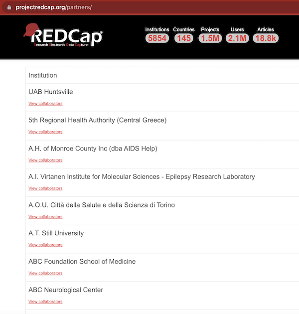<!-- style = "border : 1px solid rgb(var(--color-highlight)); max-width: 500px;"-->

<div class = "important">

Although these materials are intended for any researcher who finds them useful, we know the institutional affiliation of some of our users, so for your convenience we're adding some of the REDCap URLs that might be useful to you.  Want us to add your institution's REDCap link, so that this training is more useful for your peers, too?  Email us at [`dart@chop.edu`](mailto:dart@chop.edu).

* Children's Hospital of Philadelphia: https://redcap.chop.edu/
* Drexel Med: https://redcap.drexelmed.edu
* Penn Medicine: https://redcap.med.upenn.edu
* Penn Nursing: https://redcap.nursing.upenn.edu
* University of Botswana: https://ehealth.ub.bw/redcap

</div>

## About APIs

**API** stands for **Application Programming Interface**. It's a way for people or machines to interact with software in a prescribed way.  APIs allow a user to ask for a particular resource, using various parameters to indicate what resource is being requested.  Some APIs also allow for adding resources via upload.

Generally, most well-crafted APIs will accept parameters that include things like:

* What kind of data is being requested (e.g. what fields from a database)
* Which data items are being requested (e.g. by an identifier or resource name)
* The format requested (e.g. CSV or JSON)
* Any key and/or password required (for-pay or freemium APIs need to track how much of their services you've used, or you may need to authenticate to get access to private or sensitive resources)
* A data payload, if data is being uploaded
* Search terms, if applicable
* Ranges (like date ranges), if applicable

The API will receive the request, and should do one (or possibly more) of the following:

* Return the desired data in the desired format to the requesting (client) program,
* Send a return code that means success (in the case, say, of adding data), or
* Provide a descriptive and helpful error message

There are many APIs, from governmental organizations like the U.S. Census Bureau, to news outlets including the New York Times, to social media platforms like Twitter, and companies like IBM Watson.  APIs are ubiquitous and you benefit from APIs all the time without realizing it. API use cases are myriad, and a few examples could include:

* Getting the latest, most up-to-date data for an dashboard that counts hospital admissions for influenza
* Requesting, on a news site, only news stories related to public health in Ghana
* Communicating between code, such as sending success messages from one program to another

Let's use a simple API example that is as easy as copying and pasting a URL.   NCBI, the National Center for Biotechnology Information, has an API called "Entrez" that you can use for a number of purposes, including to get PubMed article IDs that meet your conditions.  They provide the following example on [their website](https://www.ncbi.nlm.nih.gov/books/NBK25500/):

> Example: Get the PubMed IDs (PMIDs) for articles about breast cancer published in Science in 2008
>
> `https://eutils.ncbi.nlm.nih.gov/entrez/eutils/esearch.fcgi?db=pubmed&term=science[journal]+AND+breast+cancer+AND+2008[pdat]`

Note that there are some terms added in the URL, parameters like `db` and `term`.  There are clearly some rules about how `term` is structured, and if we wanted to learn more about this API we could read their documentation to learn what parameters we could include in the URL (web address).

Try copying and pasting that URL into your browser and you'll get some text that's clearly formatted for computers, not for humans!  It will start with something like this:

```xml
<eSearchResult>
<Count>6</Count>
<RetMax>6</RetMax>
<RetStart>0</RetStart>
<IdList>
<Id>19008416</Id>
<Id>18927361</Id>
<Id>18787170</Id>
<Id>18487186</Id>
<Id>18239126</Id>
<Id>18239125</Id>
</IdList>
```

<div class = "warning">
Entrez, like many APIs, has a limit to what you can do anonymously.  If you try to run this a few times in a row, you'll get an error message that starts with `{"error":"API rate limit exceeded"`...
</div>

### API Access

Some APIs allow for anonymous use.  Others require all users to be registered and prove their identity.  Others have one level of service for anonymous users and another level for registered users.  REDCap hosts private data that can be very sensitive, so every API call to REDCap must come with proof that demonstrates that the requestor has the right to see the data they're asking for.

**Automation**

APIs are automated, which means they won't rely on you logging in manually, adding a user name and password interactively. API calls have to run without human intervention, which means you need to provide your R or Python script with credentials that show you are allowed see the data you're accessing. But obviously you don't want to put your user name and password in a script. Your user name and password might open a lot of doors at your institution, including your email, your payroll information, and your EHR access. You want to isolate **just** your access to this **particular** data, and using your all-powerful login information to access REDCap data is far too powerful.

**Security**

What if your credentials fell into the wrong hands, because they were in a script on a drive that many people have access to? This is where API keys or tokens come in. API credentials give very specific access to very specific things.  They can also be regenerated easily (like changing a lock on a door), in case you suspect they may have been lost or misused. If API credentials do fall into the wrong hands, it's not great, but it's much better than accidentally sharing your username and password! The access codes you need to provide might be called tokens, keys, passwords, or some other descriptor. In REDCap, the term is "token," and we'll show you in a bit how to generate a token for your data.

### Advantages of the REDCap API

Two important advantages to using an API are **data freshness** and **reproducibility**.

**Data Freshness**

Let's say you have to run some analysis on data you're collecting in REDCap, and you want to re-run this analysis every couple of weeks to see the latest figures. One way to do that is to manually export data from REDCap to a .csv and save it to a file that you analyze.  REDCap likes to download files with a date stamp as part of the file name, so you have to keep track of various file names and make sure you are analyzing the right data. You may, after all, end up collecting multiple .csvs, each of which has a particular version of the data in REDCap. This can easily become overwhelming and cause confusion or mistakes.

What's a better approach? Reach into the REDCap database directly each time you run your analysis script, so that you know you're using the most up-to-date data.

**Reproducibility**

Another problem with using manually downloaded files from REDCap is that this method requires unscripted, point-and-click manual work. If you were to document this carefully, you'd have to give several steps, like where to log in to REDCap, which project to use, the .csv download settings (which fields or forms to download), file naming conventions, and where to put the file. Most of us don't go into this level of detail in our manual workflows, for good reason! It's tiresome, and we know that sometimes things change in the look and feel of a website, so including screenshots and detailed instructions about where to look for a link or how to highlight multiple fields is a lot of work for something that might have slightly different steps next week or next month.

A better approach is to use a script that uses an API call. First of all, it's scripted, which means no manual steps to write up in a Word document or add to a GitHub repo or jot down on a sticky note. Also, the typical API has a standard interface that will change very little. API access may improve over time, adding new features, but it's very infrequent that an API will radically change and remove options, rendering your script unusable. The same half-dozen lines of code you use to access your data will almost always be stable for months or years, and if you do need to change it, you're only changing that small chunk of code, instead of a step-by-step document with words and images that describe a manual effort.

### Quiz: API Advantages

What does "API" stand for?

[[ ]] Application Private Interface
[[ ]] Android Programming Interface
[[X]] Application Programming Interface
[[ ]] Application Programming Interchange
[[ ]] Anonymous Programming Interface
***************

<div class = "answer">

API stands for Application Programming Interface!

</div>

**************


Which of the following are true statements?  Select all that apply!

[[X]] APIs are good for reducing point-and-click analysis steps
[[ ]] APIs are good for getting archived data, but not the best way to get fresh data
[[X]] APIs tend to be stable and change infrequently
[[X]] APIs allow you to extract data directly into your analysis script
[[ ]] APIs do not provide any improvements in research reproducibility
[[?]] There are multiple correct answers!
***************

<div class = "answer">

APIs have multiple advantages related to data freshness and reproducibility.  API usage can reduce the amount of point-and-click analysis step and allow you to import data directly into your analysis script. This can make your research more easily reproducible.  APIs are generally quite stable, changing infrequently, and are great for getting the freshest data (instead of relying on a stale .csv).

</div>

**************

## Hands-On Practice: Setup

For the next part of this module, we'd like you to work with a real REDCap database that you create or in which you have User Rights (a very high level of privilege that you may not have on projects you didn't create).

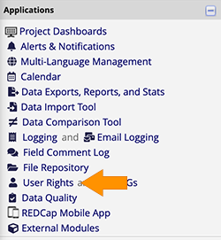<!-- style = "border :1px solid rgb(var(--color-highlight));" -->

If you have a REDCap project in mind, log in and open that project.  On the left side, under **Applications,** do you see **User Rights**?  If so, congratulations, you can use this project to experiment with the REDCap API.  We will only be using the API to access project data, not change or destroy it or add new data, so what we're going to describe here is safe to perform on a real dataset.

<div class = "warning">

Just because we're not going to break any of your data doesn't mean that it's okay from a regulatory perspective to use the API to download data to your computer.  Think about whether the use of this data is governed by a protocol or data use agreement, and whether your computer is an approved place to do analysis of the data.  

</div>

If you can't or don't want to use your own existing REDCap project, you can clone a sample project from us.  We've taken data from the University of California, Irvine Machine Learning Repository, specifically, their dataset on [cervical cancer risk factors](https://archive.ics.uci.edu/ml/datasets/Cervical+cancer+%28Risk+Factors%29), and made that data into a REDCap project.  Here are the steps to take our REDCap project and make it yours!

1. Download our [REDCap xml file](media/cervical_cancer_factors.REDCap.xml), saving it to a place you'll be able to find it (like your Downloads folder).  We suggest doing a right click on the link and choosing **Save Link As,** or **Download Linked File As.**
2. Log in to your REDCap server and choose **New Project.**
3. Fill out the Project title, Project purpose, Assign project to Folder, and Project notes fields as you like.  We called our project "API Testing" but that's only a suggestion.
4. Choose **Upload a REDCap project XML file** as the Project Creation option.  
5. Click **Choose File,** and in the file picker, navigate to where you saved our XML file.

An image below shows what you might see after steps 1-5, although your institution may have different colors, layouts, etc. on their page.

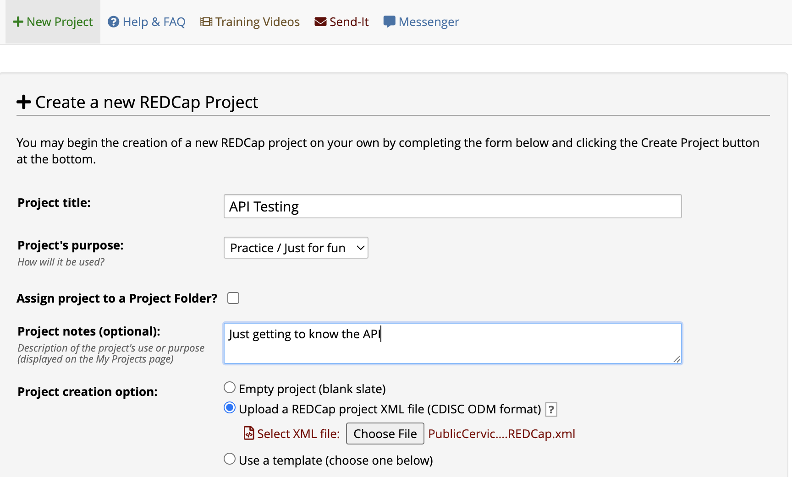<!-- style = "border :1px solid rgb(var(--color-highlight)); max-width:800px;" -->

6. At the bottom of the page, click **Create Project.**  It may take a few minutes to digest that giant XML file!

Congratulations, now you have a project that you created, which means you have User Rights capabilities.  That will come in handy in our next step!

### Enabling the API

In REDCap, the project owner (or people with user rights) have to explicitly give permission to use the REDCap API to project users who need that capability. In fact, when you create a new REDCap project, REDCap does not provide you with these permissions by default, even though you're the project owner! Take a look at your REDCap project and look on the left hand side of the screen to look at the menu of options. Chances are, you won't see anything that says "API." If that's the case, don't worry. We're going to walk you through how to give yourself API access.

Open your REDCap database (one that belongs to you or in which you have the ability to change user rights). In the left side of the screen, choose **User Rights** from the list of applications.

<!-- style = "border :1px solid rgb(var(--color-highlight));" -->

The User Rights panel will open in the main part of your screen. Click on your user id (or your role) and choose **Edit User Privileges.** Give yourself API Export access, as shown in the image below.  For now, we'll leave API Import/Update turned off, so that you feel secure knowing you can't accidentally upload anything that could mess up your data.

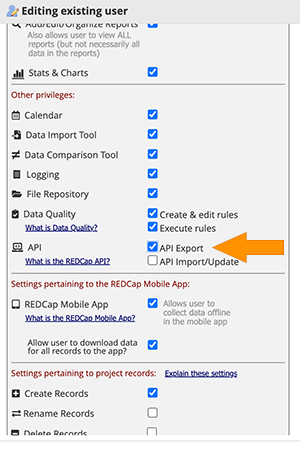<!-- style = "border :1px solid rgb(var(--color-highlight));" -->

**The next step depends on your version of REDCap.**  Do you see a box on the right side of your User Rights panel labeled **Privileges for Viewing and Exporting Data**?  If you do, give yourself some Data Export Rights.  We recommend **Full Data Set**, but you can choose a less privileged level of access if you're working with identified data and want to be extra careful.  Note that our sample project on cervical cancer risk factors is already deidentified.

This is what we're talking about:

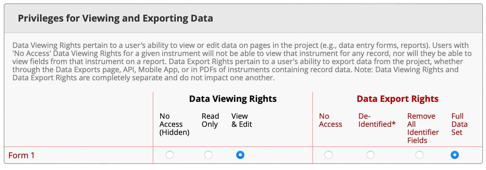<!-- style = "border :1px solid rgb(var(--color-highlight)); max-width: 800px;" -->

Once you're all done giving yourself API export rights and (if applicable) data export rights, click **Save Changes**.

Refresh your browser (reload the page) so that your new permissions are included in what you get shown in your project. Now, on the left hand side of the project, you should see something new under Applications – **API** and **API Playground.**

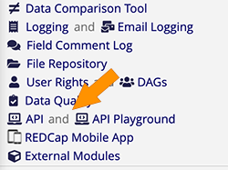<!-- style = "border :1px solid rgb(var(--color-highlight));" -->

### API Token

So now you have the **right** to use the API, but you can't start using it just yet. You have to generate an API token.  Click on the **API** application in the left side menu and in the main part of your screen, click on the button to **Generate API Token.**  Depending on your institution's rules, you might automatically be granted a token immediately, or it might be generated manually by an administrator a few minutes or hours later.

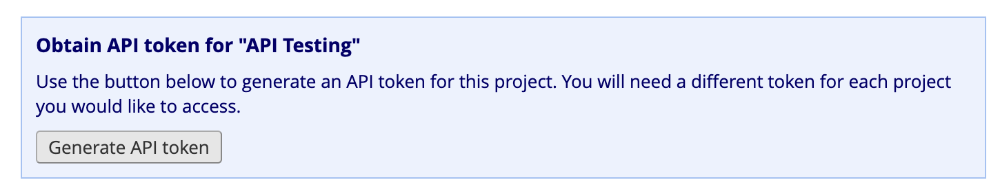<!-- style = "max-width:600px;" -->

The API token is unique to the combination of user and project. It's a code that allows access only to the data in a single project and only the data that the person who generated the API token is allowed to see.  If you have three different projects, your token is different for each one. Importantly, if you feel like you may have accidentally given your API token away, it's a good idea to regenerate it, which is a single-click operation. It makes your old token invalid and creates a new token.

Soon, your API token will show up in that same API Application. It will look something like this (note, I've obscured my token – sharing this in a post like this one would be a terrible idea!).

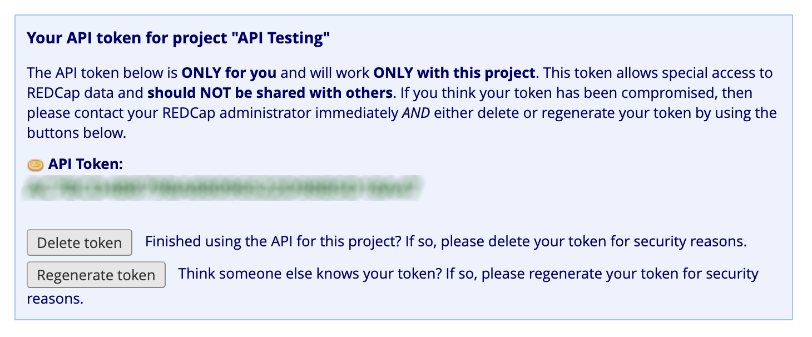<!-- style = "max-width:600px;" -->

You'll use this token when you request data in your R or Python script.

### Quiz: REDCap API Token

Which of the following is true of a REDCap API Token?  Select all that apply!

[[ ]] As soon as you enable API Export in User Rights, an API token is generated for you
[[X]] A REDCap API token is unique to you (no one else on a project has the same API token)
[[X]] A REDCap API token is unique to the project (none of your other projects will give you the same API token)
[[ ]] The REDCap API token is permanent and unchanging
[[X]] Before generating an API token, you must have API rights given to you by someone who can change User Rights
[[ ]] The REDCap API changes daily for added security
[[?]] There are multiple correct answers!
***************

<div class = "answer">

You can generate a REDCap API token once you have been given API rights.  Once you have API rights, your token isn't automatically generated, but it's an easy single click to get your token when you're ready.  Your token is unique both to you and to the project -- it's a unique key that is only meant for you, and only for the project it was generated for.  That said, anyone who has that key can access the data, so you should not share it with anyone. The REDCap API token doesn't change daily, but you can change it if you feel like it may have been accidentally shared to another person.

</div>

**************

## Hands on Practice: API Playground

So, you have some data in a REDCap database, and you have an API key that gives you access to that data. How do you use this key, though? Learning how to use an API can be tricky, because it requires you to pass not only the key, but your actual request like "give me only the field called `species`" or "give me only the form called `inclusion_criteria`." Luckily, REDCap provides you an **API Playground** that gives you not only a view into what the API can do, but provides a good start to giving you the actual code. Let's take a deeper look.

The API Playground has several parts:

* The API Method selector menus
* Raw Request Parameters
* Response
* Code Examples

Let's look at how each part of the API Playground helps you learn the API.

### API Method

In your REDCap project, head over to the **API Playground** – click on that phrase in the Applications pane on the left. Then, at the top of your screen, you'll see the menu-driven selection box. The first selection you have to make is **API Method**.

For now, choose **Export Records** as the API method.  This will allow you to download records (rows of data).  Make sure that:

* The "Format" (second option down) is "CSV" and
* The "Type" (third option down) is "flat."

You don't have to change any other fields.  Leaving everything else alone means you'll download all the records (rows) and all of the forms / instruments with all of their fields (columns) into a single .csv file.

<div class = "warning">
Be careful not to choose `.json` as the format -- `.csv`, or **comma separated values**, is the file format you want to download!
</div>

The **Raw Request Parameters** box below your selection will change to reflect whatever you chose. Here's an example of what you might see, if you're using the cervical cancer data.  If you're using your own dataset, things will look different.  Note that we've blurred out the API key here -- that's not something we want to share!

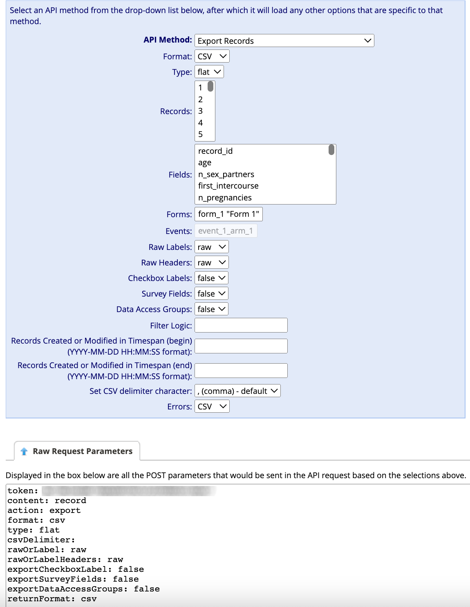<!-- style = "border :1px solid rgb(var(--color-highlight));" -->

This **Raw Request Parameters** gives you a quick look at the information you're passing to REDCap, to make sure you selected what you really wanted in the menu part above.  Go on to the next page to see how to submit this API request!

### Execute Request

Look further down the API Playground page, in the **Response** area, and click on the button that says **Execute Request.** You might get a "waiting" spinner, and then a box will appear below the button with the data that REDCap returned from your request.

You requested your data to be in a .csv, so you should get some data that's "comma separated" – a bunch of fields that are separated by commas, with each new line of data being separated by a line break.

<div class = "warning">

In the **Response** box, data is presented in plain text, not in a table, so it might look confusing or overwhelming. If you want to, you can copy that plain text by clicking on the contents of the box and then using your browser's "Select All" function, followed by "Copy." Then paste it into a text editor like Atom or Notepad, saving it with the .csv extension. That will allow you to then open it in Excel to see if the .csv is what you intended. Below, here's the cervical cancer data before, as comma separated values in plain text, and after, as text saved as a .csv and opened in Excel:

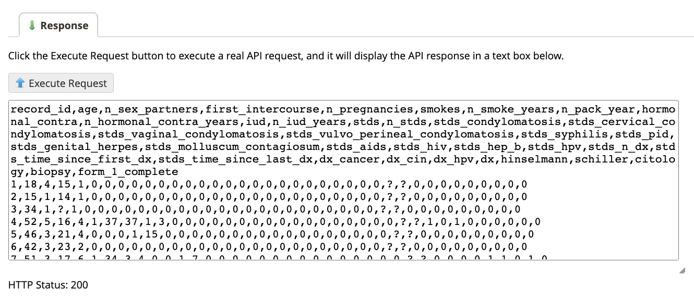<!-- style = "border :1px solid rgb(var(--color-highlight));" -->

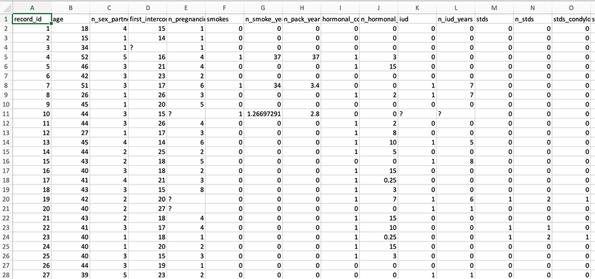<!-- style = "border :1px solid rgb(var(--color-highlight));" -->

</div>

Below the Response box with the comma separated values data, you'll see an HTTP status. You want that to be 200, which means no errors occurred.

This is an example of trying out and learning about the API without having to write code. You can experiment with various methods and learn easily without having to go through the frustration of writing a lot of code to find out how to do things.

In some API methods, like **Export Records**, you'll have a number of drop down menus you can choose from to tailor your request, including which "forms" and which "fields" you want to retrieve. You can make multiple choices in menus like these by holding down control while clicking (Windows) or command while clicking (Mac).  Helpfully, however, if you want **every** item listed (say, you want every form and every field), you don't click any selection at all, and REDCap assumes you mean everything that appears in the drop-down list.

<div class = "important">
Do take a look and make sure your Response box contains comma separated values and shows a good return code (200).  If not, something has gone wrong -- either you don't have the correct rights, which means you need to take another look at your rights in the User Rights section of REDCap, or you've issued an API call that is incorrect in some way (for instance, maybe you requested a .json format instead of .csv).
</div>

### API Playground: Code

So, you've experimented in the API Playground and you know the kind of API call you want to make. Now, how do you automate this selection so that your R or Python code will issue exactly the same request using code?  REDCap's API playground comes to the rescue again, with code snippets.

In the tabs at the bottom of the API Playground, you'll see names of programming languages, including Python and R.  Below you can see what the Python code looks like for the API request to retrieve all records from the cervical cancer database:

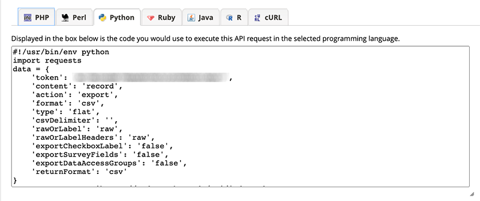<!-- style = "border :1px solid rgb(var(--color-highlight));" -->

We'll show you how to use Python and R in two separate sections, so you can feel free to look at either one, or both!

## Python and the REDCap API

<div class = "important">
There is a useful Python library that makes importing REDCap data into Python simpler than the code REDCap suggests.  Nevertheless, we think it's important to show you how to use the code REDCap provides, because it is reliable and reflects the current state of the REDCap API.  

The Python library, PyCap, that streamlines this effort is great and seems very stable, and we provide a link to it toward the end of this module, but Python libraries depend on volunteers who keep them updated.  Therefore, we think it's useful to know how to use the basic method we'll share here, even if in the future you prefer a different approach.
</div>

Open a Jupyter notebook (running Python 3) and paste the code from the API Playground's "Python" tab into your first cell and run that cell.  It works!  Kind of.  Take a look below to see what the result of our API call for the records of cervical cancer data looks like.

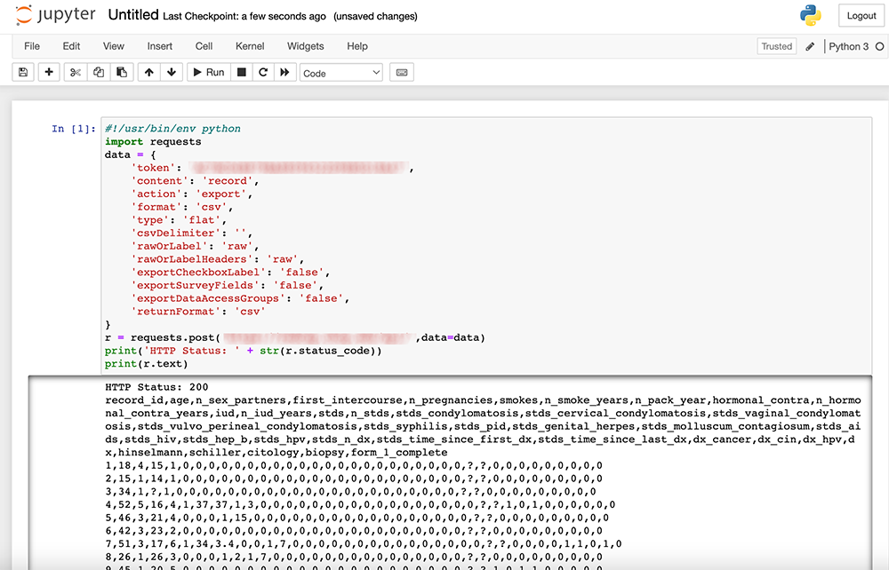<!-- style = "border :1px solid rgb(var(--color-highlight));" -->

What's the only problem with this?  Well, it's not in a pandas data frame, which is what we'd prefer to work with.  We can fix that by adding a few lines of code!  Add this to a second cell, and run it.

```python
import pandas as pd
from io import StringIO
df = pd.read_csv(StringIO(r.text))
df
```

Below, this is the result when we do that for our cervical cancer data database:

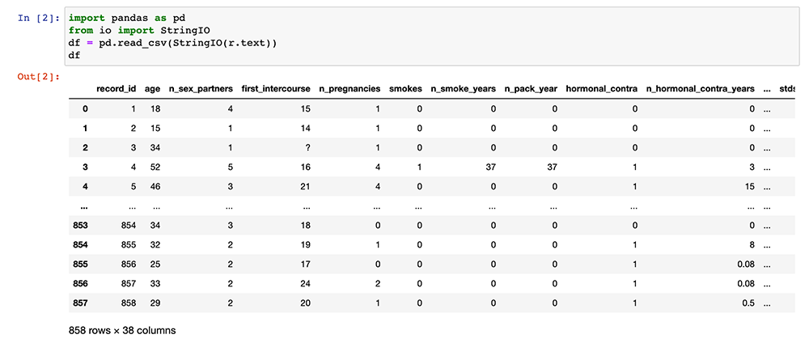<!-- style = "border :1px solid rgb(var(--color-highlight));" -->

Now, your data is in a pandas data frame and you're ready to do all sorts of work with that data (like cleaning question marks out of the data, getting summary statistics, finding correlations, visualizing data, and modeling data).  Importantly, you can re-run the cells in this notebook at any time to get the latest version of the data from REDCap!  

## R and the REDCap API

REDCap assumes you're going to use an R script and not an R Markdown document, but we advocate using R Markdown for just about everything you do in R, so we're going to teach that approach.

<div class = "important">
There are useful R packages that make importing REDCap data into R simpler than the code REDCap suggests.  Nevertheless, we think it's important to show you how to use the code REDCap provides, because it is reliable and reflects the current state of the REDCap API.  

The R packages that streamline this effort (we like REDCapR and redcapAPI) are great and seem very stable, and we provide links to them toward the end of this module, but R packages depend on volunteers who keep them updated.  Therefore, we think it's useful to know how to use the basic method we'll share here, even if in the future you prefer a different approach.
</div>

First, open RStudio and create a new R Markdown (File > New File > R Markdown).  Give your R Markdown the title and author information you want, leave the default output choice (HTML), and click on **OK.**

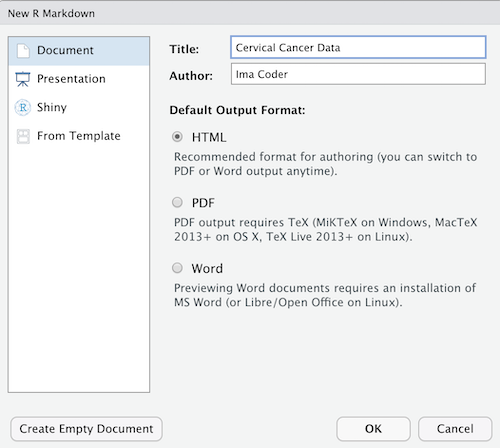<!-- style = "border :1px solid rgb(var(--color-highlight));" -->

Remove all the "boilerplate" text after the setup chunk (so, delete all the lines after around line 10) and add a new empty chunk:

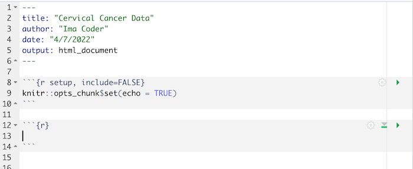<!-- style = "border :1px solid rgb(var(--color-highlight));" -->

Then:

* Copy the R code from the API Playground and paste it into the empty chunk
* Remove the first line (the one that starts `#!/usr/bin`).
* Run that chunk!

After running that chunk, you should have some new objects in your **Environment.**  Of particular interest is the object called `result`.  See below what we see when we run the chunk of code to get records from the cervical cancer database:

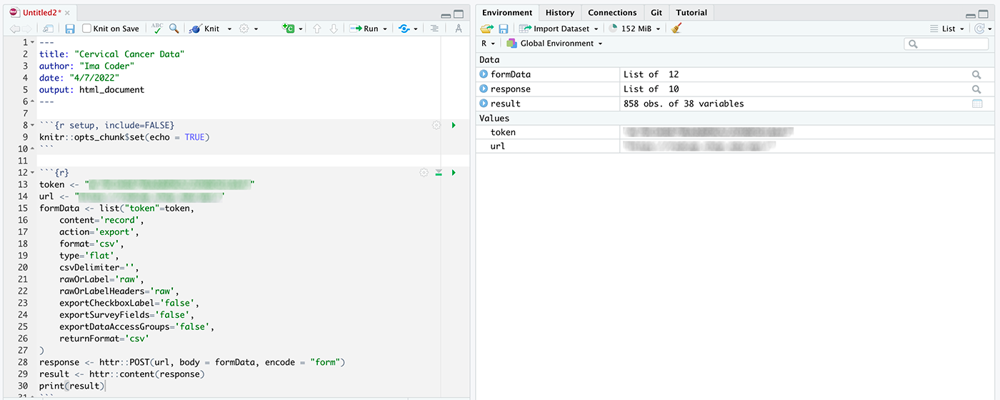<!-- style = "border :1px solid rgb(var(--color-highlight));" -->

Click on "result" in the environment pane to open a file viewer.  

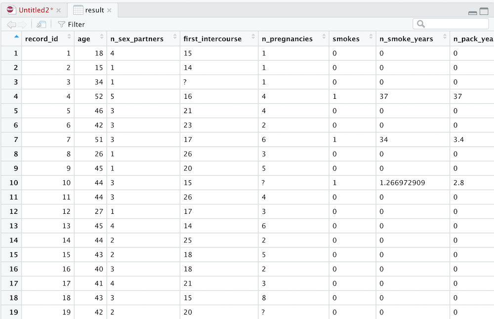<!-- style = "border :1px solid rgb(var(--color-highlight));" -->

Now, your data is in a data frame and you're ready to do all sorts of work with that data (like cleaning question marks out of the data, getting summary statistics, finding correlations, visualizing data, and modeling data).  Importantly, you can re-run the chunks in this R Markdown at any time to get the latest version of the data from REDCap!  

## Additional Resources

We've barely scratched the surface of what you can do with the REDCap API.  Here are some helpful resources to allow you to advance!

* Besides the base R code that REDCap suggests, there are also several great R packages that simplify accessing REDCap (so you don't have to copy / paste every time).  

  - [REDCapR](https://cran.r-project.org/web/packages/REDCapR/REDCapR.pdf) is a great option, and its `redcap_read_oneshot` does what we practiced here (go and get all the records from a REDCap project) in one single line!
  - [redcapAPI](https://github.com/nutterb/redcapAPI/wiki) is another powerful package which is highly configurable and might be better for times when you're doing less typical API requests.

* Similarly, Python has [PyCap](https://pypi.org/project/pycap/), which is useful for simplifying data requests in Python.


## Feedback

In the beginning, we stated some goals.

**Learning Objectives:**

@learning_objectives

We ask you to fill out a brief (5 minutes or less) survey to let us know:

* If we achieved the learning objectives
* If the module difficulty was appropriate
* If we gave you the experience you expected

We gather this information in order to iteratively improve our work.  Thank you in advance for filling out [our brief survey](https://redcap.chop.edu/surveys/?s=KHTXCXJJ93&module_name=%22Using+the+REDCap+API%22&version=1.0.3)!
