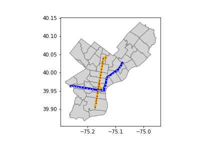
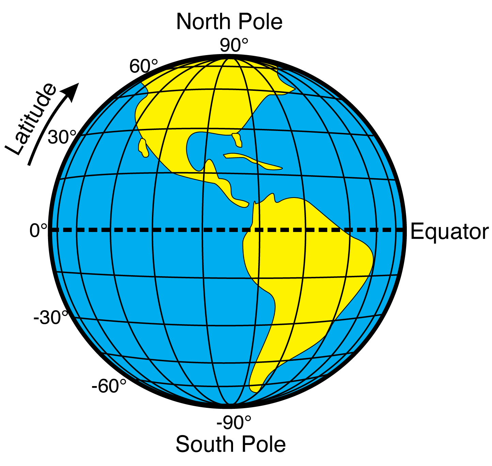
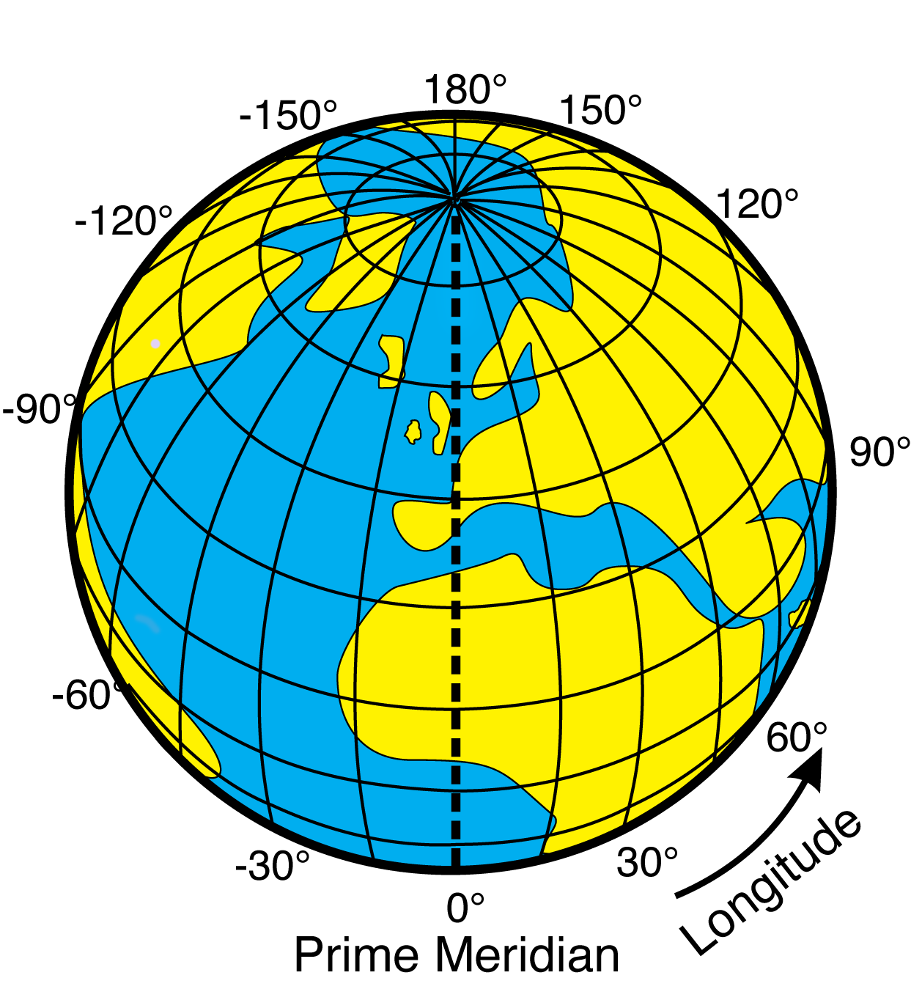

<!--

author:   Elizabeth Drellich
email:    drelliche@chop.edu
version:  0.0.1
module_template_version: 2.0.1
language: en
narrator: UK English Female
title: Maps: the Visual Vocabulary of Geospatial Data
comment:  This is a general overview of how geospatial data can be presented visually using maps.
long_description: Although maps can be extremely effective ways to receive information with only limited prerequisite specialized knowledge, creating them requires some specialized vocabulary. This modules is for learners who want to move beyond reading maps and are considering making their own maps.
estimated_time: ?? minutes

@learning_objectives  

After completion of this module, learners will be able to:

- describe types of geospatial data
- identify common types of maps

@end

link:  https://chop-dbhi-arcus-education-website-assets.s3.amazonaws.com/css/styles.css

script: https://kit.fontawesome.com/83b2343bd4.js

-->

# Maps: the Visual Vocabulary of Geospatial Data

## Overview
@comment

**Is this module right for me?** @long_description

**Estimated time to completion:** @estimated_time

**Pre-requisites**
None

**Learning Objectives**

@learning_objectives

## The power of maps

Pros of maps:

- don't need a lot of specialized knowledge to understand them
- meanings persist throughout time, check out these really old maps!
- some conventions: land/water is a convention worth keeping, north = up maybe less so, although depending on context can really confuse people

Issues to consider:

- maps can distort information just as much as any other way of presenting data. Because they are so striking, perhaps even more so!
- remember, visual means very accessible for SOME, but not universally accessible. If your ONLY way of communicating the information is with a map, it will be less accessible or completely inaccessible to those with different vision capabilities. Even those who have no trouble seeing your map, may not be visual learners, so rely exclusively on maps to your own peril.
- A map is a representation of reality, but it is not reality. [Failures of GPS navigation systems](https://www.salon.com/2014/02/19/9_of_the_most_epic_gps_failures_partner/) can make the difference particularly clear, but there are many subtler ways in which maps are good, but imperfect representations.

Maps are inherently political:

- the idea of claiming land by mapping it (still in effect via oceanography and ocean floor mapping to claim continental shelf/deep see drilling rights: The United Nations Convention on the Law of the Sea (UNCLOS))
- in public health, maps can have huge consequences for who has political power or receives services or benefits.
- From the name of a neighborhood to regions actually suffering from war... making, or even sharing a map can be a political statement... be warned? (Hans island Canada/Denmark seems like a safe example and recently resolved...)

## How does geospatial data become a map?

Interpreting the geospatial data presented by a map is one thing, but if you want to make a map, you need to know how geospatial data becomes a map!

The following map shows the city of Philadelphia, along with a few specific attributes:

- zip codes divide the city into regions,
- two train lines, the Broad Street Line (in orange) and the Market Frankfort Line (in dark blue) are also pictured,
- train stations along those two train lines are shown as black and white dots.

The data for this map comes from [SEPTA](https://septaopendata-septa.opendata.arcgis.com/search?tags=Highspeed) and [OpenDataPhilly](https://www.opendataphilly.org/dataset/zip-codes).

How did the data about stations, train lines, and zip codes become a map? Each of those attributes was stored as text, a string of numbers representing one of the following types:

- Points
- Lines (and Mulitlines)
- Polygons (and Multipolygons)

We will investigate each of theses type of spatial data a little more closely.

### Points

Before we can talk about locations all over the earth, we have to establish the locations of a few very special points. The first two are the **North Pole** and the **South Pole**. If you imagine a line going straight through the planet connecting the two poles, this is the axis around which the Earth rotates creating night and day.

The **equator** is the circle around the surface of the earth that is exactly half way between the north and south poles. Any celestial body, like a planet or a star, that spins on an axis has two poles and an equator. Imagine a flat surface containing the equator and dividing the planet into a northern hemisphere and southern hemisphere. That flat surface is called the **equatorial plane**.

A **meridian** is a straight line on the surface of the earth connecting the poles. The third point we need is the location of the [Greenwich Observatory](https://www.rmg.co.uk/royal-observatory) in London, England. The meridian running through the observatory is called the **Prime Meridian**. Unlike the poles, which are fixed points determined by the astronomical fact that the earth is spinning on an axis, the location of the Prime Meridian was a human decision made for [historical](https://greenwichmeantime.com/articles/history/navy/) rather than geographical reasons.

Now that we have established the poles, the equator, and the prime meridian, we can use those to to create a coordinate system that will specify and point on earth!

**Latitude and Longitude**
==========================

**Latitude** is a measure of how far north or south a location is from the equator. Given a point on the surface of the earth, imagine a straight line to the center of the earth. The angle that line makes with the equatorial plane, measured in degrees (denoted $ {}^\circ $), is the point's latitude. Since that angle could be either above or below the equatorial plane, we have to specify which angle we are talking about. The horizontal line on the picture below corresponding to 30 degrees north, or +30$ {}^\circ $, goes through the United States, while the line representing 30 degrees south, or -30$ {}^\circ $, runs through Chile and Argentina.

**Longitude** is similarly an angular measurement, but rather than measuring relative to the equatorial plane, it measures relative to the prime meridian. Positive angles correspond to locations to the east of the prime meridian, while negative angles refer to points west of it. The meridian on the exact opposite side of the world from the prime meridian is, by convention, +180$ {}^\circ $ or 180$ {}^\circ $ East, even though it could just as accurately be described as -180$ {}^\circ $ or 180$ {}^\circ $ West.

Together, latitude and longitude form a (spherical) coordinate system that can specify any point on the planet, with high precision.

The Roberts Center for Pediatric Research at the Children's Hospital of Philadelphia, for example, is located at 39.94583795815241, -75.18659130245932. These numbers actually have far more significant digits than are appropriate, and correspond to a particular spot in the building's lobby.

The location data produced today by satellites has no problem with long decimal numbers, but the first accurate measurements of longitude depended on the ability to accurately measure time.

While most of your geospatial data will likely use decimal degrees (DD), like the location for the Roberts Center above did, there is another way to specify smaller angles, using [degrees, minutes, and seconds (DMS)](https://gisgeography.com/decimal-degrees-dd-minutes-seconds-dms/). If you find yourself working with nautical data you may have to get comfortable with DMS measurements, but since most biomedical data deals with locations on land, we will leave this as a topic for you to explore further if interested.

It is important to remember that this coordinate system is measuring angles, not distance. The points (0N,90E) and (0N, 90W) are directly across the planet from each other, as a far away as two points can get (over 20,000 km). However (89N, 90E) and (89N, 90W) are both in the arctic circle, less than 240 km away from each other.

### Lines

It might be a line or path, tracing out the route of a road, river, or isobar (all the points where the air pressure is a specific value) (1 dimensional).
Data on lines is stored as an ordered sequence of points. The "line" consists of straight line segments from one point to the next to the next.

### Polygons

It might be a region, like a country, park, or body of water (2 dimensional).

In different contexts the same physical object might be described using different types of data. While a city might be a 2D region of a local map, it might only appear as a point in national or global data. Similarly a river might be a line dividing two regions of land on either side, or it could be a region of its own. Which format you use will depend on your needs. Knowing what you will use the data for will help you determine which types of location data you want to acquire.

### Multipolygons

Regions that are "simply connected," which is a mathematics term for having exactly one obvious interior and one obvious exterior can be represented by polygons. But what about regions like Hawaii (a collection of several islands) or South Africa (which has two holes punched out of it where the country of Lesotho is located)?

These more complicated regions are described by **mulitpolygons**. A multipolygon is a collection of polygons.

Examples: code and image of Hawaii

## Ways to present data with maps

Every map involves choices to emphasize some data and omit other data. The type of data you want to display can help you choose what type of map to make. In this section we will learn about some of the most common types of maps.

### Choropleths
(and variations)

### Dot distribution

single points, you can still see a lot with only points, assuming you have a lot of points. Could be very accurate (where is this car?) or sort of vague and politically determined (each city has an official lat/long located somewhere within the city limits?)

### Graduated symbol maps
(https://gisgeography.com/dot-distribution-graduated-symbols-proportional-symbol-maps/#:~:text=Graduated%20symbol%20maps%20and%20proportional%20symbol%20maps%20scale%20the%20size,instead%20of%20scaling%20them%20larger.)

### Proportional symbol maps
### Heat maps

### Cartograms
(kind of a weird one...)

## Quiz

## Additional Resources

The last section of the module content should be a list of additional resources, both ours and outside sources, including links to other modules that build on this content or are otherwise related.

## Feedback

In the beginning, we stated some goals.

**Learning Objectives:**

@learning_objectives

We ask you to fill out a brief (5 minutes or less) survey to let us know:

* If we achieved the learning objectives
* If the module difficulty was appropriate
* If we gave you the experience you expected

We gather this information in order to iteratively improve our work.  Thank you in advance for filling out [our brief survey](https://redcap.chop.edu/surveys/?s=KHTXCXJJ93&module_name=%22Module+Template%22)!

Remember to change the redcap link so that the module name is correct for this module!
